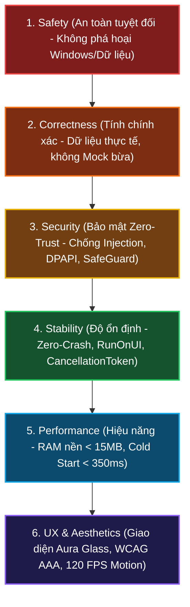
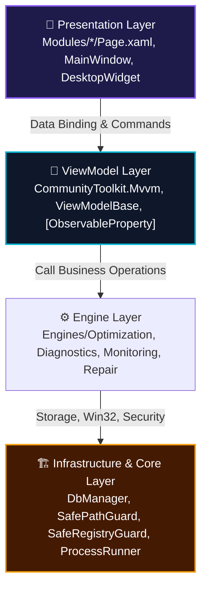

# 🤖 WinCare Pro Suite — AI Agent Operational Directive & Engineering Manual
> **Tài liệu hướng dẫn tối cao dành cho AI Coding Agents (Antigravity, Claude, Copilot, Cursor, etc.)**  
> **Áp dụng cho:** Toàn bộ tác vụ đọc, phân tích, thiết kế, tái cấu trúc, viết mã nguồn, kiểm thử và đóng gói trên kho mã `WinCare`.  
> **Phiên bản hệ thống:** v4.9.2 (Codename: Orion)  
> **Nền tảng mục tiêu:** Windows 10 (Build 19041+) & Windows 11 (x64)  
> **Công nghệ lõi:** .NET 10.0 • C# 13 • Windows App SDK (WinUI 3) • SQLite 3 WAL • CommunityToolkit.Mvvm

---

## 🧭 1. Tôn Chỉ Hoạt Động & Thứ Bậc Ưu Tiên Tuyệt Đối

Khi thực hiện bất kỳ nhiệm vụ nào trong dự án WinCare Pro, AI Agent **bắt buộc** phải tuân theo thứ tự ưu tiên bất khả xâm phạm sau đây:

$$\mathbf{Safety} > \mathbf{Correctness} > \mathbf{Security} > \mathbf{Stability} > \mathbf{Performance} > \mathbf{Maintainability} > \mathbf{UX} > \mathbf{Aesthetics}$$



1. **Safety (An toàn tuyệt đối):** Không bao giờ làm hỏng hệ điều hành, không xóa nhầm file người dùng, không bao giờ vô hiệu hóa dịch vụ Windows sống còn.
2. **Correctness (Tính chính xác):** Mọi tính toán dung lượng rác, chỉ số phần cứng, trạng thái hệ thống phải trung thực và chính xác.
3. **Security (Bảo mật Zero-Trust):** Không bao giờ ghép chuỗi lệnh shell, cô lập tham số qua `ArgumentList`, mã hóa dữ liệu nhạy cảm bằng Windows DPAPI.
4. **Stability (Độ ổn định không crash):** Bọc 100% cập nhật giao diện bằng `RunOnUI`, xử lý ngoại lệ I/O/Win32 triệt để, quản lý `CancellationToken` chuẩn xác.
5. **Performance (Hiệu năng vượt trội):** Tối ưu hóa chu kỳ GC, dọn RAM (`EmptyWorkingSet`), chống rò rỉ bộ nhớ XAML.
6. **Maintainability & Aesthetics:** Mã nguồn sạch, kiến trúc MVVM phân tầng, tuân thủ C# 13, giao diện Fluent Design 2.0 Aura Glass.

---

## 🏛️ 2. Kiến Trúc Hệ Thống & Bản Đồ Thư Mục Mã Nguồn

Dự án tuân thủ mô hình **4-Tier Modular MVVM Architecture**. Chiều phụ thuộc bắt buộc đi **một chiều từ ngoài vào trong**:

$$\text{Presentation (Views/XAML)} \longrightarrow \text{ViewModel} \longrightarrow \text{Engines (Business Logic)} \longrightarrow \text{Infrastructure / Core}$$



### Bản đồ cấu trúc thư mục (Repository Blueprint):

```
d:\WinCare/
├── App.xaml / App.xaml.cs          # Điểm khởi đầu ứng dụng, Cấu hình DI Container, Global Exception Hooks
├── MainWindow.xaml / .cs           # Cửa sổ chính, Navigation, Aura Glass Backdrop (Mica/Acrylic)
├── MainWindow.Search.cs            # Thanh tìm kiếm nhanh toàn cầu (Global App Search)
├── MainWindow.ThemeUpdates.cs      # Xử lý cập nhật theme động và chuyển đổi ngôn ngữ
├── MainWindow.Win32.cs             # Win32 Subclassing, Acrylic Backdrop Hook, Window Messages
├── Core/                           # Nền tảng cốt lõi, Helper, Models, Interop Win32
│   ├── AppConstants.cs             # Định số phiên bản (SemVer 2.0), Mutex ID, App Constants
│   ├── Helpers/
│   │   ├── AnimationHelper.cs      # Hiệu ứng chuyển động WinUI & Composition Visuals
│   │   ├── Animation3DHelper.cs    # Hoạt cảnh quét 3D HUD (SpriteVisual, Ambient Light)
│   │   ├── FormatHelper.cs         # Định dạng dung lượng Byte, Tốc độ mạng, Thời gian
│   │   ├── ProcessRunner.cs        # Trình thực thi CLI an toàn chống Command Injection (Bắt buộc!)
│   │   ├── SafePathGuard.cs        # Khiên chắn tệp tin hệ thống chống xóa nhầm (Bắt buộc!)
│   │   ├── SafeRegistryGuard.cs    # Khiên chắn Registry chống xóa Root Hives/Khóa sống còn
│   │   ├── UiLoadingHelper.cs      # Skeleton loaders & Shimmer effects
│   │   ├── ViewModelBase.cs        # Lớp cơ sở cho toàn bộ ViewModels (RunOnUI, IsBusy, OperationState)
│   │   └── WmiHelper.cs            # Truy vấn phần cứng an toàn qua WMI/CIM có Timeout
│   ├── Interop/
│   │   └── NativeApi.cs            # P/Invoke Win32, DllImport, Kernel32, User32, Advapi32
│   └── Models/                     # DTO, Enums, Cấu trúc dữ liệu toàn hệ thống
├── Engines/                        # Động cơ nghiệp vụ (Business Logic & Diagnostics)
│   ├── Diagnostics/                # AiDiagnosticsEngine, AiWinCareScoringEngine, PredictiveAnalysisEngine, SystemEngine
│   ├── Monitoring/                 # NetworkEngine, ProcessService, NativeConnections, SpeedTest
│   ├── Optimization/               # DiskEngine, JunkCleanerEngine, StartupEngine, SystemOptimizerEngine
│   └── Repair/                     # ContextMenuEngine, HardwareDriverEngine, RegistryBackupEngine, SecurityPrivacyEngine, SoftwareUpdaterEngine, UninstallEngine
├── Infrastructure/                 # Hạ tầng lưu trữ, bảo mật, ghi nhật ký
│   ├── Caching/                    # IconCacheService, Bộ nhớ đệm tài nguyên
│   ├── Database/                   # DbManager.cs (SQLite 3 WAL, _dbLock, Snapshots, Logs)
│   ├── Logging/                    # CrashLogger.cs, AuditLogService.cs
│   ├── Scheduling/                 # MaintenanceScheduler, Tác vụ định kỳ
│   └── Security/                   # CryptoHelper.cs (DPAPI), ServiceSafetyService.cs (Service Whitelist)
├── Modules/                        # 16 Phân hệ giao diện chức năng tự trị (View + ViewModel)
│   ├── AiAssistant/                # Trợ lý chẩn đoán AI Heuristic nội bộ
│   ├── Dashboard/                  # Giám sát tài nguyên thời gian thực, Live Gauges, Composite Score
│   ├── DesktopWidget/              # Widget HUD nổi Acrylic trên màn hình Desktop
│   ├── Disk/                       # Phân tích dung lượng đĩa, tệp tin lớn, tệp trùng lặp
│   ├── JunkCleaner/                # Dọn dẹp tệp tạm, cache trình duyệt, nhật ký hệ thống
│   ├── Network/                    # Trung tâm giám sát mạng, DNS benchmark, sửa lỗi mạng
│   ├── Notifications/              # Trung tâm thông báo và lịch sử cảnh báo
│   ├── Registry/                   # Dọn dẹp, sao lưu và tối ưu hóa Windows Registry
│   ├── Repair/                     # Sửa chữa hệ thống (SFC, DISM, Windows Update Reset)
│   ├── Security/                   # Khiên bảo vệ bảo mật, tường lửa, quyền riêng tư Windows
│   ├── Settings/                   # Thiết lập ứng dụng, Theme Studio, Quản lý sao lưu/hoàn tác
│   ├── StartupManager/             # Quản lý ứng dụng khởi động và dịch vụ hệ thống
│   ├── SystemOptimizer/            # Tối ưu RAM nền, hiệu ứng giao diện, Gaming Turbo
│   ├── Uninstall/                  # Gỡ bỏ phần mềm triệt để, dọn tàn dư Registry & Thư mục
│   └── Updates/                    # Quản lý cập nhật phần mềm (Winget integration)
├── Services/                       # Các Singleton / Transient Services hỗ trợ
│   ├── ThemeService/               # ThemeManager.cs (Dark, Light, Aura Glass, Custom Accents)
│   ├── TranslationService/         # TranslationManager.cs, TranslationManager.Translations.cs (i18n)
│   ├── LockingAppService/          # Khóa tiến trình đang can thiệp file
│   └── DialogService/              # Hộp thoại xác nhận, cảnh báo an toàn WinUI 3
├── Shared/                         # Thành phần dùng chung (Converters, Components, Animations)
├── WinCarePro.Tests/               # Bộ 339 bài kiểm thử xUnit tự động (Zero-Bug Policy)
├── docs/                           # 11 Chương tài liệu kỹ thuật chuyên sâu
└── rules/                          # 10 Bộ quy chuẩn kỹ thuật cấp Enterprise
```

---

## 📋 3. Mười Quy Chuẩn Kỹ Thuật Bắt Buộc (The 10 Inviolable Rules)

Mọi AI Agent khi phát sinh hoặc sửa đổi code **PHẢI TUÂN THỦ 100%** mười bộ quy tắc sau (tham chiếu từ thư mục `rules/`):

### 🔴 Rule 01: Kiến Trúc Phân Tầng & Dependency Injection
- **Quy tắc phụ thuộc:** View chỉ giao tiếp với ViewModel; ViewModel gọi Engine; Engine gọi Infrastructure. Cấm View gọi thẳng Engine.
- **Không lẫn lộn UI:** Tầng Engine và Core tuyệt đối **KHÔNG ĐƯỢC** chứa bất kỳ WinUI 3 types nào (`Button`, `TextBox`, `SolidColorBrush`, `Window`, `FrameworkElement`).
- **Giao tiếp liên ViewModel:** Cấm tham chiếu chéo ViewModel (`_otherVm.Method()`). Sử dụng `WeakReferenceMessenger` của `CommunityToolkit.Mvvm` hoặc Service trung gian.
- **DI Scope:** Khai báo Service Singleton (`DbManager`, `ThemeManager`, `TranslationManager`) hoặc Transient (`*Engine`, `*ViewModel`) tại [App.xaml.cs](file:///d:/WinCare/App.xaml.cs).

### 🔴 Rule 02: Bảo Mật & An Toàn Tuyệt Đối (Zero-Trust)
- **Chống Command Injection:** **TUYỆT ĐỐI CẤM** nối chuỗi lệnh thô `cmd.exe /c "..."`. Luôn dùng [ProcessRunner.cs](file:///d:/WinCare/Core/Helpers/ProcessRunner.cs) và đưa tham số vào `ProcessStartInfo.ArgumentList`. Mọi input người dùng phải qua [InputSanitizer.cs](file:///d:/WinCare/Core/Helpers/InputSanitizer.cs).
- **Khiên chắn File [SafePathGuard.cs](file:///d:/WinCare/Core/Helpers/SafePathGuard.cs):** Mọi thao tác `File.Delete()` hoặc `Directory.Delete()` **BẮT BUỘC** gọi `SafePathGuard.IsSafeToDelete(path)`. Cấm xóa `C:\`, `C:\Windows`, `System32`, `Program Files`, các thư mục cá nhân (`Desktop`, `Documents`, `Pictures`), và cấm đệ quy vào Junction / Reparse Points.
- **Khiên chắn Registry [SafeRegistryGuard.cs](file:///d:/WinCare/Core/Helpers/SafeRegistryGuard.cs):** Cấm xóa Root Hives (`HKLM`, `HKCU`), cấm xóa tiền tố hệ thống sống còn, độ sâu đường dẫn xóa phải $\ge 3$ cấp (`SegmentCount >= 3`), cấm sửa giá trị `Shell` hoặc `Userinit`.
- **Bảo vệ Windows Services:** Kiểm tra qua `ServiceSafetyService.IsProtectedService(name)`. Cấm dừng/vô hiệu hóa các dịch vụ: `RpcSs`, `DcomLaunch`, `WinDefend`, `CryptSvc`, `EventLog`, `PlugPlay`.
- **Mã hóa DPAPI:** Dữ liệu nhạy cảm lưu trong SQLite phải mã hóa bằng [CryptoHelper.cs](file:///d:/WinCare/Core/Helpers/CryptoHelper.cs) (`ProtectedData.Protect` với `DataProtectionScope.CurrentUser`).

### 🔴 Rule 03: Đa Luồng & Bất Đồng Bộ (Zero-Crash Threading)
- **Quy tắc UI Thread:** WinUI 3 cấm cập nhật UI hoặc `ObservableCollection` từ luồng nền. Mọi cập nhật UI trong ViewModel **BẮT BUỘC** bọc trong `RunOnUI(() => { ... })` từ [ViewModelBase.cs](file:///d:/WinCare/Core/Helpers/ViewModelBase.cs).
- **Hợp tác hủy tác vụ (`CancellationToken`):** Mọi phương thức async nặng (quét đĩa, tìm file, ping mạng) **BẮT BUỘC** nhận `CancellationToken ct = default` và gọi `ct.ThrowIfCancellationRequested()`.
- **Khóa SQLite WAL:** Mọi thao tác ghi/đọc SQLite trong [DbManager.cs](file:///d:/WinCare/Infrastructure/Database/DbManager.cs) **BẮT BUỘC** nằm trong `lock (_dbLock)`. Không gọi code ngoài khi đang giữ lock.
- **Cấm Sync-over-Async:** Cấm gọi `.Result` hoặc `.Wait()` trên UI Thread. Cấm `async void` (ngoại trừ XAML UI Event Handlers).
- **Mẫu `finally` phục hồi trạng thái:** Mọi phương thức async bật `IsBusy = true` hoặc `OperationState.Running` bắt buộc có khối `finally` để hoàn trả `IsBusy = false` và `OperationState.Idle`.

### 🟡 Rule 04: Hiệu Năng & Quản Lý Bộ Nhớ
- **Ngân sách tài nguyên (Budgets):**
  - Khởi động lạnh (Cold Start): $\le 350\text{ ms}$.
  - RAM khi chạy tiền cảnh: $\le 85\text{ MB}$.
  - RAM khi thu nhỏ xuống khay hệ thống: $\le 15\text{ MB}$ (sau khi gọi `TrimProcessMemory()`).
  - CPU khi Idle: $\le 0.3\%$. Hoạt cảnh UI: 120 FPS.
- **Chống rò rỉ XAML:** Hủy đăng ký sự kiện (`-=`) trong `Unloaded` hoặc `Dispose()`. Sử dụng `WeakReferenceMessenger`. Giải phóng toàn bộ `IDisposable` qua `using var`.
- **Bộ nhớ đệm Icon:** Dùng `ConcurrentDictionary<string, ImageSource>` trong `IconCacheService`, không gọi `SHGetFileInfo` lặp lại.
- **Chống giật số Telemetry:** Thêm `Typography.NumeralAlignment="Tabular"` trên TextBlock hiển thị CPU%, RAM%, Network speed.
- **Dọn dẹp 3D Visuals & Reduced Motion:** Hủy bỏ `Stop3DScanEffect` khi chuyển trang. Kiểm tra `ReducedMotionHelper.AreAnimationsEnabled` trước khi chạy animation.

### 🔴 Rule 05: Chuẩn Lập Trình C# 13 & .NET 10
- **Mẫu [OperationResult.cs](file:///d:/WinCare/Core/Models/OperationResult.cs):** Mọi hàm Engine/Service có nguy cơ lỗi I/O, Win32, Registry **BẮT BUỘC** trả về `OperationResult` hoặc `OperationResult<T>`, không ném ngoại lệ thô ra tầng giao diện.
- **Zero-Silent Catch:** Tuyệt đối cấm `catch { }` hoặc nuốt lỗi không ghi nhận. Ngoại lệ phải ghi vào `CrashLogger` hoặc trả qua `OperationResult.Fail()`.
- **Đa ngôn ngữ bắt buộc (i18n):** Tuyệt đối không hardcode chuỗi text trên giao diện. Mọi chuỗi hiển thị phải lấy qua `TranslationManager.Instance.GetString("Key")` hoặc `"Key".Translate()`. Phải bổ sung đầy đủ cặp key trong cả `vi-VN` và `en-US` tại [TranslationManager.Translations.cs](file:///d:/WinCare/Services/TranslationService/TranslationManager.Translations.cs).
- **Nullable Reference Safety:** Giữ `<Nullable>enable</Nullable>`. Không dùng toán tử `!` trừ khi có chứng minh bất biến chắc chắn.

### 🟡 Rule 06: Giao Diện Aura Glass & Trải Nghiệm Người Dùng
- **Chất liệu nền:** Mica/MicaAlt cho cửa sổ chính, Desktop Acrylic cho Widget HUD/Flyouts. Bo góc `CornerRadius="8"` hoặc `"12"`, viền mờ `BorderThickness="1"`.
- **Hoạt cảnh mượt mà:** Chuyển trang $\le 250\text{ ms}`, Cubic-Bezier easing, Staggered Entrance delay $30\text{ ms}$, Shimmer Skeleton Loader khi đang quét.
- **Tiêu chuẩn tiếp cận:** Độ tương phản WCAG 2.1 AAA $\ge 4.5:1$, hỗ trợ phím Tab (`FocusVisualPrimaryBrush`), Tooltip đầy đủ cho icon-only buttons.
- **Bảng màu Theme Studio:** Sử dụng Resource Keys chuẩn (`SystemAccentColor`, `SuccessStatusBrush`, `WarningStatusBrush`, `DangerStatusBrush`).

### 🔴 Rule 07: Kiểm Thử Tự Động & Đảm Bảo Chất Lượng (Zero-Bug Policy)
- **100% Passed:** Duy trì tỷ lệ kiểm thử thành công 100% (Toàn bộ 339 bài test trong `WinCarePro.Tests` phải pass).
- **Cách ly kiểm thử:** Sử dụng SQLite in-memory (`Data Source=:memory:`) hoặc thư mục tạm `TestTemp/`. Mock các hàm Win32 nguy hiểm.
- **Bắt buộc viết Unit Test cho tính năng mới:** Mọi Engine/ViewModel mới phải có bài test bao phủ: Vòng đời Hủy (`CancellationToken`), Thử nghiệm Stress (`Scan -> Cancel -> Scan`), An toàn `SafePathGuard`, Kiểm tra biên (0% RAM, 100% CPU), và Đồng bộ từ điển dịch `vi-VN`/`en-US`.
- **Cấu trúc AAA:** Triển khai bài test theo mẫu Arrange - Act - Assert sử dụng thư viện `FluentAssertions`.

### 🔴 Rule 08: Đóng Gói, Phát Hành & Đánh Số Phiên Bản (SemVer 2.0)
- **Xuất bản:** Self-contained x64 (`--self-contained true`, nhúng sẵn .NET 10).
- **Bộ cài Inno Setup:** Khai báo `PrivilegesRequired=admin`, kiểm tra Mutex ứng dụng cũ, hỗ trợ dọn sạch thư mục khi gỡ cài đặt.
- **Đồng bộ phiên bản 7 vị trí khi bump version:**
  1. `Core/AppConstants.cs`
  2. `WinCarePro.csproj`
  3. `setup.iss`
  4. `update.json`
  5. `Package.appxmanifest`
  6. XAML Version badges (`MainWindow.xaml`, `SettingsPage.xaml`)
  7. `TranslationManager.Translations.cs`

### 🔴 Rule 09: Tương Tác Windows Registry & Win32 Interop
- **Registry View đa kiến trúc:** Luôn duyệt cả hai chế độ `RegistryView.Registry64` và `RegistryView.Registry32` (`WOW6432Node`).
- **Sao lưu trước khi sửa:** Bắt buộc gọi `RegistryBackupEngine.BackupKey()` trước khi chỉnh sửa hoặc xóa khóa Registry.
- **Quản lý Handle Win32:** Mọi Handle tiến trình (`IntPtr`) lấy từ P/Invoke phải được đóng qua `CloseHandle` hoặc bọc trong `SafeHandle` để ngăn chặn Kernel Handle Leak.
- **WMI Timeout:** Mọi truy vấn `ManagementObjectSearcher` phải bọc trong `using` và có cơ chế Timeout / Fallback sang Registry.

### 🔴 Rule 10: Quản Lý Sự Cố, Ghi Log & Bảo Vệ Riêng Tư (Zero-PII)
- **Phân tách 2 kênh log:** Audit Log (Lưu trong SQLite bảng `Logs`) vs Crash Logger (Lưu trong `%AppData%\WinCarePro\CrashLogs\`).
- **Zero-PII Leakage:** Không ghi mật khẩu, token vào log. Mọi đường dẫn thư mục cá nhân người dùng phải chuẩn hóa thành `%USERPROFILE%` hoặc `%TEMP%`.
- **Giới hạn kích thước:** Tối đa 5 MB/tệp log, lưu trữ tối đa 30 ngày / 10 tệp log gần nhất. Bảng `Logs` trong SQLite giữ tối đa 1,000 bản ghi gần nhất.
- **Global Exception Hooks:** Đăng ký đầy đủ 3 bộ móc: `AppDomain.CurrentDomain.UnhandledException`, `TaskScheduler.UnobservedTaskException`, và `XAML this.UnhandledException`.

---

## 🧩 4. Danh Sách 16 Phân Hệ Tính Năng & Động Cơ Tương Ứng

| STT | Phân Hệ Chức Năng | View (XAML / Code-Behind) | ViewModel Phụ Trách | Engine / Service Cốt Lõi | Mức Rủi Ro |
| :---: | :--- | :--- | :--- | :--- | :---: |
| **01** | **Dashboard & Live HUD** | `Modules/Dashboard/DashboardPage.xaml` | `DashboardViewModel.cs` | `ProcessService`, `AiWinCareScoringEngine`, `SystemEngine` | 🟢 Read-Only |
| **02** | **AI WinCare Assistant** | `Modules/AiAssistant/AiAssistantPage.xaml` | `AiAssistantViewModel.cs` | `AiDiagnosticsEngine`, `PredictiveAnalysisEngine` | 🟢 Read-Only |
| **03** | **Junk Cleaner** | `Modules/JunkCleaner/JunkCleanerPage.xaml` | `JunkViewModel.cs` | `JunkCleanerEngine`, `SafePathGuard` | 🟡 Chỉnh sửa Tệp |
| **04** | **App Uninstaller** | `Modules/Uninstall/UninstallPage.xaml` | `UninstallViewModel.cs` | `UninstallEngine`, `UninstallEngine.Leftovers` | 🟠 Gỡ App & Registry |
| **05** | **Network Center** | `Modules/Network/NetworkPage.xaml` | `NetworkViewModel.cs` | `NetworkEngine`, `NativeConnections`, `DnsBenchmark` | 🟡 Thay đổi Cấu hình |
| **06** | **System Repair** | `Modules/Repair/RepairPage.xaml` | `RepairViewModel.cs` | `ProcessRunner` (`sfc`, `dism`, Windows Update reset) | 🟠 Sửa Tệp Hệ Thống |
| **07** | **Security Shield** | `Modules/Security/SecurityPage.xaml` | `SecurityViewModel.cs` | `SecurityPrivacyEngine`, `ServiceSafetyService` | 🟡 Tinh chỉnh Bảo mật |
| **08** | **System Optimizer** | `Modules/SystemOptimizer/SystemOptimizerPage.xaml` | `SystemOptimizerViewModel.cs` | `SystemOptimizerEngine`, `NativeMethods.EmptyWorkingSet` | 🟡 Tinh chỉnh RAM/Visual |
| **09** | **Gaming Turbo** | `Modules/SystemOptimizer/GamingTurboPage.xaml` | `GamingTurboViewModel.cs` | `SystemOptimizerEngine`, `ProcessService` | 🟡 Quản lý Tiến trình |
| **10** | **Context Menu Manager** | `Modules/Repair/ContextMenuPage.xaml` | `ContextMenuViewModel.cs` | `ContextMenuEngine`, `SafeRegistryGuard` | 🟠 Chỉnh sửa Registry |
| **11** | **Startup & Services** | `Modules/StartupManager/StartupManagerPage.xaml` | `StartupManagerViewModel.cs` | `StartupEngine`, `ServiceSafetyService` | 🟠 Quản lý Khởi động |
| **12** | **Disk & Storage** | `Modules/Disk/DiskPage.xaml` | `DiskViewModel.cs` | `DiskEngine`, `SafePathGuard` | 🟡 Phân tích Dung lượng |
| **13** | **Registry Center** | `Modules/Registry/RegistryPage.xaml` | `RegistryViewModel.cs` | `RegistryBackupEngine`, `SafeRegistryGuard` | 🔴 Sửa Registry Sâu |
| **14** | **Software Updater** | `Modules/Updates/UpdatesPage.xaml` | `UpdatesViewModel.cs` | `SoftwareUpdaterEngine`, `ProcessRunner` (`winget`) | 🟡 Tải & Cài đặt |
| **15** | **Desktop HUD Widget** | `Modules/DesktopWidget/DesktopWidgetWindow.xaml` | `DesktopWidgetViewModel.cs` | `ProcessService`, `SystemEngine` | 🟢 Read-Only |
| **16** | **Settings & System Care**| `Modules/Settings/SettingsPage.xaml` | `SettingsViewModel.cs` | `SettingsService`, `ThemeManager`, `TranslationManager` | 🟢 Lưu Trữ Cấu Hình |

---

## 🛠️ 5. Cẩm Nang Thực Hiện Nhiệm Vụ Của AI Agent (Step-by-Step SOPs)

Khi nhận được yêu cầu từ người dùng, AI Agent phải chọn đúng kịch bản thực thi tương ứng dưới đây:

### 🚀 Kịch Bản 1: Thêm một Phân Hệ / Tính Năng Mới
1. **Bước 1: Định nghĩa Model:** Tạo Data Models trong `Core/Models/`. Nếu có trạng thái lỗi/thành công, luôn dùng `OperationResult<T>`.
2. **Bước 2: Xây dựng Engine:** Tạo Engine trong `Engines/<Category>/`. Nhận `CancellationToken`, bọc lệnh I/O qua `SafePathGuard` hoặc `SafeRegistryGuard`.
3. **Bước 3: Đăng ký DI Service:** Mở [App.xaml.cs](file:///d:/WinCare/App.xaml.cs), đăng ký Engine và ViewModel vào `ConfigureServices()` (Singleton hoặc Transient).
4. **Bước 4: Tạo ViewModel:** Tạo `<Feature>ViewModel.cs` trong `Modules/<Feature>/`, kế thừa từ `ViewModelBase`. Sử dụng `[ObservableProperty]`, `[RelayCommand]`, và bọc mọi cập nhật danh sách/UI trong `RunOnUI()`. Quản lý `_cts` và khối `finally`.
5. **Bước 5: Thiết kế Giao diện View:** Tạo `<Feature>Page.xaml` tuân thủ Aura Glass Design (Mica, Bo góc, Shimmer, Tabular figures).
6. **Bước 6: Khai báo i18n:** Thêm toàn bộ Translation Keys vào cả `vi-VN` và `en-US` trong [TranslationManager.Translations.cs](file:///d:/WinCare/Services/TranslationService/TranslationManager.Translations.cs).
7. **Bước 7: Viết Unit Test:** Thêm các bài test xUnit trong `WinCarePro.Tests/` kiểm tra Hủy tác vụ, Edge cases, và An toàn.
8. **Bước 8: Xác minh biên dịch & kiểm thử:** Chạy `dotnet test` để đảm bảo 100% Passed.

### 🐛 Kịch Bản 2: Sửa Lỗi (Bug Fixing) & Tối Ưu Hóa
1. **Bước 1: Xác định phạm vi lỗi:** Định vị chính xác lỗi thuộc tầng nào (View, ViewModel, Engine hay Infrastructure).
2. **Bước 2: Kiểm tra các quy chuẩn liên quan:** Nếu liên quan đến Threading $\rightarrow$ Xem Rule 03; nếu liên quan đến Xóa file/Registry $\rightarrow$ Xem Rule 02 & 09; nếu liên quan đến UI crash $\rightarrow$ Kiểm tra `RunOnUI` và `DispatcherQueue`.
3. **Bước 3: Sửa mã nguồn:** Áp dụng giải pháp an toàn tối đa, không phá vỡ hợp đồng của các lớp khác.
4. **Bước 4: Chạy kiểm thử hồi quy:** Chạy toàn bộ bộ test `dotnet test WinCarePro.Tests/WinCarePro.Tests.csproj`. Đảm bảo không làm hỏng bất kỳ test case nào đã có.
5. **Bước 5: Viết thêm Regression Test:** Viết tối thiểu 1 test case tái hiện lỗi cũ và chứng minh lỗi đã được giải quyết triệt để.

### 🌐 Kịch Bản 3: Cập Nhật Chuỗi Giao Diện & Dịch Thuật
1. Tuyệt đối **KHÔNG** đưa chuỗi thô (Hardcoded string) vào file `.xaml` hoặc `.cs`.
2. Khai báo mã khóa theo quy ước `PascalCase` rõ nghĩa (Ví dụ: `Junk_Status_Cleaning`, `Settings_Theme_MicaDescription`).
3. Mở [TranslationManager.Translations.cs](file:///d:/WinCare/Services/TranslationService/TranslationManager.Translations.cs) và bổ sung giá trị dịch cho cả hai từ điển:
   - `_translations["vi-VN"]["Your_Key"] = "Nội dung tiếng Việt";`
   - `_translations["en-US"]["Your_Key"] = "English Content";`
4. Trong XAML, dùng `Text="{Binding Your_Key, Converter={StaticResource TranslationConverter}}"` hoặc `x:Uid`. Trong C#, dùng `TranslationManager.Instance.GetString("Your_Key")`.

---

## ⚡ 6. Bộ Lệnh Kiểm Tra & Vận Hành Bắt Buộc (Tooling & CLI)

AI Agent có thể thực thi các lệnh sau từ Powershell tại thư mục gốc `d:\WinCare`:

```powershell
# 1. Khôi phục thư viện và gói NuGet:
dotnet restore WinCarePro.csproj

# 2. Biên dịch dự án chính ở chế độ Debug:
dotnet build WinCarePro.csproj -c Debug

# 3. Biên dịch dự án chính ở chế độ Release:
dotnet build WinCarePro.csproj -c Release

# 4. Chạy toàn bộ bộ kiểm thử tự động xUnit (Mục tiêu: 339/339 Passed):
dotnet test WinCarePro.Tests/WinCarePro.Tests.csproj --verbosity normal

# 5. Chạy một nhóm kiểm thử cụ thể (Ví dụ: kiểm tra an toàn bảo mật):
dotnet test WinCarePro.Tests/WinCarePro.Tests.csproj --filter "FullyQualifiedName~SecurityAndSafetyTests"

# 6. Đóng gói Self-Contained x64:
.\publish.bat

# 7. Đóng gói Trình cài đặt hoàn chỉnh (Inno Setup Installer):
.\publish_installer.bat
```

---

## 🛑 7. Bảng Đối Chiếu Anti-Patterns (Cấm Tuyệt Đối vs Chuẩn Mực)

| Trường hợp | ❌ CẤM TUYỆT ĐỐI (Anti-Pattern) | ✅ CHUẨN MỰC BẮT BUỘC (Best Practice) |
| :--- | :--- | :--- |
| **Gọi CLI Hệ thống** | `Process.Start("cmd.exe", "/c sfc /scannow " + arg);` | `ProcessRunner.RunAsync("sfc.exe", new[] { "/scannow" });` |
| **Xóa Tệp Tin** | `File.Delete(filePath);` | `if (SafePathGuard.IsSafeToDelete(filePath)) File.Delete(filePath);` |
| **Xóa Registry** | `Registry.LocalMachine.DeleteSubKeyTree(key);` | `if (SafeRegistryGuard.IsSafeToDeleteKey(key)) ...` |
| **Cập nhật UI** | `JunkItems.Add(item);` (trong luồng `Task.Run`) | `RunOnUI(() => JunkItems.Add(item));` |
| **Xử lý Ngoại lệ** | `catch (Exception) { /* empty */ }` | `catch (Exception ex) { CrashLogger.LogError("...", ex); return OperationResult.Fail("...", ex); }` |
| **Bất đồng bộ** | `var res = engine.ScanAsync().Result;` | `var res = await engine.ScanAsync(ct);` |
| **Kiểu trả về** | `public async void Scan()` | `public async Task ScanAsync()` (Chỉ void cho XAML Events) |
| **Chuỗi giao diện** | `<TextBlock Text="Dọn dẹp rác"/>` | `<TextBlock Text="{Binding Junk_CleanBtn, Converter={StaticResource TranslationConverter}}"/>` |
| **Xử lý Hủy bỏ** | `if (ct.IsCancellationRequested) return;` (quên reset cờ) | `try { ... } finally { IsBusy = false; OperationState = OperationState.Idle; }` |
| **Khóa SQLite** | `using var cmd = conn.CreateCommand();` (không có lock) | `lock (_dbLock) { using var cmd = ...; }` |

---

## ✅ 8. Bản Kiểm Kê Trước Khi Hoàn Tất Nhiệm Vụ (Agent Completion Checklist)

Trước khi thông báo hoàn thành bất kỳ nhiệm vụ nào cho người dùng, AI Agent **BẮT BUỘC** tự rà soát và tích chọn đủ 12 tiêu chí sau:

- [ ] **1. Hierarchy of Priorities:** Mã nguồn tuân thủ thứ bậc `Safety > Correctness > Security > Stability > Performance`.
- [ ] **2. 4-Tier Separation:** Tầng View không gọi tắt vào Engine, tầng Engine không chứa class WinUI 3 XAML.
- [ ] **3. Command Injection Free:** Mọi tương tác CLI đều dùng `ProcessRunner.cs` với `ArgumentList`, không ghép chuỗi thô.
- [ ] **4. SafePathGuard & SafeRegistryGuard:** 100% thao tác xóa File/Registry đều được thẩm định an toàn qua Guard.
- [ ] **5. Zero-Crash UI Dispatching:** 100% thay đổi dữ liệu UI/ObservableCollection từ luồng nền được bọc trong `RunOnUI()`.
- [ ] **6. Cooperative Cancellation:** Các hàm async nặng đều nhận `CancellationToken` và có khối `finally` dọn dẹp cờ `IsBusy`.
- [ ] **7. SQLite WAL Concurrency:** Mọi lệnh ghi/đọc SQLite đều nằm trong khối `lock (_dbLock)` tránh database lock.
- [ ] **8. Zero-Silent Catch:** Không có khối `catch { }` rỗng; mọi lỗi đều ghi log hoặc trả về qua `OperationResult.Fail()`.
- [ ] **9. i18n Completeness:** Không hardcode text; cặp Key mới đã được khai báo đủ cả 2 ngôn ngữ `vi-VN` và `en-US`.
- [ ] **10. Memory & Resource Cleanup:** Hủy đăng ký sự kiện XAML, dừng Animation 3D trong `OnNavigatedFrom`, giải phóng `using var`.
- [ ] **11. Unit Test 100% Passed:** Toàn bộ 339 bài kiểm thử xUnit chạy thành công, không có test nào bị fail (`0 Failed`).
- [ ] **12. Zero Compiler Warnings/Errors:** Dự án biên dịch sạch sẽ, không phát sinh lỗi cảnh báo cú pháp nghiêm trọng mới.

---

<div align="center">
  <sub><b>WinCare Pro Suite v4.9.2 (Codename: Orion)</b> — Tài liệu đặc tả kỹ thuật vận hành AI Agent cấp Enterprise</sub><br/>
  <sub>Tham chiếu toàn diện: <a href="rules/README.md">10 Bộ Quy Chuẩn Kỹ Thuật</a> • <a href="docs/README.md">11 Chương Tài Liệu Chuyên Đề</a></sub>
</div>
