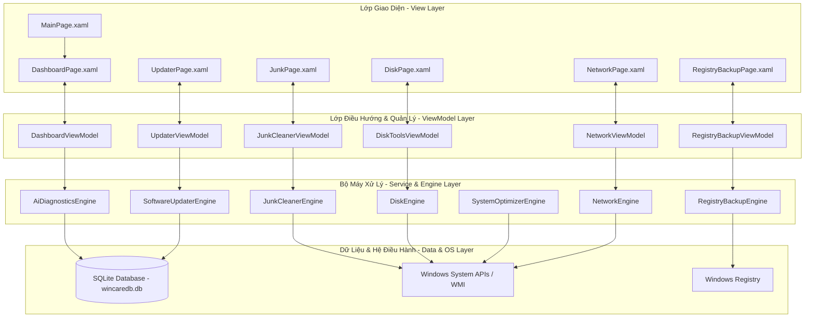

# 🚀 WinCare Pro Suite

<div align="center">
  

  <h3>Hệ Thống Tối Ưu Hóa, Dọn Dẹp & Sửa Lỗi Windows Toàn Diện</h3>
  <p align="center">
    Một bộ công cụ tối ưu hóa máy tính mã nguồn mở, gọn nhẹ, hiện đại được xây dựng dựa trên giao diện <b>Fluent Design (WinUI 3 / Windows App SDK)</b> và sức mạnh của <b>.NET 10.0 & SQLite</b>.
  </p>

  <p align="center">
    <a href="https://github.com/Nguyen-Trung-Tien/WinCarePro/releases/latest"></a>
  </p>

  <p align="center">
    
    
    
    
    
  </p>
</div>

---

## 📖 Tổng quan dự án

**WinCare Pro** là một bộ công cụ bảo trì hệ thống nâng cao, cung cấp bảng điều khiển (Dashboard) thông minh giúp chẩn đoán sức khỏe phần cứng, quản lý tài nguyên hệ thống, sửa lỗi phân mảnh/bảo mật và làm sạch dung lượng lưu trữ Windows. 

Ứng dụng hướng đến việc mang lại trải nghiệm Fluent Design nguyên bản của Windows 11 — mượt mà, trực quan, hỗ trợ chế độ Dark Mode tối ưu và tích hợp các công nghệ phần mềm mới nhất của hệ sinh thái Microsoft.

---

## 📐 Kiến trúc & Mô hình hoạt động

Dự án tuân thủ nghiêm ngặt mô hình thiết kế **MVVM (Model-View-ViewModel)** giúp phân tách rõ ràng giao diện, logic xử lý và cơ sở dữ liệu.



---

## ✨ Các tính năng nổi bật

### 1. 🧹 Chăm sóc & Dọn dẹp (Care & Cleanup)
* **Trình dọn rác nâng cao (Junk Cleaner):** Tự động phát hiện và xóa sạch an toàn các tệp tạm thời (Temp files), Nhật ký hệ thống (Log dumps), Bộ nhớ đệm trình duyệt (Browser cache) và các tệp cài đặt Windows Update đã lỗi thời.
* **Sửa lỗi hệ thống (System Repair):** Tích hợp chuẩn đoán quét hệ thống nâng cao chạy trực tiếp các lệnh kiểm tra tệp tin hệ thống SFC (`sfc /scannow`) và công cụ sửa lỗi ổ đĩa/ảnh hệ thống DISM (`DISM.exe /Online /Cleanup-Image /RestoreHealth`).

### 2. ⚡ Tối ưu hiệu năng (Performance Tuning)
* **Quản lý khởi động & Dịch vụ (Startup & Services):** Phân tích các tiến trình tự động khởi động cùng hệ điều hành, đo lường mức độ ảnh hưởng của chúng đến tốc độ khởi động máy và dễ dàng bật/tắt các dịch vụ Windows Services không cần thiết.
* **Theo dõi tiến trình thời gian thực (Process Manager):** Liệt kê chi tiết lượng CPU, RAM đang sử dụng của từng tiến trình đang chạy và cho phép cưỡng bức dừng (End Task) các phần mềm bị treo.
* **Trình tối ưu hóa hệ thống (System Optimizer):** Áp dụng các tinh chỉnh dịch vụ và cấu hình hệ thống giúp tăng tốc phản hồi của Windows Explorer, tối ưu hiệu suất bộ nhớ đệm và cải thiện tốc độ chơi game/làm việc.

### 3. 💾 Phân tích ổ đĩa & Đăng ký (Storage & Registry)
* **Phân tích sức khỏe ổ đĩa (Disk Tools):** Đọc thông số S.M.A.R.T từ phần cứng để đánh giá tuổi thọ ổ cứng (HDD/SSD), hỗ trợ tìm kiếm file trùng lặp (Duplicate Finder) để giải phóng dung lượng và quét các thư mục trống rác.
* **Sao lưu & Khôi phục Registry (Registry & Backup):** Quét phát hiện các lỗi đường dẫn hỏng, tệp liên kết lỗi trong Registry và cung cấp công cụ sao lưu, khôi phục điểm khôi phục nhanh để phòng ngừa sự cố.

### 4. 🌐 Quản trị mạng (Network Center)
* **Giám sát thời gian thực:** Hiển thị chi tiết trạng thái card mạng LAN/Wi-Fi, đo đạc tốc độ tải xuống/tải lên tức thời thông qua biểu đồ trực quan (Real-time Network Traffic Graph).
* **Danh sách Tiến trình sử dụng mạng:** Thống kê chi tiết các phần mềm và tiến trình đang chiếm dụng băng thông mạng nhiều nhất.
* **Chẩn đoán mạng nhanh:** Đo đạc thời gian phản hồi ping, tỷ lệ mất gói tin (Packet Loss), hỗ trợ giải phóng/làm mới IP và xóa bộ nhớ đệm DNS (Flush DNS) chỉ với 1 click.

### 5. 🛡️ Bảo mật & Phân tích AI (Safety & AI Audits)
* **Kiểm tra an toàn (Security & Privacy):** Giám sát trạng thái hoạt động của Windows Defender, tường lửa (Firewall), mức độ kiểm soát tài khoản người dùng UAC và thực hiện kiểm tra quyền truy cập cục bộ.
* **Chẩn đoán AI (AI Diagnostics):** Bộ máy phân tích thông minh tự động thu thập các chỉ số từ hệ thống, tính toán điểm số sức khỏe tổng quát (Composite Health Score từ 0 - 100) và đưa ra các đề xuất khắc phục cụ thể theo cấu trúc thời gian thực.
* **Báo cáo chuyên nghiệp:** Hỗ trợ xuất nhật ký chẩn đoán ra tệp văn bản thô (.txt) hoặc cấu trúc dữ liệu JSON để phân tích sâu hơn.

---

## 🛠️ Công nghệ & Dependencies chính

WinCare Pro sử dụng các thư viện phần mềm hiện đại và ổn định nhất nhằm tối đa hóa hiệu suất hoạt động trên hệ điều hành Windows:

| Thư viện / Công nghệ | Phiên bản | Mô tả |
| :--- | :--- | :--- |
| **.NET SDK** | `10.0` | Nền tảng thực thi cốt lõi của ứng dụng với hiệu năng tối ưu nhất. |
| **Windows App SDK** | `2.2.0` | Thư viện phát triển ứng dụng Windows Client sử dụng WinUI 3. |
| **CommunityToolkit.Mvvm** | `8.2.2` | Bộ công cụ phát triển theo mô hình MVVM chuẩn hóa từ Microsoft. |
| **Microsoft.Data.Sqlite** | `10.0.9` | Trình quản lý cơ sở dữ liệu SQLite cục bộ siêu nhẹ, hiệu năng cao. |
| **System.Management** | `10.0.9` | Cung cấp khả năng truy vấn WMI để trích xuất thông tin phần cứng. |
| **TaskScheduler** | `2.12.2` | Quản lý và lập lịch các tác vụ bảo trì tự động chạy ngầm. |

---

## 📥 Hướng dẫn Tải về & Cài đặt

### Cách 1: Tải bộ cài đặt Setup đóng gói sẵn (Khuyên dùng cho người dùng)
1. Truy cập vào mục [Releases](https://github.com/Nguyen-Trung-Tien/WinCarePro/releases) ở cột bên phải giao diện GitHub.
2. Tìm phiên bản mới nhất và tải về file **`WinCareProSetup.exe`**.
3. Chạy file exe vừa tải về để tiến hành cài đặt chương trình (Trình cài đặt yêu cầu quyền Administrator để đăng ký dịch vụ hệ thống).

### Cách 2: Tự biên dịch từ mã nguồn (Dành cho Lập trình viên)

#### **Yêu cầu môi trường:**
* **Hệ điều hành:** Windows 10 (bản dựng 19041 trở lên) hoặc Windows 11.
* **IDE:** Visual Studio 2022 (cài đặt kèm gói *Development cho Máy tính cá nhân với .NET*).
* **SDK:** .NET 10.0 SDK trở lên.

#### **Quy trình biên dịch và khởi chạy bằng CLI:**
1. Clone mã nguồn về máy cục bộ:
   ```bash
   git clone https://github.com/Nguyen-Trung-Tien/WinCarePro.git
   cd WinCarePro
   ```
2. Thực hiện khôi phục các gói NuGet phụ thuộc:
   ```bash
   dotnet restore
   ```
3. Chạy ứng dụng ở chế độ Debug:
   ```bash
   dotnet run
   ```

---

## 📦 Công cụ đóng gói & Phát hành chuyên nghiệp

Dự án cung cấp sẵn hai tập lệnh Batch tự động hóa quy trình đóng gói phần mềm trong thư mục gốc:

### Tập lệnh 1: Đóng gói thành ứng dụng di động (Portable Executable)
* Tên tập lệnh: **`publish.bat`**
* Cách hoạt động: Làm sạch dự án -> Khôi phục NuGet cho nền tảng `win-x64` -> Xuất bản thành 1 file chạy duy nhất đã nén mã thực thi (`PublishSingleFile=true`, `PublishReadyToRun=true`).
* Đầu ra: File đơn lẻ nằm trong thư mục `.\PublishOutput\WinCarePro.exe`. Bạn có thể sao chép tệp này sang bất kỳ máy tính Windows khác để chạy ngay mà không cần cài đặt.

### Tập lệnh 2: Đóng gói thành file cài đặt Setup Installer
* Tên tập lệnh: **`publish_installer.bat`**
* Yêu cầu: Máy tính cần cài đặt sẵn phần mềm **Inno Setup 6**.
* Cách hoạt động: Tự động chạy biên dịch ứng dụng ra thư mục tạm `.\PublishOutputFolder`, sau đó gọi trình biên dịch Inno Setup (`ISCC.exe`) để cấu hình file `setup.iss` và tạo ra bộ cài hoàn chỉnh.
* Đầu ra: File cài đặt Setup chuyên nghiệp nằm tại `.\PublishOutput\WinCareProSetup.exe` (dung lượng khoảng 72 MB do chứa toàn bộ runtime .NET 10.0 tự cấp - Self-Contained).

---

## 📂 Cấu trúc thư mục nguồn của Dự án

Cấu trúc mã nguồn được phân bổ logic như sau:

```text
WinCare/
│
├── Assets/                 # Chứa các tài nguyên đồ họa, hình ảnh và icon ứng dụng
├── Database/               # Tương tác SQLite (DbManager.cs quản lý logs, reports)
├── Engines/                # Bộ máy xử lý logic tính năng lõi (Junk, Disk, AI, Update, v.v.)
├── Models/                 # Định nghĩa các cấu trúc dữ liệu mô hình (DataModels.cs)
├── ViewModels/             # Các lớp liên kết dữ liệu ViewModels kế thừa ViewModelBase
├── Views/                  # Tập hợp các tệp giao diện người dùng XAML và code-behind tương ứng
│
├── App.xaml / App.xaml.cs  # Điểm khởi đầu cấu hình và cấu trúc điều hướng toàn cục
├── MainWindow.xaml / .cs   # Cửa sổ chính hiển thị giao diện ứng dụng
├── WinCarePro.csproj       # File cấu hình cấu trúc dự án và các NuGet Dependencies
├── app.manifest            # Định nghĩa các đặc quyền thực thi của Windows
├── publish.bat             # Batch script để đóng gói ứng dụng di động Portable
├── publish_installer.bat   # Batch script tự động build bộ cài đặt Inno Setup
└── setup.iss               # Kịch bản biên dịch bộ cài đặt Inno Setup
```

---

## 📝 Giấy phép (License) & Đóng góp ý kiến

Dự án được phân phối dưới giấy phép **MIT License**. Bạn hoàn toàn có thể tự do sao chép, sửa đổi, phân phối hoặc sử dụng cho mục đích thương mại với điều kiện giữ nguyên thông báo bản quyền gốc.

Nếu bạn phát hiện lỗi hoặc có bất kỳ ý kiến đóng góp phát triển ứng dụng tốt hơn, vui lòng tạo một **Issue** hoặc gửi **Pull Request** trực tiếp trên kho lưu trữ mã nguồn này. Xem thêm [Nhật ký Phát hành (RELEASE_NOTES.md)](file:///d:/WinCare/RELEASE_NOTES.md) để biết chi tiết các thay đổi trong phiên bản mới nhất v3.2.0.

---
<div align="center">
  <sub>Được phát triển và thiết kế bởi <b>Nguyễn Trung Tiên</b></sub>
</div>
