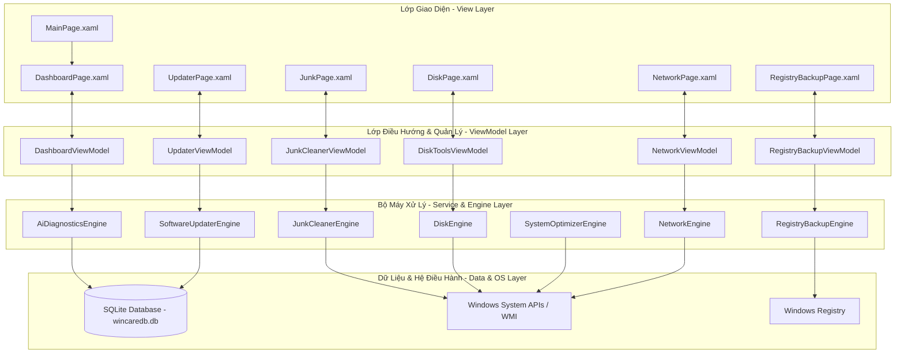

# 🚀 WinCare Pro Suite

<div align="center">
  

  <h3>Hệ Thống Tối Ưu Hóa, Dọn Dẹp & Sửa Lỗi Windows Toàn Diện</h3>
  <p align="center">
    Một bộ công cụ tối ưu hóa máy tính mã nguồn mở, gọn nhẹ, hiện đại được xây dựng dựa trên giao diện <b>Fluent Design (WinUI 3 / Windows App SDK)</b> và sức mạnh của <b>.NET 10.0 & SQLite</b>.
  </p>

  <p align="center">
    <a href="https://github.com/Nguyen-Trung-Tien/WinCarePro/releases/download/v3.3.1/WinCareProSetup.exe"></a>
  </p>

  <p align="center">
    
    
    
    
    
  </p>
</div>

---

## 📖 Tổng quan dự án

**WinCare Pro** là một bộ công cụ bảo trì hệ thống nâng cao, cung cấp bảng điều khiển (Dashboard) thông minh giúp chẩn đoán sức khỏe phần cứng, quản lý tài nguyên hệ thống, sửa lỗi phân mảnh/bảo mật và làm sạch dung lượng lưu trữ Windows. 

Ứng dụng hướng đến việc mang lại trải nghiệm Fluent Design nguyên bản của Windows 11 — mượt mà, trực quan, hỗ trợ chế độ Dark Mode tối ưu và tích hợp các công nghệ phần mềm mới nhất của hệ sinh thái Microsoft.

---

## 📐 Kiến trúc & Mô hình hoạt động

Dự án tuân thủ nghiêm ngặt mô hình thiết kế **MVVM (Model-View-ViewModel)** giúp phân tách rõ ràng giao diện, logic xử lý và cơ sở dữ liệu.



---

## ✨ Phân hệ & Các tính năng nổi bật của Hệ thống

Hệ thống WinCare Pro được chia thành 14 phân hệ chức năng chuyên nghiệp, giúp bảo trì và tối ưu hệ thống một cách toàn diện:

### 1. 📊 Bảng điều khiển (Dashboard)
* **Chỉ số thời gian thực:** Theo dõi biểu đồ và tỷ lệ phần trăm sử dụng CPU, dung lượng RAM khả dụng, cùng hoạt động đọc/ghi của các ổ đĩa.
* **Điểm sức khỏe AI (Composite Health Score):** Thu thập thông số hệ thống tự động, tính toán điểm số tổng quan (0 - 100) và đưa ra các khuyến nghị tối ưu thông minh.

### 2. 🧹 Dọn rác hệ thống (Junk Cleaner)
* **Lõi quét chuyên sâu:** Dọn dẹp an toàn tệp tin tạm (System Temp), Nhật ký hệ thống (Log files), tệp lỗi bộ nhớ (Memory Dumps), bộ nhớ đệm cập nhật và các tệp tin tạm thời của trình duyệt.
* **Trực quan hóa:** Hiển thị biểu đồ hình tròn (Pie Chart) phân tích tỷ lệ dung lượng của từng nhóm rác.

### 3. 🔌 Quản lý Driver (Driver Updater)
* **Quét Driver phần cứng:** Tự động nhận diện thiết bị phần cứng thiếu driver hoặc cần cập nhật firmware.
* **Driver Wizard:** Quy trình thuật sĩ 3 bước khép kín giúp quét, tải xuống gói nhị phân và cài đặt driver an toàn.

### 4. 💻 Thông tin phần cứng (Hardware Info)
* **Chi tiết cấu hình:** Hiển thị thông số kỹ thuật đầy đủ của CPU (nhân/luồng, xung nhịp), card màn hình (GPU), bộ nhớ RAM, Bo mạch chủ (Mainboard), BIOS và phiên bản Windows đang chạy.

### 5. 🚀 Trình gỡ ứng dụng (App Uninstaller)
* **Gỡ cài đặt hàng loạt (Batch Uninstall):** Chọn và gỡ bỏ đồng thời nhiều ứng dụng cùng lúc.
* **Gỡ cài đặt cưỡng bức (Force Uninstall):** Gỡ bỏ triệt để các ứng dụng Windows Store cứng đầu thông qua lệnh PowerShell ngầm.
* **Quét dọn tàn dư (Leftovers Purger):** Tự động truy quét Registry và các thư mục ứng dụng để xóa bỏ các tập tin/khóa rác còn sót lại.

### 6. ⚙️ Sửa lỗi hệ thống (System Repair)
* **Tích hợp công cụ gốc:** Chạy trực tiếp trình kiểm tra tệp tin hệ thống SFC (`sfc /scannow`) và công cụ sửa lỗi ảnh hệ thống DISM (`DISM /Online /Cleanup-Image /RestoreHealth`).
* **Tiến trình trực quan:** Phân tách luồng xử lý và hiển thị phần trăm hoàn thành cụ thể cho từng giai đoạn chẩn đoán.

### 7. 🛡️ Bảo mật & Quyền riêng tư (Security Center)
* **Giám sát bảo mật:** Kiểm tra trạng thái hoạt động của Windows Defender, Tường lửa (Firewall), và cấp độ kiểm soát tài khoản người dùng UAC.
* **Tinh chỉnh quyền riêng tư:** Cho phép bật/tắt các quyền truy cập máy ảnh, micrô, vị trí và các dịch vụ thu thập dữ liệu ngầm của Windows.

### 8. 🌐 Giám sát mạng (Network Center)
* **Đo lường lưu lượng:** Hiển thị tốc độ Tải xuống (Download) và Tải lên (Upload) tức thời qua biểu đồ đường động thời gian thực.
* **Theo dõi tiến trình:** Thống kê danh sách các phần mềm đang chiếm dụng băng thông mạng nhiều nhất.
* **Chẩn đoán nhanh:** Đo Ping, kiểm tra Packet Loss, giải phóng/làm mới IP và làm sạch bộ nhớ đệm DNS (Flush DNS) chỉ với một cú click chuột.

### 9. 📊 Quản lý tiến trình (Process Manager)
* **Giám sát tài nguyên:** Liệt kê toàn bộ tiến trình đang chạy kèm thông số CPU, RAM, số lượng Threads và Handles.
* **Quản trị tác vụ:** Cho phép đóng băng hoặc dừng cưỡng bức (End Task) các tiến trình bị treo.

### 10. 💾 Sao lưu Registry (Registry Backup)
* **Quét Registry lỗi:** Tìm kiếm các liên kết tệp tin hỏng, lỗi đường dẫn ứng dụng hoặc registry rác.
* **Sao lưu & Khôi phục:** Tạo nhanh các điểm khôi phục (Restore Point) an sau cho Windows Registry để sẵn sàng khôi phục khi gặp sự cố.

### 11. 📂 Quản lý khởi động (Startup Manager)
* **Tăng tốc khởi động:** Liệt kê các phần mềm tự khởi động cùng hệ điều hành, đo lường mức độ tác động và hỗ trợ bật/tắt dễ dàng.
* **Quản lý dịch vụ (Services):** Bật/tắt hoặc thay đổi trạng thái hoạt động của các Windows Services ngầm để giải phóng RAM.

### 12. ⚡ Tinh chỉnh hiệu năng (System Optimizer)
* **Giải phóng RAM (RAM Booster):** Bộ dọn dẹp bộ nhớ vật lý tức thì giúp tăng dung lượng RAM trống cho hệ thống.
* **Tăng tốc Explorer:** Áp dụng các tinh chỉnh dịch vụ để Windows Explorer hoạt động phản hồi nhanh hơn.
* **Game Mode:** Tối ưu hóa cấu hình bộ nhớ đệm và các dịch vụ ngầm khi chơi game.

### 13. 🔄 Cập nhật ứng dụng (Application Updater)
* **Kiểm tra bản cập nhật:** Tự động truy vấn phiên bản mới từ máy chủ hoặc GitHub.
* **Cập nhật tự động:** Hỗ trợ tải về và cài đặt trực tiếp bản cài đặt mới, hỗ trợ cả đường dẫn tệp tin cục bộ (`file:///`) cho phát triển thử nghiệm.

### 14. 🔔 Trung tâm thông báo (Notification Center)
* **Lịch sử hoạt động:** Lưu trữ nhật ký dọn dẹp, tối ưu hóa hệ thống và hiển thị các cảnh báo bảo trì định kỳ cho người dùng.

---

## 🛠️ Công nghệ & Dependencies chính

WinCare Pro sử dụng các thư viện phần mềm hiện đại và ổn định nhất nhằm tối đa hóa hiệu suất hoạt động trên hệ điều hành Windows:

| Thư viện / Công nghệ | Phiên bản | Mô tả |
| :--- | :--- | :--- |
| **.NET SDK** | `10.0` | Nền tảng thực thi cốt lõi của ứng dụng với hiệu năng tối ưu nhất. |
| **Windows App SDK** | `2.2.0` | Thư viện phát triển ứng dụng Windows Client sử dụng WinUI 3. |
| **CommunityToolkit.Mvvm** | `8.2.2` | Bộ công cụ phát triển theo mô hình MVVM chuẩn hóa từ Microsoft. |
| **Microsoft.Data.Sqlite** | `10.0.9` | Trình quản lý cơ sở dữ liệu SQLite cục bộ siêu nhẹ, hiệu năng cao. |
| **System.Management** | `10.0.9` | Cung cấp khả năng truy vấn WMI để trích xuất thông tin phần cứng. |
| **TaskScheduler** | `2.12.2` | Quản lý và lập lịch các tác vụ bảo trì tự động chạy ngầm. |

---

## 📥 Hướng dẫn Tải về & Cài đặt

### Cách 1: Tải bộ cài đặt Setup đóng gói sẵn (Khuyên dùng cho người dùng)
1. **Tải về trực tiếp:** Click vào nút **[Download Latest Release]** màu xanh ở đầu trang README này để tải về file **`WinCareProSetup.exe`**.
2. Chạy file exe vừa tải về để tiến hành cài đặt chương trình (Trình cài đặt yêu cầu quyền Administrator để đăng ký dịch vụ hệ thống).

### Cách 2: Tự biên dịch từ mã nguồn (Dành cho Lập trình viên)

#### **Yêu cầu môi trường:**
* **Hệ điều hành:** Windows 10 (bản dựng 19041 trở lên) hoặc Windows 11.
* **IDE:** Visual Studio 2022 (cài đặt kèm gói *Development cho Máy tính cá nhân với .NET*).
* **SDK:** .NET 10.0 SDK trở lên.

#### **Quy trình biên dịch và khởi chạy bằng CLI:**
1. Clone mã nguồn về máy cục bộ:
   ```bash
   git clone https://github.com/Nguyen-Trung-Tien/WinCarePro.git
   cd WinCarePro
   ```
2. Thực hiện khôi phục các gói NuGet phụ thuộc:
   ```bash
   dotnet restore
   ```
3. Chạy ứng dụng ở chế độ Debug:
   ```bash
   dotnet run
   ```

---

## 📦 Công cụ đóng gói & Phát hành chuyên nghiệp

Dự án cung cấp sẵn hai tập lệnh Batch tự động hóa quy trình đóng gói phần mềm trong thư mục gốc:

### Tập lệnh 1: Đóng gói thành ứng dụng di động (Portable Executable)
* Tên tập lệnh: **`publish.bat`**
* Cách hoạt động: Làm sạch dự án -> Khôi phục NuGet cho nền tảng `win-x64` -> Xuất bản thành 1 file chạy duy nhất đã nén mã thực thi (`PublishSingleFile=true`, `PublishReadyToRun=true`).
* Đầu ra: File đơn lẻ nằm trong thư mục `.\PublishOutput\WinCarePro.exe`. Bạn có thể sao chép tệp này sang bất kỳ máy tính Windows khác để chạy ngay mà không cần cài đặt.

### Tập lệnh 2: Đóng gói thành file cài đặt Setup Installer
* Tên tập lệnh: **`publish_installer.bat`**
* Yêu cầu: Máy tính cần cài đặt sẵn phần mềm **Inno Setup 6**.
* Cách hoạt động: Tự động chạy biên dịch ứng dụng ra thư mục tạm `.\PublishOutputFolder`, sau đó gọi trình biên dịch Inno Setup (`ISCC.exe`) để cấu hình file `setup.iss` và tạo ra bộ cài hoàn chỉnh.
* Đầu ra: File cài đặt Setup chuyên nghiệp nằm tại `.\PublishOutput\WinCareProSetup.exe` (dung lượng khoảng 72 MB do chứa toàn bộ runtime .NET 10.0 tự cấp - Self-Contained).

---

## 📂 Cấu trúc thư mục nguồn của Dự án

Cấu trúc mã nguồn được phân bổ logic như sau:

```text
WinCare/
│
├── Assets/                 # Chứa các tài nguyên đồ họa, hình ảnh và icon ứng dụng
├── Database/               # Tương tác SQLite (DbManager.cs quản lý logs, reports)
├── Engines/                # Bộ máy xử lý logic tính năng lõi (Junk, Disk, AI, Update, v.v.)
├── Models/                 # Định nghĩa các cấu trúc dữ liệu mô hình (DataModels.cs)
├── ViewModels/             # Các lớp liên kết dữ liệu ViewModels kế thừa ViewModelBase
├── Views/                  # Tập hợp các tệp giao diện người dùng XAML và code-behind tương ứng
│
├── App.xaml / App.xaml.cs  # Điểm khởi đầu cấu hình và cấu trúc điều hướng toàn cục
├── MainWindow.xaml / .cs   # Cửa sổ chính hiển thị giao diện ứng dụng
├── WinCarePro.csproj       # File cấu hình cấu trúc dự án và các NuGet Dependencies
├── app.manifest            # Định nghĩa các đặc quyền thực thi của Windows
├── publish.bat             # Batch script để đóng gói ứng dụng di động Portable
├── publish_installer.bat   # Batch script tự động build bộ cài đặt Inno Setup
└── setup.iss               # Kịch bản biên dịch bộ cài đặt Inno Setup
```

---

## 📝 Giấy phép (License) & Đóng góp ý kiến

Dự án được phân phối dưới giấy phép **MIT License**. Bạn hoàn toàn có thể tự do sao chép, sửa đổi, phân phối hoặc sử dụng cho mục đích thương mại với điều kiện giữ nguyên thông báo bản quyền gốc.

Nếu bạn phát hiện lỗi hoặc có bất kỳ ý kiến đóng góp phát triển ứng dụng tốt hơn, vui lòng tạo một **Issue** hoặc gửi **Pull Request** trực tiếp trên kho lưu trữ mã nguồn này. Xem thêm [Nhật ký Phát hành (RELEASE_NOTES.md)](file:///d:/WinCare/RELEASE_NOTES.md) để biết chi tiết các thay đổi trong phiên bản mới nhất v3.3.1.

---
<div align="center">
  <sub>Được phát triển và thiết kế bởi <b>Nguyễn Trung Tiến</b></sub>
</div>
