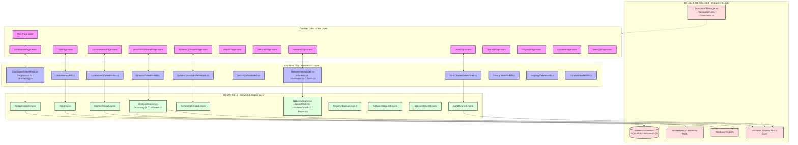

# 🚀 WinCare Pro Suite

<div align="center">
  

  <h3>Hệ Thống Tối Ưu Hóa, Dọn Dẹp & Sửa Lỗi Windows Toàn Diện</h3>
  <p align="center">
    Một bộ công cụ bảo trì máy tính mã nguồn mở, gọn nhẹ, hiện đại được xây dựng dựa trên giao diện <b>Fluent Design (WinUI 3 / Windows App SDK)</b> và sức mạnh của <b>.NET 10.0 & SQLite</b>.
  </p>

  <p align="center">
    <a href="https://github.com/Nguyen-Trung-Tien/WinCarePro/releases/download/v3.4.5/WinCareProSetup.exe">
      
    </a>
  </p>

  <p align="center">
    
    
    
    
    
  </p>
</div>

---

## 📖 Tổng quan dự án

**WinCare Pro** là một bộ ứng dụng chăm sóc hệ điều hành Windows thế hệ mới. Với giao diện Mica trong suốt, hiệu ứng chuyển động mượt mà và thiết kế Fluent Design nguyên bản của Windows 11, WinCare Pro cung cấp giải pháp tất-cả-trong-một giúp chẩn đoán, dọn dẹp, bảo mật, chắp vá hệ thống và giám sát tài nguyên phần cứng theo thời gian thực.

Ứng dụng được thiết kế tối giản nhưng mạnh mẽ, không chứa quảng cáo hay tiến trình chạy ngầm làm chậm máy, mang lại hiệu suất tối đa cho trải nghiệm máy tính của bạn.

---

## 📐 Kiến trúc & Mô hình hoạt động (Modular MVVM)

Mã nguồn của WinCare Pro được tổ chức theo mô hình **MVVM (Model-View-ViewModel)** chuẩn hóa và mô-đun hóa cao. Các tệp dữ liệu dùng chung (Data Models), hệ thống dịch thuật và các lớp điều khiển View/ViewModel lớn đều đã được phân rã thành các tệp phân phần chuyên biệt (partial classes) để tối ưu hóa hiệu năng biên dịch và quản lý mã nguồn.


```mermaid
graph TD
    %% Styling
    classDef ui fill:#f9f,stroke:#333,stroke-width:2px;
    classDef vm fill:#bbf,stroke:#333,stroke-width:2px;
    classDef engine fill:#dfd,stroke:#333,stroke-width:2px;
    classDef data fill:#fdd,stroke:#333,stroke-width:2px;

    subgraph UI [Lớp Giao Diện - View Layer]
        MainPage[MainPage.xaml]:::ui
        DashboardPage[DashboardPage.xaml]:::ui
        JunkPage[JunkPage.xaml]:::ui
        DiskPage[DiskPage.xaml]:::ui
        NetworkPage[NetworkPage.xaml]:::ui
        UninstallPage[Uninstall/UninstallPage.xaml]:::ui
        RepairPage[RepairPage.xaml]:::ui
        SecurityPage[SecurityPage.xaml]:::ui
        OptimizerPage[SystemOptimizerPage.xaml]:::ui
        ContextMenuPage[ContextMenuPage.xaml]:::ui
        StartupPage[StartupPage.xaml]:::ui
        RegistryPage[RegistryPage.xaml]:::ui
        UpdaterPage[UpdaterPage.xaml]:::ui
        SettingsPage[SettingsPage.xaml]:::ui
    end

    subgraph Logic [Lớp Giao Tiếp - ViewModel Layer]
        DashboardVM[DashboardViewModel.cs<br/>.Diagnostics.cs / .Monitoring.cs]:::vm
        JunkVM[JunkCleanerViewModel.cs]:::vm
        DiskVM[DiskViewModel.cs]:::vm
        NetworkVM[NetworkViewModel.cs<br/>.Adapters.cs / .DnsRepair.cs / .Tools.cs]:::vm
        UninstallVM[UninstallViewModel.cs]:::vm
        SecurityVM[SecurityViewModel.cs]:::vm
        OptimizerVM[SystemOptimizerViewModel.cs]:::vm
        ContextMenuVM[ContextMenuViewModel.cs]:::vm
        StartupVM[StartupViewModel.cs]:::vm
        RegistryVM[RegistryViewModel.cs]:::vm
        UpdaterVM[UpdaterViewModel.cs]:::vm
    end

    subgraph CoreEngine [Bộ Máy Xử Lý - Service & Engine Layer]
        AiDiagnostics[AiDiagnosticsEngine]:::engine
        JunkCleaner[JunkCleanerEngine]:::engine
        DiskEngine[DiskEngine]:::engine
        NetEngine[NetworkEngine.cs<br/>.SpeedTest.cs / .DnsBenchmark.cs / .Repair.cs]:::engine
        SysOptimizer[SystemOptimizerEngine]:::engine
        ContextMenuEngine[ContextMenuEngine]:::engine
        RegistryBackup[RegistryBackupEngine]:::engine
        SoftwareUpdater[SoftwareUpdaterEngine]:::engine
        DriverEngine[HardwareDriverEngine]:::engine
        UninstallEngine[UninstallEngine.cs<br/>.Scanning.cs / .Leftovers.cs]:::engine
    end

    subgraph DataOS [Dữ Liệu & Hệ Điều Hành - Data & OS Layer]
        SqliteDB[(SQLite DB - wincaredb.db)]:::data
        WmiHelper[WmiHelper.cs / Windows WMI]:::data
        RegistryStore[Windows Registry]:::data
        WinAPI[Windows System APIs / Shell]:::data
        TranslationMgr[TranslationManager.cs<br/>.Translations.cs / .Extensions.cs]:::data
    end

    %% Connections
    MainPage --> DashboardPage
    DashboardPage <--> DashboardVM
    JunkPage <--> JunkVM
    DiskPage <--> DiskVM
    NetworkPage <--> NetworkVM
    UninstallPage <--> UninstallVM
    OptimizerPage <--> OptimizerVM
    ContextMenuPage <--> ContextMenuVM
    
    DashboardVM --> AiDiagnostics
    JunkVM --> JunkCleaner
    DiskVM --> DiskEngine
    NetworkVM --> NetEngine
    UninstallVM --> UninstallEngine
    OptimizerVM --> SysOptimizer
    ContextMenuVM --> ContextMenuEngine

    AiDiagnostics --> SqliteDB
    JunkCleaner --> WinAPI
    DiskEngine --> WmiHelper
    NetEngine --> WinAPI
    UninstallEngine --> WinAPI & RegistryStore
    ContextMenuEngine --> RegistryStore
    TranslationMgr -.-> UI
```

---

## ✨ 12 Phân hệ chức năng cốt lõi (Core Modules)

WinCare Pro cung cấp 12 công cụ chuyên nghiệp và tiện ích hệ thống được tối ưu hóa cao:

### 1. 📊 Bảng điều khiển (Dashboard)
* **Giám sát thời gian thực:** Theo dõi biểu đồ động đo hiệu suất CPU, RAM, dung lượng đĩa, hoạt động I/O và hiệu năng sử dụng GPU thực tế thời gian thực (qua Performance Counter).
* **Điểm sức khỏe AI (Composite Health Score):** Sử dụng các thuật toán phân tích nhanh để đánh giá tình trạng PC theo thang điểm từ `0` đến `100`, kiểm tra thắt cổ chai CPU (CPU Throttling), đo lường sức khỏe ổ cứng (SSD/HDD Health %) và đề xuất tối ưu.

### 2. 🧹 Dọn rác hệ thống (Junk Cleaner)
* **Lõi quét đa luồng:** Dọn dẹp sạch sẽ các tệp tin rác hệ thống (Temp Files), Nhật ký hoạt động (Logs), Tệp đổ bộ nhớ lỗi (Memory Dumps), và bộ nhớ đệm trình duyệt.
* **Phân tích lưu trữ trực quan:** Hiển thị chi tiết tỷ lệ các nhóm tệp tin rác bằng biểu đồ tròn (Pie Chart) trực quan.

### 3. 🚀 Trình gỡ ứng dụng (App Uninstaller)
* **Gỡ cài đặt hàng loạt (Batch Uninstall):** Hỗ trợ chọn nhiều ứng dụng cùng lúc để gỡ cài đặt tự động.
* **Gỡ cài đặt cưỡng bức (Force Uninstall):** Tự động phát hiện và hiển thị hộp thoại nhắc nhở Force Uninstall khi trình gỡ thông thường bị lỗi, hỗ trợ dọn dẹp triệt để ứng dụng (kể cả Microsoft Store) và tệp rác thừa.
* **Quét dọn tàn dư chuyên sâu:** Tự động phát hiện và xóa bỏ sạch sẽ các khóa Registry thừa, thư mục rác (Leftovers) còn sót lại của ứng dụng với tùy chọn chọn tất cả thông minh.
* **Buộc gỡ ứng dụng UWP:** Gỡ bỏ các ứng dụng Microsoft Store cài sẵn cứng đầu bằng lệnh PowerShell an toàn kèm theo giới hạn thời gian chờ (timeout 30 giây).

### 4. 🌐 Giám sát mạng (Network Center)
* **Theo dõi băng thông:** Biểu đồ đường thời gian thực đo lường chính xác tốc độ Upload và Download.
* **Bảo mật DNS qua HTTPS (DoH):** Tích hợp cấu hình Secure DNS (DoH) trực tiếp từ giao diện hỗ trợ các nhà cung cấp phổ biến (Cloudflare, Google, AdGuard, NextDNS) giúp bảo mật và mã hóa các truy vấn tên miền.
* **Bộ công cụ mạng nâng cao:** Ping Test, Packet Loss check, Flush DNS, Renew IP, Benchmarking DNS và Speed Test. Giao diện co giãn thông minh linh hoạt theo độ phân giải màn hình.

### 5. 🛠️ Sửa lỗi hệ thống (System Repair)
* **Khôi phục tập tin cốt lõi:** Chạy trực tiếp công cụ chẩn đoán hệ thống SFC (`sfc /scannow`) và công cụ sửa lỗi ổ đĩa DISM (`RestoreHealth`).
* **Trực quan hóa & Hoạt động bất đồng bộ:** Hiển thị chi tiết từng bước kiểm tra hệ thống và tiến độ cụ thể. Toàn bộ các tiến trình hệ thống được chạy bất đồng bộ thông qua `ProcessRunner` tránh gây đơ, treo giao diện người dùng.

### 6. 🛡️ Khiên bảo mật (Security Shield)
* **Quản trị bảo mật:** Giám sát trạng thái hoạt động của Windows Defender, Tường lửa (Firewall) và quyền kiểm soát tài khoản người dùng UAC.
* **Bảo vệ quyền riêng tư (Privacy Tweaks):** Cho phép bật/tắt các quyền thu thập dữ liệu ngầm, quyền truy cập Camera/Microphone/Vị trí của ứng dụng.
* **Phím tắt tiện ích hệ thống:** Tích hợp các nút mở nhanh các công cụ quản trị hệ thống Windows chính thức và an toàn bao gồm **Windows Security** (Trình diệt virus), **System Information** (Xem chi tiết phần cứng chuyên sâu qua `msinfo32.exe`), **Windows Update** (Cập nhật driver/hệ thống đã kiểm chứng bởi Microsoft) và **Task Manager** (Quản lý tiến trình nâng cao qua `taskmgr.exe`).

### 7. ⚡ Tinh chỉnh hiệu năng (System Optimizer)
* **Giải phóng RAM vật lý (RAM Booster):** Dọn dẹp Working Sets của các chương trình để giải phóng RAM trống ngay lập tức.
* **Tối ưu hóa hệ thống:** Cấu hình tinh chỉnh Windows Explorer, tăng tốc phản hồi phản hồi ứng dụng và kích hoạt chế độ chơi game (Game Mode).

### 8. 🖱️ Menu chuột phải (Context Menu)
* **Bật/Tắt Menu chuột phải:** Quản lý các mục menu chuột phải hệ thống (ContextMenu) cho các loại All Files, Desktop Background và Folders trực tiếp qua Registry.
* **Nhận diện nâng cao:** Tự động tra cứu và hiển thị tên đầy đủ của các khóa Class ID (CLSID) trong Registry để người dùng dễ kiểm soát.

### 9. 📂 Khởi động & Dịch vụ (Startup & Services)
* **Quản lý khởi động:** Liệt kê các chương trình tự khởi động cùng Windows, đánh giá mức độ ảnh hưởng đến thời gian boot máy và cho phép bật/tắt.
* **Quản trị Services:** Theo dõi và kiểm soát hoạt động của các dịch vụ hệ thống chạy ngầm.

### 10. 💾 Công cụ ổ đĩa (Disk Tools)
* **Sức khỏe ổ đĩa (SMART Info):** Đọc thông số nhiệt độ, tỷ lệ lỗi và tình trạng sức khỏe thực tế của ổ đĩa cứng (SSD/HDD).
* **Phân tích dung lượng (Storage Analyzer):** Quét thư mục bất kỳ để tìm ra các tệp tin và thư mục đang chiếm dụng dung lượng lớn nhất.
* **Tìm tệp trùng lặp (Duplicate Finder):** Tìm kiếm và dọn dẹp các tệp tin bị trùng nội dung giúp giải phóng dung lượng đĩa.

### 11. 🔧 Quản trị Registry (Registry Center)
* **Bảo vệ tính ổn định hệ thống:** Thay vì quét tự động tiềm ẩn nhiều rủi ro lỗi hệ điều hành (tuân theo khuyến cáo của Microsoft), giao diện cung cấp các chỉ dẫn an toàn và hỗ trợ sao lưu Registry tự động cũng như tạo điểm khôi phục nhanh (System Restore Point).
* **Phím tắt công cụ:** Cho phép truy cập trực tiếp vào trình soạn thảo **Registry Editor** (`regedit`) để tự sửa thủ công và **System Restore** (`rstrui`) để khôi phục nhanh khi xảy ra lỗi.

### 12. 🔄 Cập nhật phần mềm (Software Updater)
* **Quản lý ứng dụng bên thứ ba:** Kiểm tra phiên bản mới của các ứng dụng đã cài đặt trên máy.
* **Cập nhật nhanh chóng:** Tải và cài đặt tự động thông qua Windows Package Manager (winget) hoặc liên kết trực tiếp.


## 🔔 Tiện ích hệ thống bổ sung
* **Trung tâm thông báo (Notification Center):** Nơi lưu trữ lịch sử hoạt động bảo trì, dọn dẹp và hiển thị các gợi ý bảo vệ máy tính thời gian thực.
* **Cài đặt & Đa ngôn ngữ (Settings):** Hỗ trợ đổi giao diện Màu Sáng / Tối (Light/Dark Theme), chuyển đổi tức thì giữa **Tiếng Việt** và **Tiếng Anh**, cấu hình tự động cập nhật ngầm.

---

## 🛠️ Công nghệ & Dependencies chính

Ứng dụng được tối ưu hóa sâu với các công nghệ phần mềm mới nhất của Microsoft:

| Thư viện / Công nghệ | Phiên bản | Vai trò trong hệ thống |
| :--- | :--- | :--- |
| **.NET SDK** | `10.0` | Môi trường thực thi thế hệ mới, tối ưu hóa bộ nhớ và tốc độ xử lý. |
| **Windows App SDK** | `2.2.0` | Thư viện WinUI 3 mang lại giao diện Fluent Design mượt mà trên Windows 10/11. |
| **CommunityToolkit.Mvvm** | `8.2.2` | Bộ công cụ chuẩn hóa cấu trúc MVVM, tách biệt giao diện và logic nghiệp vụ. |
| **Microsoft.Data.Sqlite** | `10.0.9` | Cơ sở dữ liệu SQLite cục bộ lưu trữ lịch sử hoạt động gọn nhẹ và an toàn. |
| **System.Management** | `10.0.9` | Truy vấn WMI lấy thông số phần cứng chính xác của máy tính. |
| **TaskScheduler** | `2.12.2` | Đăng ký tác vụ bảo trì tự động với hệ điều hành. |

---

## 📥 Hướng dẫn Cài đặt & Sử dụng

### Cách 1: Sử dụng bộ cài đặt đóng gói sẵn (Khuyên dùng cho người dùng)
1. Truy cập vào phần [Releases](https://github.com/Nguyen-Trung-Tien/WinCarePro/releases) hoặc nhấn nút **Download** ở đầu trang README để tải về file **`WinCareProSetup.exe`**.
2. Mở file exe vừa tải về để bắt đầu cài đặt (Yêu cầu quyền Administrator để cài đặt các dịch vụ hệ thống bổ trợ).

### Cách 2: Tự biên dịch từ mã nguồn (Dành cho nhà phát triển)

#### **Yêu cầu hệ thống:**
* **Hệ điều hành:** Windows 10 (Build 19041 trở lên) hoặc Windows 11.
* **IDE:** Visual Studio 2022 (được tích hợp gói *Desktop development with .NET*).
* **SDK:** .NET 10.0 SDK trở lên.

#### **Các bước biên dịch:**
1. Tải mã nguồn về máy:
   ```bash
   git clone https://github.com/Nguyen-Trung-Tien/WinCarePro.git
   cd WinCarePro
   ```
2. Khôi phục các gói NuGet dependencies:
   ```bash
   dotnet restore
   ```
3. Khởi chạy ứng dụng dưới chế độ Debug:
   ```bash
   dotnet run
   ```

---

## 📦 Công cụ đóng gói & Phát hành chuyên nghiệp

Thư mục gốc chứa các kịch bản tự động hóa quá trình đóng gói và phát hành ứng dụng:

* **Tạo bản Portable (`publish.bat`):** Biên dịch ứng dụng thành một tệp thực thi duy nhất đã được nén và tối ưu hóa (`PublishSingleFile=true`, `PublishReadyToRun=true`). Bản này có thể chạy trực tiếp tại đường dẫn `.\PublishOutput\WinCarePro.exe` (lưu ý: cần sao chép và phân phối cả thư mục `Assets` đi kèm nằm cùng thư mục với file exe để hiển thị đầy đủ biểu tượng và tài nguyên đồ họa).
* **Tạo bộ cài Setup (`publish_installer.bat`):** Sử dụng **Inno Setup 6** kết hợp với kịch bản [setup.iss](file:///d:/WinCare/setup.iss) để đóng gói toàn bộ ứng dụng và runtime tự cấp (Self-contained) thành tệp cài đặt chuyên nghiệp `.\PublishOutput\WinCareProSetup.exe`. Bộ cài hỗ trợ dọn dẹp các tệp tạm thời và thư mục cấu hình trong AppData của ứng dụng khi gỡ cài đặt.

---

## 📂 Cấu trúc thư mục nguồn của Dự án

```text
WinCare/
│
├── Assets/                 # Tài nguyên đồ họa, hình ảnh và icon Fluent của ứng dụng
├── Core/                   # Thư mục cốt lõi chứa các Helpers và mô hình dữ liệu (Models) dùng chung
│   ├── Helpers/            # Các tiện ích hệ thống (như WmiHelper.cs, ProcessRunner.cs, AnimationHelper.cs, ViewModelBase.cs)
│   └── Models/             # Các Data Models phân tách (như ProcessInfo.cs, DriverInfo.cs...)
├── Engines/                # Động cơ xử lý logic cốt lõi (Diagnostics, Monitoring, Optimization, Repair)
├── Infrastructure/         # Xử lý Caching, Database (SQLite), Logging, Scheduling và Security
├── Modules/                # Tập hợp các View (xaml) và ViewModel (cs) phân theo trang chức năng MVVM
├── Services/               # Các dịch vụ hệ thống bổ trợ (Dịch thuật, thông báo, dọn dẹp...)
├── Shared/                 # Các UI Components tùy biến và Converter giao diện dùng chung
│
├── App.xaml / App.xaml.cs  # Điểm khởi chạy cấu hình và thiết lập điều hướng toàn cục
├── MainWindow.xaml / .cs   # Cửa sổ chính chứa khung điều hướng và thanh tiêu đề
├── WinCarePro.csproj       # File cấu hình cấu trúc dự án và các NuGet Dependencies
├── app.manifest            # Tệp cấu hình các đặc quyền bảo mật và thực thi của Windows
├── publish.bat             # Batch script đóng gói ứng dụng di động Portable
├── publish_installer.bat   # Batch script tự động build bộ cài đặt Inno Setup
└── setup.iss               # Kịch bản biên dịch bộ cài đặt Inno Setup
```

---

## 📝 Giấy phép (License) & Đóng góp ý kiến
Nếu bạn phát hiện lỗi hoặc có bất kỳ ý kiến đóng góp phát triển ứng dụng tốt hơn, vui lòng tạo một **Issue** hoặc gửi **Pull Request** trực tiếp trên kho lưu trữ mã nguồn này. Xem thêm [Nhật ký Phát hành (RELEASE_NOTES.md)](file:///d:/WinCare/RELEASE_NOTES.md) để biết chi tiết các thay đổi trong phiên bản mới nhất v3.4.5.

---
<div align="center">
  <sub>Được phát triển và thiết kế bởi <b>Nguyễn Trung Tiến</b></sub>
</div>
