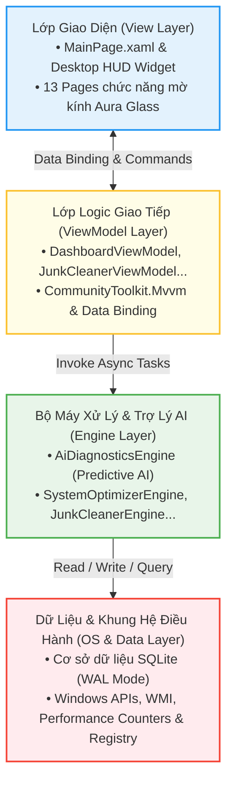

# 🚀 WinCare Pro Suite v4.0.0

<div align="center">
  

  <h3>Hệ Thống Tối Ưu Hóa, Dọn Dẹp & Sửa Lỗi Windows Toàn Diện Thế Hệ Mới</h3>
  <p align="center">
    Một bộ công cụ chăm sóc và bảo trì máy tính mã nguồn mở, gọn nhẹ, hiện đại được xây dựng dựa trên giao diện <b>Aura Glassmorphic Fluent 2.0 (WinUI 3 / Windows App SDK 2.2.0)</b> và sức mạnh tối ưu của <b>.NET 10.0 & SQLite</b>.
  </p>

  <p align="center">
    <a href="https://github.com/Nguyen-Trung-Tien/WinCarePro/releases/download/v4.0.0/WinCareProSetup.exe">
      
    </a>
  </p>

  <p align="center">
    
    
    
    
    
    
  </p>
</div>

---

## 📖 Tổng quan dự án

**WinCare Pro v4.0.0** là giải pháp tối ưu hóa và chăm sóc hệ điều hành Windows thế hệ mới. Sở hữu ngôn ngữ thiết kế **Aura Glassmorphic Fluent 2.0**, hiệu ứng kính mờ Mica/Acrylic cùng tần số chuyển động **120 FPS Visual Composition**, ứng dụng mang lại trải nghiệm thị giác cao cấp và mượt mà tuyệt đối trên Windows 10 và Windows 11.

Không chỉ dọn dẹp và bảo mật thông thường, WinCare Pro v4.0.0 tích hợp **Trợ lý AI Health Copilot Engine** tự động phân tích và dự đoán rủi ro phần cứng, cửa sổ nổi **Desktop HUD Widget** đơn thể (Single-Instance), cùng hệ thống **Hoàn tác Registry (Undo/Rollback System)** an toàn. Ứng dụng hoạt động độc lập, hoàn toàn không chứa quảng cáo hay tiến trình chạy ngầm làm chậm máy.

---

## 📐 Kiến trúc & Mô hình hoạt động (Modular MVVM Architecture)

WinCare Pro được thiết kế chuẩn mực theo mô hình **MVVM (Model-View-ViewModel)** mô-đun hóa cao. Toàn bộ logic nghiệp vụ, các bộ máy quét (Engines), dịch vụ phần cứng và quản lý giao diện đều được phân tách sạch sẽ thành các partial classes và dịch vụ tiêm phụ thuộc (Dependency Injection).


```mermaid
graph TD
    %% Styling
    classDef ui fill:#E3F2FD,stroke:#2196F3,stroke-width:2px;
    classDef vm fill:#FFFDE7,stroke:#FBC02D,stroke-width:2px;
    classDef engine fill:#E8F5E9,stroke:#4CAF50,stroke-width:2px;
    classDef data fill:#FFEBEE,stroke:#F44336,stroke-width:2px;

    UI["Lớp Giao Diện (View Layer)<br/>• MainPage.xaml & Desktop HUD Widget<br/>• 13 Pages chức năng mờ kính Aura Glass"]:::ui
    VM["Lớp Logic Giao Tiếp (ViewModel Layer)<br/>• DashboardViewModel, JunkCleanerViewModel...<br/>• CommunityToolkit.Mvvm & Data Binding"]:::vm
    Engine["Bộ Máy Xử Lý & Trợ Lý AI (Engine Layer)<br/>• AiDiagnosticsEngine (Predictive AI)<br/>• SystemOptimizerEngine, JunkCleanerEngine..."]:::engine
    Data["Dữ Liệu & Khung Hệ Điều Hành (OS & Data Layer)<br/>• Cơ sở dữ liệu SQLite (WAL Mode)<br/>• Windows APIs, WMI, Performance Counters & Registry"]:::data

    UI <--> |Data Binding & Commands| VM
    VM --> |Invoke Async Tasks| Engine
    Engine --> |Read / Write / Query| Data
```

---

## ✨ Các Phân hệ Chức năng Cốt lõi (Core Modules)

WinCare Pro v4.0.0 tích hợp bộ công cụ chuyên nghiệp toàn diện cho Windows:

### 1. 📊 Bảng điều khiển (Dashboard & Live Monitoring)
* **Giám sát tài nguyên 120 FPS:** Theo dõi biểu đồ động thời gian thực về CPU, RAM, GPU, dung lượng ổ đĩa và hoạt động I/O đĩa.
* **Điểm sức khỏe Composite Health Score:** Phân tích tình trạng tổng thể máy tính theo thang điểm `0 - 100`, kiểm tra CPU Throttling, tuổi thọ SSD/HDD và nhiệt độ phần cứng.

### 2. 🤖 Trợ lý AI Health Copilot Engine (Predictive AI Analytics)
* **Dự đoán rủi ro thông minh:** Thuật toán AI phân tích xu hướng tiêu thụ lưu trữ và ước tính số ngày còn lại trước khi ổ C: bị đầy dung lượng.
* **Tối ưu thời gian boot:** Tính toán ước tính số giây khởi động có thể cắt giảm dựa trên các ứng dụng startup và dịch vụ dư thừa.
* **Khuyến nghị phân cấp:** Đưa ra giải pháp khắc phục trực quan theo mức độ nguy cơ (**Critical**, **High**, **Medium**).

### 3. 🪟 Cửa sổ Desktop HUD Widget Đơn Thể (Single-Instance Floating Widget)
* **HUD Nổi Kính mờ:** Cửa sổ mini mờ kính ghim nổi trên góc màn hình (`IsAlwaysOnTop = true`), hiển thị tức thì mức sử dụng CPU, RAM và tốc độ Mạng (Download/Upload).
* **Cơ chế Single-Instance Focus:** Đảm bảo duy nhất 1 cửa sổ HUD chạy trên màn hình, chống hiện tượng đè hoặc trùng lặp cửa sổ.

### 4. 🧹 Dọn rác hệ thống (Junk Cleaner Engine)
* **Quét đa luồng an toàn:** Xóa sạch các tệp tạm (Temp Files), Nhật ký ứng dụng (Logs), Tệp đổ bộ nhớ lỗi (Memory Dumps), và bộ nhớ đệm trình duyệt.
* **Phân tích biểu đồ tròn:** Trực quan hóa tỷ lệ các loại rác lưu trữ bằng biểu đồ tròn sinh động.

### 5. 🚀 Trình gỡ ứng dụng chuyên sâu (App Uninstaller & Force Uninstall)
* **Gỡ cài đặt hàng loạt:** Hỗ trợ chọn và gỡ nhiều phần mềm cùng lúc.
* **Buộc gỡ cài đặt (Force Uninstall):** Xóa sạch tàn dư Registry và thư mục thừa của các ứng dụng bị lỗi trình gỡ mặc định.
* **Gỡ ứng dụng UWP Store:** Gỡ bỏ các ứng dụng Microsoft Store cài sẵn qua PowerShell an toàn với giới hạn timeout 30 giây.

### 6. 🌐 Giám sát Mạng & Secure DNS (Network Center)
* **Biểu đồ băng thông thời gian thực:** Đo tốc độ Download/Upload trực quan.
* **Bộ đo SpeedTest kép (Dual-endpoint):** Kiểm tra chính xác Ping, Download & Upload speed với cơ chế tự động chuyển máy chủ dự phòng.
* **Bảo mật DNS qua HTTPS (DoH):** Tích hợp cấu hình Secure DNS trực tiếp từ UI hỗ trợ Cloudflare, Google, AdGuard và NextDNS.
* **Giao diện Responsive:** Tự động tối ưu bố cục theo mọi độ phân giải màn hình.

### 7. 🛡️ Quản trị Registry & Hệ thống Hoàn tác (Registry Undo System)
* **Cơ chế Rollback an toàn:** Cho phép sao lưu và hoàn tác (Undo) các thay đổi Registry chỉ với 1-Click.
* **Phím tắt an toàn:** Tích hợp nút mở nhanh **Registry Editor** (`regedit`) và **System Restore** (`rstrui`) tạo điểm khôi phục tức thì.

### 8. ⚡ Tinh chỉnh hiệu năng & RAM Booster (System Optimizer)
* **Giải phóng RAM vật lý:** Dọn dẹp Working Set của ứng dụng ngầm để thu hồi bộ nhớ RAM trống ngay lập tức.
* **Gaming Turbo Mode:** Kích hoạt chế độ năng lượng *Ultimate Performance* và ưu tiên tài nguyên CPU cho ứng dụng/game.

### 9. 🛠️ Sửa lỗi hệ thống (System Repair)
* **Công cụ cốt lõi:** Chạy trực tiếp SFC (`sfc /scannow`) và DISM (`RestoreHealth`) khôi phục tệp tin hệ điều hành bị hỏng.
* **Thực thi bất đồng bộ:** Sử dụng `ProcessRunner` đảm bảo giao diện luôn mượt mà không bị treo đơ trong suốt quá trình sửa lỗi.

### 10. 🛡️ Khiên bảo mật (Security Shield)
* **Giám sát an ninh:** Quản lý trạng thái Windows Defender, Firewall và UAC.
* **Bảo vệ riêng tư (Privacy Tweaks):** Cho phép bật/tắt các quyền thu thập dữ liệu ngầm và quyền truy cập Camera/Microphone.
* **Phím tắt Windows Security:** Mở nhanh Trình diệt virus, Trình xem cấu hình `msinfo32` và Task Manager.

### 11. 🖱️ Quản lý Menu chuột phải (Context Menu Manager)
* Cho phép bật/tắt các mục menu chuột phải trong Windows Explorer cho Tệp, Thư mục và Màn hình chính thông qua Registry với tra cứu tên CLSID chính xác.

### 12. 📂 Quản lý Khởi động & Dịch vụ (Startup & Services)
* **Startup Manager:** Đánh giá mức độ ảnh hưởng (Boot Impact Rating) của các chương trình khởi động cùng Windows và cho phép bật/tắt dễ dàng.
* **Services Manager:** Quản lý và kiểm soát trạng thái các dịch vụ hệ thống ngầm.

### 13. 💾 Công cụ ổ đĩa (Disk Tools)
* **Sức khỏe SMART:** Đọc nhiệt độ, tỷ lệ lỗi và tuổi thọ thực tế của ổ SSD/HDD.
* **Storage Analyzer & Duplicate Finder:** Quét cây thư mục tìm tệp chiếm dung lượng lớn và dọn dẹp tệp bị trùng lặp nội dung.

### 14. 🔄 Cập nhật phần mềm (Software Updater Engine)
* Động cơ `SoftwareUpdaterEngine` tự động quét phiên bản mới của các ứng dụng bên thứ ba thông qua **Windows Package Manager (winget)** hoặc tải trực tiếp.

### 15. ⚙️ Cài đặt & Trung tâm thông báo (Settings & Notifications)
* **Đa ngôn ngữ 100%:** Chuyển đổi tức thì giữa **English** và **Tiếng Việt** trên toàn bộ 13 phân hệ trang.
* **Theme Sáng / Tối:** Thay đổi giao diện Light/Dark Mode linh hoạt không bị nháy hình.

---

## 🛠️ Công nghệ & Thư viện sử dụng

Ứng dụng được tối ưu hóa sâu với công nghệ .NET và Windows App SDK mới nhất:

| Thư viện / Công nghệ | Phiên bản | Vai trò trong hệ thống |
| :--- | :--- | :--- |
| **.NET SDK** | `10.0` | Môi trường thực thi tối ưu bộ nhớ và tốc độ xử lý hàng đầu. |
| **Windows App SDK** | `2.2.0` | Thư viện WinUI 3 mang lại giao diện Aura Glassmorphic Fluent 2.0. |
| **CommunityToolkit.Mvvm** | `8.2.2` | Bộ công cụ chuẩn hóa cấu trúc MVVM và liên kết dữ liệu hai chiều. |
| **Microsoft.Data.Sqlite** | `10.0.9` | Cơ sở dữ liệu SQLite cục bộ lưu trữ nhật ký hoạt động chế độ WAL. |
| **System.Management** | `10.0.9` | Truy vấn WMI lấy thông số phần cứng chuyên sâu. |
| **TaskScheduler** | `2.12.2` | Đăng ký tác vụ bảo trì tự động với hệ điều hành. |
| **LiveChartsCore** | `2.0.5` | Biểu đồ theo dõi tài nguyên phần cứng thời gian thực. |

---

## 📥 Hướng dẫn Cài đặt & Biên dịch

### Cách 1: Cài đặt từ Bộ đóng gói (Khuyên dùng)
1. Truy cập trang [Releases](https://github.com/Nguyen-Trung-Tien/WinCarePro/releases) hoặc bấm nút **Download** ở đầu bài để tải tệp **`WinCareProSetup.exe`**.
2. Chạy file cài đặt với quyền Administrator để cài đặt đầy đủ các thành phần hệ thống.

### Cách 2: Tự biên dịch từ mã nguồn (Dành cho Developer)

#### **Yêu cầu môi trường:**
* **Hệ điều hành:** Windows 10 (Build 19041 trở lên) hoặc Windows 11.
* **IDE:** Visual Studio 2022 (tích hợp gói *Desktop development with .NET*).
* **SDK:** .NET 10.0 SDK.

#### **Các bước thực hiện:**
1. Clone mã nguồn:
   ```bash
   git clone https://github.com/Nguyen-Trung-Tien/WinCarePro.git
   cd WinCarePro
   ```
2. Restore các gói NuGet:
   ```bash
   dotnet restore
   ```
3. Khởi chạy ở chế độ Debug:
   ```bash
   dotnet run
   ```

---

## 📦 Script Đóng gói & Phát hành Tự động

* **Bản di động Portable (`publish.bat`):** Biên dịch ứng dụng thành một tệp thực thi duy nhất nén R2R (`PublishSingleFile=true`, `PublishReadyToRun=true`) tại `.\PublishOutput\WinCarePro.exe`.
* **Bộ cài chuyên nghiệp (`publish_installer.bat`):** Sử dụng **Inno Setup 6** với kịch bản [setup.iss](file:///d:/WinCare/setup.iss) để đóng gói toàn bộ runtime .NET 10 tự cấp (Self-contained) thành tệp `.\PublishOutput\WinCareProSetup.exe`.

---

## 📂 Cấu trúc Thư mục Mã Nguồn

```text
WinCare/
│
├── Assets/                 # Tài nguyên logo, biểu tượng Fluent 3D & hình ảnh
├── Core/                   # Lớp cốt lõi chứa Helpers, Models & Base ViewModels
│   ├── Helpers/            # Utilities (WmiHelper, ProcessRunner, AnimationHelper, ViewModelBase...)
│   └── Models/             # Các mô hình dữ liệu (ProcessInfo, DriverInfo, HealthMetrics...)
├── Engines/                # Động cơ xử lý logic (AiDiagnosticsEngine, JunkCleanerEngine, SystemOptimizerEngine...)
├── Infrastructure/         # Quản lý Database SQLite, Cache, Logging & Security
├── Modules/                # Tập hợp các View (XAML) và ViewModel (CS) theo chuẩn MVVM
├── Services/               # Các dịch vụ bổ trợ (TranslationManager, NotificationService...)
├── Shared/                 # Các UI Components tùy biến & Value Converters
│
├── App.xaml / App.xaml.cs  # Điểm khởi chạy & điều hướng toàn cục
├── MainWindow.xaml / .cs   # Cửa sổ chính & khung điều hướng Navigation
├── WinCarePro.csproj       # File cấu hình dự án .NET 10 & NuGet Dependencies
├── publish.bat             # Script đóng gói bản Portable
├── publish_installer.bat   # Script tự động tạo bộ cài đặt Inno Setup
└── setup.iss               # Kịch bản Inno Setup Installer
```

---

## 🏆 Đảm bảo Chất lượng & Kiểm thử (Code Quality & Testing)

* **Trạng thái Biên dịch:** Bản Release win-x64 biên dịch hoàn hảo (`0 Errors, 0 Warnings`).
* **Kết quả Kiểm thử Tự động (Unit Tests):** Đạt tỷ lệ vượt qua **100% (67/67 tests passed)** đối với tất cả các module cốt lõi:
  * Trợ lý AI Health Copilot (`AiDiagnosticsEngine`)
  * Tinh chỉnh RAM & Hệ thống (`SystemOptimizerEngine`)
  * Dọn rác hệ thống (`JunkCleanerEngine`)
  * Trình quản lý khởi động (`StartupEngine`)
  * Tiến trình bất đồng bộ (`ProcessRunner`)
  * Kiểm tra mạng (`NetworkEngine`)
  * Lưu trữ đệm Cài đặt (`SettingsPersistence`)
  * Cơ sở dữ liệu SQLite (`DbManager`)
* **An toàn & Bảo mật:**
  * Thao tác SQLite được parameterized chống SQL Injection.
  * Thuật toán dọn rác bỏ qua các điểm liên kết Symlinks/Junctions bảo vệ dữ liệu cá nhân.
  * Động cơ cập nhật kiểm tra chữ ký số Authenticode tin cậy (`X509Certificate2.Verify()`).

---

## 📝 Giấy phép (License) & Tài liệu Liên quan

Nếu bạn phát hiện lỗi hoặc muốn góp ý phát triển, vui lòng tạo **Issue** hoặc **Pull Request** trên GitHub repository.

> [!NOTE]
> * Để tìm hiểu chi tiết về kiến trúc mã nguồn và tài liệu kỹ thuật, xem **[Tài Liệu Phát Triển (docs/DEVELOPER_GUIDE.md)](file:///d:/WinCare/docs/DEVELOPER_GUIDE.md)**.
> * Xem chi tiết lịch sử phát hành trong **[Nhật ký Phát hành (RELEASE_NOTES.md)](file:///d:/WinCare/RELEASE_NOTES.md)**.

---

<div align="center">
  <sub>Được phát triển và thiết kế bởi <b>Nguyễn Trung Tiến</b></sub>
</div>
