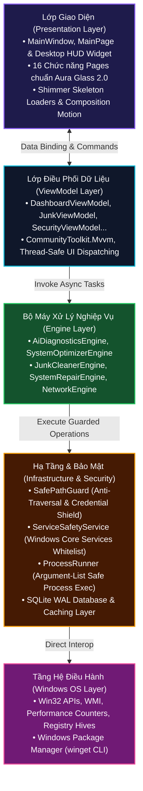

# 🚀 WinCare Pro Suite v4.7 (Codename: Nova)

<div align="center">
  

  <h3>Hệ Thống Tối Ưu Hóa, Dọn Dẹp & Bảo Trì Windows Toàn Diện Thế Hệ Mới</h3>
  <p align="center">
    Bộ công cụ chăm sóc, dọn rác, sửa lỗi và tăng tốc máy tính mã nguồn mở cao cấp được xây dựng trên nền tảng <b>Aura Glassmorphic Fluent 2.0 (WinUI 3 / Windows App SDK 2.2.0)</b> kết hợp sức mạnh vượt trội của <b>.NET 10.0, Windows Composition API & SQLite WAL</b>.
  </p>

  <p align="center">
    <a href="https://github.com/Nguyen-Trung-Tien/WinCarePro/releases/download/v4.7.0/WinCareProSetup.exe">
      
    </a>
  </p>

  <p align="center">
    <a href="https://github.com/Nguyen-Trung-Tien/WinCarePro/actions/workflows/ci.yml">
      
    </a>
    
    
    
    
    
    
    
  </p>
</div>

---

## 📖 Tổng Quan Dự Án

**WinCare Pro v4.7 (Codename: Nova)** là giải pháp tối ưu hóa, chăm sóc và khắc phục sự cố hệ điều hành Windows toàn diện. Với ngôn ngữ thiết kế **Aura Glass 2.0**, hiệu ứng kính mờ Mica/Acrylic, chuyển động mượt mà **Windows Composition 120 FPS**, cùng các trạng thái **Shimmer Skeleton Loading** và **Staggered Entrance Animation**, ứng dụng mang lại trải nghiệm thị giác cao cấp và hiện đại bậc nhất.

Ứng dụng tích hợp **Trợ lý AI WinCare Engine** chẩn đoán Heuristic không gửi dữ liệu ra ngoài, cửa sổ nổi **Desktop HUD Widget**, hệ thống **SafePathGuard** chống rò rỉ dữ liệu, cơ chế **Bảo vệ Dịch vụ Hệ thống (Service Safety Whitelist)**, và khả năng **tự động thu nhỏ RAM nền (< 15MB)** khi chạy ngầm dưới khay hệ thống.

---

## 📐 Kiến Trúc Hệ Thống (Modular MVVM Architecture)

Hệ thống được thiết kế theo mô hình kiến trúc phân lớp chuẩn mực với tính mô-đun hóa cao:


```mermaid
graph TD
    classDef ui fill:#1e1b4b,stroke:#8b5cf6,stroke-width:2px,color:#fff;
    classDef vm fill:#0f172a,stroke:#06b6d4,stroke-width:2px,color:#fff;
    classDef engine fill:#14532d,stroke:#22c55e,stroke-width:2px,color:#fff;
    classDef infra fill:#451a03,stroke:#f59e0b,stroke-width:2px,color:#fff;
    classDef os fill:#701a75,stroke:#ec4899,stroke-width:2px,color:#fff;

    UI["Lớp Giao Diện (Presentation Layer)<br/>• MainWindow, MainPage & Desktop HUD Widget<br/>• 16 Chức năng Pages chuẩn Aura Glass 2.0<br/>• Shimmer Skeleton Loaders & Composition Motion"]:::ui
    VM["Lớp Điều Phối Dữ Liệu (ViewModel Layer)<br/>• DashboardViewModel, JunkViewModel, SecurityViewModel...<br/>• CommunityToolkit.Mvvm, Thread-Safe UI Dispatching"]:::vm
    Engine["Bộ Máy Xử Lý Nghiệp Vụ (Engine Layer)<br/>• AiDiagnosticsEngine, SystemOptimizerEngine<br/>• JunkCleanerEngine, SystemRepairEngine, NetworkEngine"]:::engine
    Infra["Hạ Tầng & Bảo Mật (Infrastructure & Security)<br/>• SafePathGuard (Anti-Traversal & Credential Shield)<br/>• ServiceSafetyService (Windows Core Services Whitelist)<br/>• ProcessRunner (Argument-List Safe Process Exec)<br/>• SQLite WAL Database & Caching Layer"]:::infra
    OS["Tầng Hệ Điều Hành (Windows OS Layer)<br/>• Win32 APIs, WMI, Performance Counters, Registry Hives<br/>• Windows Package Manager (winget CLI)"]:::os

    UI <--> |Data Binding & Commands| VM
    VM --> |Invoke Async Tasks| Engine
    Engine --> |Execute Guarded Operations| Infra
    Infra --> |Direct Interop| OS
```

---

## ✨ 16 Phân Hệ Chức Năng Cốt Lõi (Core Modules)

| STT | Module | Mô tả chi tiết & Điểm nổi bật |
| :--- | :--- | :--- |
| **1** | **📊 Dashboard & Live HUD** | Giám sát CPU/RAM/Disk/Network thời gian thực, điểm sức khỏe máy tính **Composite Health Score**, thẻ HUD chip trên TitleBar hỗ trợ Tabular figures chống giật số. |
| **2** | **🤖 AI WinCare Engine** | Bộ máy chẩn đoán Heuristic phân tích rủi ro phần cứng, dự đoán thời gian đầy ổ C:, phát hiện ứng dụng nghẽn CPU và đề xuất hành động tối ưu hóa 1-Click. |
| **3** | **🧹 Junk Cleaner** | Quét & dọn Temp, Cache, Recycle Bin, Delivery Optimization, Windows Update logs, Memory Dumps kết hợp **SafePathGuard** chống xóa nhầm file hệ thống. |
| **4** | **📦 App Uninstaller** | Gỡ bỏ triệt để ứng dụng Win32 & Microsoft Store (UWP/AppX), quét sâu tàn dư Registry và thư mục sót lại (**Residual Scan & Force Uninstall**). |
| **5** | **🌐 Network Center** | Đo băng thông mạng thời gian thực, kiểm tra Ping/SpeedTest, đổi DNS an toàn 1-Click (Cloudflare, Google, AdGuard, NextDNS), khôi phục Winsock/TCP-IP. |
| **6** | **🛠️ System Repair** | Tích hợp công cụ SFC (`/scannow`), DISM (`RestoreHealth`), sửa lỗi Windows Update và dọn dẹp kho thành phần WinSxS Component Store an toàn. |
| **7** | **🛡️ Security Shield** | Kiểm soát trạng thái Windows Defender, tường lửa Firewall, chính sách UAC, tắt Telemetry ngầm và quản lý quyền riêng tư (Camera, Micro, Location). |
| **8** | **⚡ System Optimizer** | Thu hồi bộ nhớ RAM trống tức thì (`EmptyWorkingSet`), tinh chỉnh hiệu ứng thị giác Visual Effects, tối ưu hóa dịch vụ hệ thống và cấu hình Power Plan. |
| **9** | **🎮 Gaming Turbo** | Tăng tốc độ mượt khi chơi game, tự động ưu tiên CPU High Priority cho tiến trình game, bật Ultimate Performance và tạm dừng các tác vụ nền dư thừa. |
| **10** | **🖱️ Context Menu Manager** | Tùy biến sâu Menu chuột phải cho Tệp, Thư mục và Desktop trên cả Windows 10 & Windows 11 qua Registry an toàn với khả năng hoàn tác. |
| **11** | **📂 Startup & Services** | Phân tích tác động khởi động (Boot Impact), bật/tắt ứng dụng khởi động cùng Windows và kiểm soát các dịch vụ nền với cảnh báo an toàn. |
| **12** | **💾 Disk & Storage Tools** | Đọc dữ liệu sức khỏe ổ cứng S.M.A.R.T (SSD/HDD), biểu đồ phân tích dung lượng cây thư mục và tìm kiếm tệp tin trùng lặp nội dung. |
| **13** | **🧬 Registry Center** | Quét và sửa chữa các khóa Registry lỗi, tối ưu hóa Registry Hive, luôn tự động tạo điểm sao lưu `.reg` trước khi thực hiện thay đổi. |
| **14** | **🔄 Software Updater** | Quét và cập nhật hàng loạt các phần mềm đã cài đặt trên máy tính thông qua Windows Package Manager (`winget CLI`) với chế độ Silent Update. |
| **15** | **🪟 Desktop HUD Widget** | Cửa sổ mini nổi mờ kính ghim trên Desktop (`Single-Instance`), hiển thị trực quan thông số CPU, RAM, Disk và tốc độ Download/Upload. |
| **16** | **⚙️ Settings & System Care** | Đa ngôn ngữ 100% (**Tiếng Việt / English**), Theme Studio chuyển đổi tức thì (Dark/Light/Cyber), bộ lập lịch bảo trì tự động định kỳ. |

---

## 🔒 Tiêu Chuẩn Bảo Mật & Ổn Định (Zero-Bug Security Architecture)

1. **Chống Command Injection Tuyệt Đối:**
   - [ProcessRunner.cs](file:///d:/WinCare/Core/Helpers/ProcessRunner.cs) sử dụng `ProcessStartInfo.ArgumentList` thay vì ghép chuỗi câu lệnh thô (Raw String Concatenation), loại bỏ hoàn toàn nguy cơ chèn mã thực thi độc hại (`&`, `|`, `;`, `powershell -enc`).
2. **Ngăn Chặn Path Traversal & Bảo Vệ Dữ Liệu Cá Nhân:**
   - [SafePathGuard.cs](file:///d:/WinCare/Core/Helpers/SafePathGuard.cs) sở hữu danh sách đen toàn diện chặn xóa thư mục gốc hệ thống (`Windows`, `System32`, `Boot`, `WinSxS`, `System Volume Information`) và bảo vệ các tệp cơ sở dữ liệu đăng nhập nhạy cảm của người dùng (`Login Data`, `Web Data`, `Local State`, `SAM`, `SECURITY`, `SYSTEM`).
   - Tự động bỏ qua các liên kết Reparse Points / Junction Symlinks tránh tấn công liên kết chéo.
3. **Bảo Vệ Dịch Vụ Hệ Thống Cốt Lõi:**
   - [ServiceSafetyService.cs](file:///d:/WinCare/Infrastructure/Security/ServiceSafetyService.cs) duy trì danh sách trắng (Whitelist) bảo vệ các dịch vụ nền thiết yếu (`RpcSs`, `DcomLaunch`, `SamSs`, `gpsvc`, `ProfSvc`, `BFE`, `WinDefend`, `CryptSvc`), ngăn chặn hành vi vô hiệu hóa nhầm làm sập Windows.
4. **An Toàn Luồng Giao Diện (Thread-Safety & Crash Prevention):**
   - 100% các cập nhật giao diện bất đồng bộ được bảo vệ qua `DispatcherQueue.TryEnqueue`, ngăn chặn triệt để hiện tượng Cross-Thread Exception gây crash ứng dụng.

---

## ⚡ Tối Ưu Hiệu Suất & Tiêu Thụ RAM Nền (High Performance)

- **Cơ Chế Thu Gọn RAM Nền (< 15MB):** Khi ứng dụng được thu nhỏ xuống System Tray, phương thức `TrimProcessMemory()` kích hoạt dọn dẹp Working Set (`EmptyWorkingSet`) và thu gom rác thế hệ 2 (`GC.Collect(2)`), giảm mức chiếm dụng bộ nhớ RAM xuống mức tối thiểu.
- **Tốc Độ Khởi Động Tức Thì (Cold Start < 350ms):** Ứng dụng áp dụng cơ chế Lazy-Loading cho toàn bộ 16 ViewModels, chỉ tải tài nguyên khi người dùng điều hướng tới phân hệ tương ứng.
- **Tabular Numerals Telemetry:** Định dạng số liệu `Typography.NumeralAlignment="Tabular"` giữ cho các số liệu CPU, RAM, Network luôn cân bằng, triệt tiêu hiện tượng giật rung bố cục khi cập nhật ở tần số 120 FPS.

---

## 🛠️ Công Nghệ & Thư Viện Sử Dụng

| Thư viện / Công nghệ | Phiên bản | Vai trò trong hệ thống |
| :--- | :--- | :--- |
| **.NET SDK** | `10.0` | Môi trường thực thi thế hệ mới tối ưu bộ nhớ và hiệu năng xử lý. |
| **Windows App SDK** | `2.2.0` | Nền tảng WinUI 3 mang lại giao diện Aura Glassmorphic Fluent 2.0. |
| **CommunityToolkit.Mvvm** | `8.2.2` | Chuẩn hóa cấu trúc MVVM, Command Pattern và Data Binding hai chiều. |
| **Microsoft.Data.Sqlite** | `10.0.9` | Cơ sở dữ liệu SQLite cục bộ lưu trữ nhật ký hoạt động chế độ WAL. |
| **System.Management** | `10.0.9` | Truy vấn WMI lấy thông số phần cứng chuyên sâu. |
| **TaskScheduler** | `2.12.2` | Đăng ký tác vụ bảo trì tự động định kỳ với Windows Task Scheduler. |
| **LiveChartsCore** | `2.0.5` | Biểu đồ theo dõi tài nguyên phần cứng thời gian thực. |

---

## 📥 Hướng Dẫn Cài Đặt & Biên Dịch

### Cách 1: Cài đặt từ Bộ đóng gói (Khuyên dùng)
1. Truy cập trang [Releases](https://github.com/Nguyen-Trung-Tien/WinCarePro/releases) hoặc bấm nút **Download** ở đầu bài để tải tệp **`WinCareProSetup.exe`**.
2. Chạy file cài đặt để tiến hành cài đặt ứng dụng.

### Cách 2: Tự biên dịch từ mã nguồn (Dành cho Developer)

#### **Yêu cầu môi trường:**
* **Hệ điều hành:** Windows 10 (Build 19041 trở lên) hoặc Windows 11.
* **IDE:** Visual Studio 2022 / Visual Studio Code (hỗ trợ .NET 10).
* **SDK:** .NET 10.0 SDK.

#### **Các bước thực hiện:**
```bash
# 1. Clone mã nguồn
git clone https://github.com/Nguyen-Trung-Tien/WinCarePro.git
cd WinCarePro

# 2. Khôi phục các gói phụ thuộc
dotnet restore

# 3. Chạy toàn bộ bộ kiểm thử tự động
dotnet test WinCarePro.Tests

# 4. Khởi chạy ứng dụng ở chế độ Debug
dotnet run
```

---

## 📦 Kịch Bản Đóng Gói & Phát Hành Tự Động

* **Bản di động Portable (`publish.bat`):** Biên dịch thành một tệp thực thi duy nhất nén R2R (`PublishSingleFile=true`, `PublishReadyToRun=true`) tại `.\PublishOutput\WinCarePro.exe`.
* **Bộ cài đặt chuyên nghiệp (`publish_installer.bat`):** Tự động gọi **Inno Setup 6** với kịch bản [setup.iss](file:///d:/WinCare/setup.iss) để đóng gói toàn bộ runtime .NET 10 tự cấp (Self-contained) thành tệp `.\PublishOutput\WinCareProSetup.exe`.

---

## 🏆 Đảm Bảo Chất Lượng & Kết Quả Kiểm Thử (100% Passed)

Toàn bộ **227/227 Unit Tests** trong bộ kiểm thử `WinCarePro.Tests` đều vượt qua thành công:

```text
Test run for WinCarePro.Tests.dll (.NETCoreApp,Version=v10.0)
Passed!  - Failed: 0, Passed: 227, Skipped: 0, Total: 227, Duration: 8 s
```

---

## 📝 Giấy Phép & Đóng Góp

Dự án được phân phối dưới giấy phép mã nguồn mở. Mọi đóng góp, báo cáo lỗi hoặc đề xuất tính năng mới đều được hoan nghênh qua **GitHub Issues** và **Pull Requests**.

> [!NOTE]
> * Xem trọn bộ 11 tài liệu kỹ thuật & kiến trúc tại **[Trung Tâm Tài Liệu (docs/README.md)](file:///d:/WinCare/docs/README.md)**.
> * Xem hướng dẫn bắt đầu nhanh cho lập trình viên tại **[Developer Onboarding (docs/10_DEVELOPER_ONBOARDING_GUIDE.md)](file:///d:/WinCare/docs/10_DEVELOPER_ONBOARDING_GUIDE.md)**.
> * Xem nhật ký thay đổi qua từng phiên bản trong **[Nhật ký Phát hành (RELEASE_NOTES.md)](file:///d:/WinCare/RELEASE_NOTES.md)**.

---

<div align="center">
  <sub>Được phát triển và thiết kế bởi <b>Nguyễn Trung Tiến</b></sub>
</div>
