# 📐 01. Kiến Trúc Tổng Thể Hệ Thống (System Architecture)

> [🏠 Mục Lục Docs](README.md) • **Chương 01** • [Trang Kế Tiếp: 02. Chi Tiết 16 Phân Hệ ➡️](02_CORE_MODULES_DETAILED.md)

Tài liệu này cung cấp cái nhìn chi tiết và chuyên sâu về kiến trúc phần mềm, nguyên lý thiết kế, cơ chế quản lý luồng dữ liệu và Dependency Injection trong **WinCare Pro Suite v4.9 (Codename: Nova)**.

---

## 1. Nguyên Lý Thiết Kế Cốt Lõi (Core Principles)

Dự án WinCare Pro được thiết kế và vận hành theo kim chỉ nam ưu tiên chất lượng:

$$\mathbf{Safety} > \mathbf{Correctness} > \mathbf{Security} > \mathbf{Stability} > \mathbf{Performance} > \mathbf{Maintainability} > \mathbf{UX} > \mathbf{Aesthetics}$$

1. **Zero-Crash UI:** Mọi thao tác tốn thời gian (I/O, quét tệp tin, phân tích tiến trình, gọi API hệ thống) đều chạy ở luồng nền (`Task.Run`) với hỗ trợ `CancellationToken` và cập nhật kết quả lên UI thread thông qua `DispatcherQueue.TryEnqueue`.
2. **Fail-Safe by Default:** Bất kỳ thao tác can thiệp hệ thống nào (sửa Registry, xóa file, tinh chỉnh dịch vụ) đều phải có cơ chế xác thực an toàn (`SafePathGuard`, `SafeRegistryGuard`, `ServiceSafetyService`), sao lưu dự phòng (`RegistryBackupEngine`, `SystemSnapshotService`), và trả về cấu trúc kết quả tường minh `OperationResult<T>`.
3. **Modular MVVM:** Phân rã tối đa các phân hệ giao diện thành các cặp View-ViewModel độc lập, không tham chiếu chéo phụ thuộc, dễ dàng mở rộng và viết unit test.

---

## 2. Mô Hình Phân Tầng (4-Tier Layered Architecture)

```mermaid
graph TD
    classDef ui fill:#1e1b4b,stroke:#8b5cf6,stroke-width:2px,color:#fff;
    classDef vm fill:#0f172a,stroke:#06b6d4,stroke-width:2px,color:#fff;
    classDef engine fill:#14532d,stroke:#22c55e,stroke-width:2px,color:#fff;
    classDef infra fill:#451a03,stroke:#f59e0b,stroke-width:2px,color:#fff;
    classDef os fill:#701a75,stroke:#ec4899,stroke-width:2px,color:#fff;

    subgraph UI_Layer ["1. Presentation Layer (WinUI 3 / XAML)"]
        MainWindow["MainWindow (Mica / TitleBar / Search)"]:::ui
        Pages["16 Feature Pages (Dashboard, Junk, Repair, Security...)"]:::ui
        HUD["Desktop HUD Widget (Layered Window)"]:::ui
        Components["Shared Components & Animations"]:::ui
    end

    subgraph VM_Layer ["2. ViewModel Layer (CommunityToolkit.Mvvm)"]
        VMs["DashboardViewModel, JunkViewModel, SecurityViewModel..."]:::vm
        VMBase["ViewModelBase (Thread-Safe Dispatcher & Property Change)"]:::vm
    end

    subgraph Engine_Layer ["3. Business Engine Layer (Engines/)"]
        DiagEngines["Diagnostics: AiDiagnosticsEngine, ScoringEngine"]:::engine
        OptEngines["Optimization: JunkCleanerEngine, SystemOptimizerEngine, DiskEngine"]:::engine
        MonEngines["Monitoring: NetworkEngine, ProcessService"]:::engine
        RepairEngines["Repair: SecurityPrivacyEngine, SoftwareUpdaterEngine, UninstallEngine"]:::engine
    end

    subgraph Infra_Layer ["4. Infrastructure & Services (Infrastructure/ & Services/)"]
        DbLayer["DbManager (SQLite WAL + Migrations)"]:::infra
        SecLayer["SafePathGuard, SafeRegistryGuard, ServiceSafetyService, CryptoHelper"]:::infra
        Svcs["ThemeService, TranslationService, NotificationService, UndoManager"]:::infra
        LogLayer["AuditLogService, CrashLogger"]:::infra
    end

    subgraph OS_Layer ["5. Windows Operating System Layer"]
        Win32["Win32 APIs (Kernel32, Advapi32, Shell32, Psapi, WinTrust)"]:::os
        WMI["WMI / CIM (Win32_Processor, Win32_DiskDrive, Win32_OperatingSystem)"]:::os
        Reg["Windows Registry Hives (HKLM, HKCU)"]:::os
        Winget["Windows Package Manager (winget CLI)"]:::os
    end

    UI_Layer <--> |Data Binding & RelayCommands| VM_Layer
    VM_Layer --> |Async Tasks & Cancellation| Engine_Layer
    Engine_Layer --> |Guarded Execution & Logging| Infra_Layer
    Infra_Layer --> |Native Interop & CLI| OS_Layer
```



---

## 3. Cơ Chế Quản Lý Phụ Thuộc (Dependency Injection)

Dự án sử dụng thư viện chuẩn `Microsoft.Extensions.DependencyInjection` được cấu hình tại [App.xaml.cs](file:///d:/WinCare/App.xaml.cs).

### 3.1. Vòng đời Dịch vụ (Service Lifetimes)

- **Singleton:** Dành cho các dịch vụ quản lý trạng thái toàn cục và tài nguyên dùng chung:
  - `DbManager`: Đảm bảo một kết nối cơ sở dữ liệu SQLite duy nhất được quản lý khóa đồng bộ.
  - `ThemeManager`, `TranslationManager`, `ISettingsService`: Lưu trữ cấu hình ứng dụng trên toàn bộ phiên làm việc.
  - `NotificationService`, `AuditLogService`, `IconCacheService`: Xử lý thông báo và cache icon bộ nhớ.
  - Các Engine cốt lõi: `AiDiagnosticsEngine`, `JunkCleanerEngine`, `SystemOptimizerEngine`, `NetworkEngine`, `ProcessService`...
- **Transient:** Dành cho các ViewModel và Pages được khởi tạo theo yêu cầu khi người dùng điều hướng qua `NavigationView`.

### 3.2. Cấu Trúc Khởi Tạo trong `App.xaml.cs`

```csharp
private static IServiceProvider ConfigureServices()
{
    var services = new ServiceCollection();

    // 1. Infrastructure Services
    services.AddSingleton<DbManager>();
    services.AddSingleton<AuditLogService>();
    services.AddSingleton<ISettingsService, SettingsService>();
    services.AddSingleton<ThemeManager>();
    services.AddSingleton<TranslationManager>();
    services.AddSingleton<NotificationService>();
    services.AddSingleton<IconCacheService>();

    // 2. Business Logic Engines
    services.AddSingleton<AiDiagnosticsEngine>();
    services.AddSingleton<AiWinCareScoringEngine>();
    services.AddSingleton<JunkCleanerEngine>();
    services.AddSingleton<SystemOptimizerEngine>();
    services.AddSingleton<SystemEngine>();
    services.AddSingleton<NetworkEngine>();
    services.AddSingleton<ProcessService>();
    services.AddSingleton<DiskEngine>();
    services.AddSingleton<StartupEngine>();
    services.AddSingleton<SoftwareUpdaterEngine>();
    services.AddSingleton<UninstallEngine>();
    services.AddSingleton<SecurityPrivacyEngine>();
    services.AddSingleton<ContextMenuEngine>();
    services.AddSingleton<HardwareDriverEngine>();

    // 3. ViewModels (Transient / Singleton)
    services.AddTransient<DashboardViewModel>();
    services.AddTransient<JunkViewModel>();
    services.AddTransient<SystemOptimizerViewModel>();
    services.AddTransient<RepairViewModel>();
    services.AddTransient<SecurityViewModel>();
    // ...

    return services.BuildServiceProvider();
}
```

---

## 4. Mô Thức Xử Lý Kết Quả Chuẩn Hóa (`OperationResult<T>`)

Để loại bỏ hoàn toàn việc ném ngoại lệ không kiểm soát (Unhandled Exceptions) giữa các tầng, tất cả phương thức nghiệp vụ trong tầng Engine và Services đều trả về đối tượng chuẩn hóa [OperationResult.cs](file:///d:/WinCare/Core/Models/OperationResult.cs).

### 4.1. Cấu Trúc `OperationResult`

```csharp
public class OperationResult
{
    public bool Success { get; set; }
    public string Message { get; set; }
    public string ErrorCode { get; set; }
    public Exception Exception { get; set; }

    public static OperationResult Ok(string message = "") => new() { Success = true, Message = message };
    public static OperationResult Fail(string error, Exception ex = null) => new() { Success = false, Message = error, Exception = ex };
}

public class OperationResult<T> : OperationResult
{
    public T Data { get; set; }

    public static OperationResult<T> Ok(T data, string message = "") => new() { Success = true, Data = data, Message = message };
    public new static OperationResult<T> Fail(string error, Exception ex = null) => new() { Success = false, Message = error, Exception = ex };
}
```

### 4.2. Lợi Ích Của Mẫu Thiết Kế Này
- **Tính tự lập (Self-contained):** ViewModel nhận kết quả có thể trực tiếp kiểm tra `result.Success`, hiển thị `result.Message` qua Toast Notification hoặc InfoBar mà không cần bọc `try-catch` lồng nhau.
- **Truy vết lỗi dễ dàng:** Thuộc tính `Exception` và `ErrorCode` tự động được gửi tới `CrashLogger` hoặc `AuditLogService`.

---

## 5. An Toàn Luồng Giao Diện & Vòng Đời Hủy Tác Vụ (Thread-Safety & Cancellation Lifecycle)

### 5.1. Điều Phối Luồng UI An Toàn (`RunOnUI`)
Do ứng dụng WinUI 3 có luồng UI riêng biệt (UI Dispatcher Thread), mọi cập nhật ObservableProperty hoặc CollectionBinding từ Background Thread bắt buộc phải qua `ViewModelBase`:

```csharp
public abstract class ViewModelBase : ObservableObject
{
    protected void RunOnUI(Action action)
    {
        if (App.MainWindow?.DispatcherQueue == null) return;

        if (App.MainWindow.DispatcherQueue.HasThreadAccess)
        {
            action();
        }
        else
        {
            App.MainWindow.DispatcherQueue.TryEnqueue(() => action());
        }
    }
}
```

Nhờ mô hình này, hệ thống ngăn chặn 100% hiện tượng `COMException (0x8001010E: The application called an interface that was marshalled for a different thread)`.

### 5.2. Quản Lý Vòng Đời Bất Đồng Bộ (`CancellationToken`)
Khi người dùng chuyển qua lại giữa các trang trong ứng dụng:
- Các Page triển khai sự kiện chuyển hướng hoặc phương thức dọn dẹp `Cleanup()` trên ViewModel.
- Mỗi ViewModel duy trì một `CancellationTokenSource` cho các tác vụ nền đang chạy (Scan, Clean, Repair, Ping, SpeedTest).
- Khi người dùng điều hướng rời trang hoặc ấn "Hủy", `cts?.Cancel()` được kích hoạt ngay lập tức, ngắt tiến trình nền mà không cập nhật UI sau khi View đã bị gỡ bỏ, triệt tiêu nguy cơ rò rỉ bộ nhớ và xung đột dữ liệu.

---

> [🏠 Mục Lục Docs](README.md) • **Chương 01** • [Trang Kế Tiếp: 02. Chi Tiết 16 Phân Hệ ➡️](02_CORE_MODULES_DETAILED.md)
