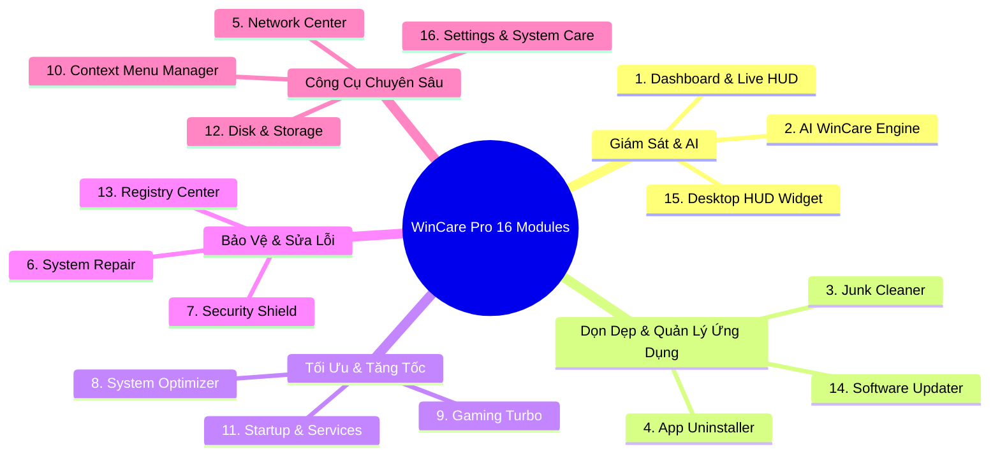

# 🧩 02. Chi Tiết 16 Phân Hệ Chức Năng Cốt Lõi (Core Modules)

Tài liệu này mô tả chi tiết 16 phân hệ tính năng trong **WinCare Pro Suite v4.3.0**, bao gồm giao diện người dùng (View), tầng điều phối (ViewModel), động cơ xử lý (Engine), quyền hạn yêu cầu và mức độ an toàn.

---

## 📋 Danh Sách Phân Hệ

---

## 1. 📊 Phân Hệ Dashboard & Live System HUD

- **Vị trí mã nguồn:** [Modules/Dashboard/DashboardPage.xaml](file:///d:/WinCare/Modules/Dashboard/DashboardPage.xaml), [DashboardViewModel.cs](file:///d:/WinCare/Modules/Dashboard/DashboardViewModel.cs)
- **Engine phụ trách:** `ProcessService`, `AiWinCareScoringEngine`, `SystemEngine`
- **Mục đích:** Cung cấp trung tâm giám sát tài nguyên phần cứng thời gian thực và đánh giá sức khỏe tổng thể.
- **Tính năng nổi bật:**
  - **Live Gauges:** Theo dõi liên tục % sử dụng CPU, RAM, Disk I/O, Tốc độ mạng (Download/Upload).
  - **Composite Health Score (0-100):** Tính toán điểm số từ 4 chỉ số phụ: Mức chiếm dụng RAM, dung lượng rác tích tụ, lỗ hổng bảo mật chưa khắc phục và tiến trình khởi động ngầm.
  - **TitleBar HUD Chip:** Thanh thông số mini ghim trên tiêu đề cửa sổ chính, hỗ trợ thuộc tính số Tabular Figures giúp ngăn chặn giật số khi cập nhật mỗi giây.
  - **Biểu đồ lịch sử tài nguyên:** Trực quan hóa biến thiên CPU và RAM trong 60 giây gần nhất.
- **Mức độ an toàn:** 100% An toàn (Chỉ đọc thông số hệ thống).

---

## 2. 🤖 Phân Hệ Trợ Lý Chẩn Đoán AI (AI WinCare Engine)

- **Vị trí mã nguồn:** [Modules/AiAssistant/AiAssistantPage.xaml](file:///d:/WinCare/Modules/AiAssistant/AiAssistantPage.xaml), [AiAssistantViewModel.cs](file:///d:/WinCare/Modules/AiAssistant/AiAssistantViewModel.cs)
- **Engine phụ trách:** [AiDiagnosticsEngine.cs](file:///d:/WinCare/Engines/Diagnostics/AiDiagnosticsEngine.cs), [PredictiveAnalysisEngine.cs](file:///d:/WinCare/Engines/Diagnostics/PredictiveAnalysisEngine.cs)
- **Mục đích:** Bộ máy chẩn đoán Heuristic nội bộ, phân tích các rủi ro hệ thống mà không gửi bất kỳ dữ liệu riêng tư nào ra ngoài internet.
- **Tính năng nổi bật:**
  - **Chẩn đoán 1-Click (Run AI Diagnostics):** Quét song song 8 khía cạnh hệ thống (Hardware, Memory, Storage, Security, Network, Boot, Residuals, Services).
  - **Dự đoán thông minh (Predictive Analysis):** Ước tính số ngày còn lại trước khi ổ cài Windows (`C:`) bị đầy dung lượng dựa trên tốc độ ghi tệp trung bình.
  - **Phát hiện tiến trình bất thường (Anomalous Process Detection):** Nhận diện các tiến trình chiếm dụng CPU bất thường (> 80% trong thời gian dài).
  - **Đề xuất hành động khắc phục tự động (Actionable Insights):** Người dùng có thể nhấn nút thực thi ngay từng khuyến nghị được AI đưa ra.
- **Mức độ an toàn:** 100% An toàn.

---

## 3. 🧹 Phân Hệ Dọn Dẹp Rác & Tệp Tạm (Junk Cleaner)

- **Vị trí mã nguồn:** [Modules/JunkCleaner/JunkCleanerPage.xaml](file:///d:/WinCare/Modules/JunkCleaner/JunkCleanerPage.xaml), [JunkViewModel.cs](file:///d:/WinCare/Modules/JunkCleaner/JunkViewModel.cs)
- **Engine phụ trách:** [JunkCleanerEngine.cs](file:///d:/WinCare/Engines/Optimization/JunkCleanerEngine.cs), [SafePathGuard.cs](file:///d:/WinCare/Core/Helpers/SafePathGuard.cs)
- **Mục đích:** Quét sâu và dọn sạch các tệp rác, tệp đệm dư thừa tích tụ nhằm giải phóng dung lượng đĩa.
- **Phạm vi dọn dẹp:**
  - **Hệ thống Windows:** `%TEMP%`, `C:\Windows\Temp`, `Prefetch`, Windows Error Reporting (`WER`), Memory Dumps (`*.dmp`), Thùng rác (Recycle Bin), Delivery Optimization files.
  - **Trình duyệt Web:** Google Chrome, Microsoft Edge, Mozilla Firefox, Brave, Opera (Dọn Cache, Shader Cache, Cookies nếu chọn).
  - **Ứng dụng bên thứ ba:** Discord Cache, Spotify Storage Cache, Adobe Temp files, Visual Studio Temp & Package Cache.
- **Cơ chế an toàn:** Bắt buộc lọc qua `SafePathGuard.IsSafeToDelete()`. Tự động bỏ qua các tệp đang bị khóa bởi tiến trình khác (`LockingAppService`) mà không làm crash ứng dụng.
- **Mức độ an toàn:** Rất an toàn.

---

## 4. 📦 Phân Hệ Gỡ Bỏ Ứng Dụng Triệt Để (App Uninstaller)

- **Vị trí mã nguồn:** [Modules/Uninstall/UninstallPage.xaml](file:///d:/WinCare/Modules/Uninstall/UninstallPage.xaml), [UninstallViewModel.cs](file:///d:/WinCare/Modules/Uninstall/UninstallViewModel.cs)
- **Engine phụ trách:** [UninstallEngine.cs](file:///d:/WinCare/Engines/Repair/UninstallEngine.cs), [UninstallEngine.Scanning.cs](file:///d:/WinCare/Engines/Repair/UninstallEngine.Scanning.cs), [UninstallEngine.Leftovers.cs](file:///d:/WinCare/Engines/Repair/UninstallEngine.Leftovers.cs)
- **Mục đích:** Gỡ cài đặt tận gốc ứng dụng Desktop Win32 và Microsoft Store (UWP/AppX), dọn sạch tàn dư tệp tin và Registry.
- **Tính năng nổi bật:**
  - **Quét ứng dụng kép:** Đọc từ Registry (`HKLM/HKCU Uninstall keys`) và Windows Package Manager (`PackageManager` COM API).
  - **Quét tàn dư sâu (Residual Leftover Scan):** Sau khi trình gỡ cài đặt gốc kết thúc, quét toàn bộ thư mục `AppData\Local`, `AppData\Roaming`, `ProgramData` và Registry Hives để phát hiện khóa sót lại.
  - **Force Uninstall (Gỡ ép buộc):** Xóa trực tiếp thư mục và Registry của các ứng dụng bị hỏng bộ gỡ cài đặt.
- **Mức độ an toàn:** Cao (Có hộp thoại xác nhận danh sách tàn dư trước khi xóa).

---

## 5. 🌐 Phân Hệ Trung Tâm Mạng (Network Center)

- **Vị trí mã nguồn:** [Modules/Network/NetworkPage.xaml](file:///d:/WinCare/Modules/Network/NetworkPage.xaml), [NetworkViewModel.cs](file:///d:/WinCare/Modules/Network/NetworkViewModel.cs)
- **Engine phụ trách:** [NetworkEngine.cs](file:///d:/WinCare/Engines/Monitoring/NetworkEngine.cs), [NetworkEngine.SpeedTest.cs](file:///d:/WinCare/Engines/Monitoring/NetworkEngine.SpeedTest.cs), [NetworkEngine.DnsBenchmark.cs](file:///d:/WinCare/Engines/Monitoring/NetworkEngine.DnsBenchmark.cs), [NetworkEngine.Repair.cs](file:///d:/WinCare/Engines/Monitoring/NetworkEngine.Repair.cs)
- **Mục đích:** Kiểm tra tốc độ mạng, tối ưu cấu hình DNS và sửa chữa kết nối mạng.
- **Tính năng nổi bật:**
  - **SpeedTest & Ping Test:** Đo độ trễ (Latency/Jitter), tốc độ tải xuống (Download) và tải lên (Upload).
  - **DNS Switcher & Benchmark:** Đổi máy chủ DNS 1-Click sang Cloudflare (1.1.1.1), Google (8.8.8.8), Quad9, AdGuard (chặn quảng cáo), NextDNS. Có công cụ Benchmark đo tốc độ phản hồi của từng DNS server.
  - **Network Repair Stack:** Thực thi reset toàn bộ mạng (Flush DNS, Reset Winsock Catalog, Reset TCP/IP Stack, Release/Renew DHCP IP).
- **Mức độ an toàn:** Rất an toàn (Yêu cầu quyền Administrator khi đổi DNS / Reset Network).

---

## 6. 🛠️ Phân Hệ Trung Tâm Sửa Lỗi Windows (System Repair)

- **Vị trí mã nguồn:** [Modules/Repair/RepairPage.xaml](file:///d:/WinCare/Modules/Repair/RepairPage.xaml), [RepairViewModel.cs](file:///d:/WinCare/Modules/Repair/RepairViewModel.cs)
- **Engine phụ trách:** [SystemEngine.cs](file:///d:/WinCare/Engines/Diagnostics/SystemEngine.cs), [SmartFixService.cs](file:///d:/WinCare/Services/Implementations/SmartFixService.cs)
- **Mục đích:** Tích hợp bộ công cụ sửa chữa lỗi tệp hệ thống, kho linh kiện Windows và các dịch vụ cơ bản.
- **Tính năng nổi bật:**
  - **SFC Scan (`sfc /scannow`):** Quét và tự động thay thế các file hệ thống Windows bị hỏng bằng bản sao chuẩn.
  - **DISM Health Restore (`DISM.exe /Online /Cleanup-Image /RestoreHealth`):** Khôi phục kho linh kiện hệ thống (Component Store).
  - **WinSxS Component Cleanup (`/StartComponentCleanup /ResetBase`):** Dọn dẹp kho cập nhật cũ để giải phóng gigabyte dung lượng.
  - **Windows Update Repair:** Tự động tắt dịch vụ `wuauserv`, `bits`, `cryptsvc`, xóa cache `%windir%\SoftwareDistribution` và khởi động lại.
  - **Smart Fix 1-Click:** Tự động phát hiện lỗi và sửa chữa theo chuỗi kịch bản an toàn.
- **Mức độ an toàn:** Chuẩn Microsoft (Yêu cầu quyền Administrator).

---

## 7. 🛡️ Phân Hệ Khiên Bảo Vệ & Quyền Riêng Tư (Security Shield)

- **Vị trí mã nguồn:** [Modules/Security/SecurityPage.xaml](file:///d:/WinCare/Modules/Security/SecurityPage.xaml), [SecurityViewModel.cs](file:///d:/WinCare/Modules/Security/SecurityViewModel.cs)
- **Engine phụ trách:** [SecurityPrivacyEngine.cs](file:///d:/WinCare/Engines/Repair/SecurityPrivacyEngine.cs)
- **Mục đích:** Giám sát trạng thái an ninh, chống gián điệp (Anti-Spyware) và bảo vệ quyền riêng tư người dùng.
- **Tính năng nổi bật:**
  - **Kiểm soát Bảo Mật Windows:** Theo dõi trạng thái Windows Defender Real-Time Protection, Firewall, User Account Control (UAC).
  - **Tắt Telemetry & Thu Thập Dữ Liệu Ngầm:** Vô hiệu hóa Diagnostic Data Tracking, Cortana tracking, Advertising ID.
  - **Quản lý Quyền Ứng Dụng (App Permissions):** Kiểm soát quyền truy cập Camera, Microphone, Vị trí địa lý (Location) của các ứng dụng Windows.
  - **Kiểm tra Chữ Ký Số Tệp Tin (WinTrust Digital Signature):** Kiểm tra tính hợp lệ chữ ký số của bất kỳ tệp thực thi nào.
- **Mức độ an toàn:** Cao.

---

## 8. ⚡ Phân Hệ Tinh Chỉnh & Tối Ưu Hệ Thống (System Optimizer)

- **Vị trí mã nguồn:** [Modules/SystemOptimizer/SystemOptimizerPage.xaml](file:///d:/WinCare/Modules/SystemOptimizer/SystemOptimizerPage.xaml), [SystemOptimizerViewModel.cs](file:///d:/WinCare/Modules/SystemOptimizer/SystemOptimizerViewModel.cs)
- **Engine phụ trách:** [SystemOptimizerEngine.cs](file:///d:/WinCare/Engines/Optimization/SystemOptimizerEngine.cs)
- **Mục đích:** Tối ưu hóa cấu hình Windows để giảm độ trễ (Latency), tăng tốc độ phản hồi và tiết kiệm tài nguyên.
- **Tính năng nổi bật:**
  - **RAM Booster Instant Flush (`EmptyWorkingSet`):** Thu hồi bộ nhớ RAM không sử dụng của các tiến trình nền ngay lập tức.
  - **Visual Effects Tuning:** Bật/tắt các hiệu ứng bóng mờ, animation rườm rà để tăng tốc máy tính cấu hình yếu.
  - **System Tweaks:** Tinh chỉnh Registry tối ưu hóa Network Throttling Index, SystemResponsiveness, MenuShowDelay.
  - **Service Optimizer:** Đặt chế độ Manual/Disabled cho các dịch vụ thừa (Windows Search Indexer, Fax, Telemetry) mà vẫn đảm bảo danh sách trắng an toàn.
- **Mức độ an toàn:** Rất an toàn (Tự động hỗ trợ Backup trước khi sửa).

---

## 9. 🎮 Phân Hệ Tăng Tốc Trò Chơi (Gaming Turbo 2.0)

- **Vị trí mã nguồn:** [Modules/GamingTurbo/GamingTurboPage.xaml](file:///d:/WinCare/Modules/GamingTurbo/GamingTurboPage.xaml), [GamingTurboViewModel.cs](file:///d:/WinCare/Modules/GamingTurbo/GamingTurboViewModel.cs)
- **Engine phụ trách:** [SystemOptimizerEngine.cs](file:///d:/WinCare/Engines/Optimization/SystemOptimizerEngine.cs), [ProcessService.cs](file:///d:/WinCare/Engines/Monitoring/ProcessService.cs)
- **Mục đích:** Chuyển hệ thống sang chế độ hiệu năng tối đa khi chơi game hoặc chạy ứng dụng đồ họa nặng.
- **Tính năng nổi bật:**
  - **Ultimate Performance Mode:** Tự động kích hoạt Power Plan hiệu năng cao nhất của Windows.
  - **Auto CPU Priority:** Tự động phát hiện tệp thực thi Game và gán độ ưu tiên CPU `High Priority` / `Real-Time (I/O)`.
  - **Tạm dừng dịch vụ nền không cần thiết (Background Task Throttling):** Giảm xung đột tài nguyên CPU/RAM trong suốt phiên chơi game.
  - **Game Booster Toggle:** 1-Click bật/tắt toàn bộ chế độ Gaming Turbo và khôi phục trạng thái cũ khi thoát game.
- **Mức độ an toàn:** 100% An toàn.

---

## 10. 🖱️ Phân Hệ Quản Lý Menu Chuột Phải (Context Menu Manager)

- **Vị trí mã nguồn:** [Modules/Repair/RepairPage.xaml](file:///d:/WinCare/Modules/Repair/RepairPage.xaml) (Tab Context Menu)
- **Engine phụ trách:** [ContextMenuEngine.cs](file:///d:/WinCare/Engines/Repair/ContextMenuEngine.cs)
- **Mục đích:** Quản lý, ẩn/hiện hoặc xóa các mục không cần thiết trong Menu chuột phải (Context Menu) trên Windows 10 & 11.
- **Tính năng nổi bật:**
  - **Hỗ trợ đầy đủ các vị trí:** Menu Tệp tin (`*`), Menu Thư mục (`Directory`, `Folder`), Menu Màn hình chính (`DesktopBackground`).
  - **Hỗ trợ Windows 11 Classic vs Modern Menu:** Chuyển đổi nhanh giữa Menu chuột phải đầy đủ kiểu cổ điển (Windows 10 style) và Menu hiện đại của Windows 11.
  - **Sao lưu & Hoàn tác:** Luôn lưu lại cấu hình cũ trước khi sửa đổi khóa Registry.
- **Mức độ an toàn:** Rất an toàn.

---

## 11. 📂 Phân Hệ Quản Lý Khởi Động & Dịch Vụ (Startup & Services)

- **Vị trí mã nguồn:** [Modules/StartupManager/StartupPage.xaml](file:///d:/WinCare/Modules/StartupManager/StartupPage.xaml), [StartupViewModel.cs](file:///d:/WinCare/Modules/StartupManager/StartupViewModel.cs)
- **Engine phụ trách:** [StartupEngine.cs](file:///d:/WinCare/Engines/Optimization/StartupEngine.cs), [ServiceSafetyService.cs](file:///d:/WinCare/Infrastructure/Security/ServiceSafetyService.cs)
- **Mục đích:** Quản lý các ứng dụng tự khởi động cùng hệ thống và các dịch vụ nền Windows (Windows Services & Scheduled Tasks).
- **Tính năng nổi bật:**
  - **Đánh giá tác động khởi động (Boot Impact):** Phân loại mức độ ảnh hưởng (High, Medium, Low) đến thời gian khởi động máy tính.
  - **Hỗ trợ nhiều nguồn khởi động:** Đọc từ `HKLM/HKCU Run`, `Startup Folder`, và `Task Scheduler`.
  - **Bảo vệ dịch vụ hệ thống:** [ServiceSafetyService.cs](file:///d:/WinCare/Infrastructure/Security/ServiceSafetyService.cs) tự động khóa và cảnh báo nếu người dùng cố ý vô hiệu hóa các dịch vụ tối quan trọng (`RpcSs`, `WinDefend`, `CryptSvc`, `DcomLaunch`...).
- **Mức độ an toàn:** Cao.

---

## 12. 💾 Phân Hệ Quản Lý Ổ Đĩa & Lưu Trữ (Disk & Storage Tools)

- **Vị trí mã nguồn:** [Modules/Disk/DiskPage.xaml](file:///d:/WinCare/Modules/Disk/DiskPage.xaml), [DiskViewModel.cs](file:///d:/WinCare/Modules/Disk/DiskViewModel.cs)
- **Engine phụ trách:** [DiskEngine.cs](file:///d:/WinCare/Engines/Optimization/DiskEngine.cs)
- **Mục đích:** Đọc thông tin sức khỏe ổ đĩa, phân tích cây dung lượng và tìm kiếm tệp tin trùng lặp.
- **Tính năng nổi bật:**
  - **S.M.A.R.T Health Check:** Đọc nhiệt độ ổ cứng, số giờ hoạt động (Power-On Hours), tỷ lệ lỗi đọc ghi của SSD và HDD qua WMI / P-Invoke.
  - **Disk Space Tree Analyzer:** Quét và hiển thị biểu đồ cây thư mục chiếm dung lượng lớn nhất.
  - **Duplicate Files Finder:** Tìm tệp trùng lặp dựa trên so sánh dung lượng kết hợp mã băm SHA-256 nhanh (Fast-Hash Byte Checking).
- **Mức độ an toàn:** 100% An toàn.

---

## 13. 🧬 Phân Hệ Trung Tâm Registry (Registry Center)

- **Vị trí mã nguồn:** [Modules/Registry/RegistryPage.xaml](file:///d:/WinCare/Modules/Registry/RegistryPage.xaml), [RegistryViewModel.cs](file:///d:/WinCare/Modules/Registry/RegistryViewModel.cs)
- **Engine phụ trách:** [RegistryBackupEngine.cs](file:///d:/WinCare/Engines/Repair/RegistryBackupEngine.cs)
- **Mục đích:** Quét, sửa các khóa Registry không hợp lệ và quản lý các bản sao lưu Registry.
- **Tính năng nổi bật:**
  - **Quét lỗi Registry:** Phát hiện đường dẫn ứng dụng bị mất (`Missing App Paths`), DLL dùng chung bị thiếu (`Missing Shared DLLs`), File Associations không hợp lệ, MUI Cache rác.
  - **Tự động sao lưu trước khi dọn:** Mọi thao tác sửa chữa đều tự động xuất tệp `.reg` sao lưu vào `%AppData%\WinCarePro\Backups\`.
  - **Khôi phục 1-Click:** Dễ dàng nhập lại bản sao lưu bất kỳ lúc nào để hoàn tác.
- **Mức độ an toàn:** Rất an toàn.

---

## 14. 🔄 Phân Hệ Cập Nhật Phần Mềm Hàng Loạt (Software Updater)

- **Vị trí mã nguồn:** [Modules/Updates/UpdatesPage.xaml](file:///d:/WinCare/Modules/Updates/UpdatesPage.xaml), [UpdatesViewModel.cs](file:///d:/WinCare/Modules/Updates/UpdatesViewModel.cs)
- **Engine phụ trách:** [SoftwareUpdaterEngine.cs](file:///d:/WinCare/Engines/Repair/SoftwareUpdaterEngine.cs)
- **Mục đích:** Tự động quét và cập nhật hàng loạt các phần mềm đang cài đặt trên máy tính lên phiên bản mới nhất.
- **Tính năng nổi bật:**
  - **Tích hợp Windows Package Manager (`winget CLI`):** Quét kho phần mềm chuẩn Microsoft.
  - **Cập nhật im lặng (Silent Batch Update):** Cập nhật từng ứng dụng hoặc toàn bộ danh sách trong chế độ nền mà không cần mở từng cửa sổ cài đặt.
  - **Hiển thị phiên bản trực quan:** So sánh trực quan giữa `Current Version` và `Available Version`.
- **Mức độ an toàn:** 100% An toàn (Tải từ nguồn chính thức của nhà phát triển qua winget repo).

---

## 15. 🪟 Phân Hệ Cửa Sổ Nổi Tiện Ích (Desktop HUD Widget)

- **Vị trí mã nguồn:** [Modules/DesktopWidget/DesktopWidgetWindow.xaml](file:///d:/WinCare/Modules/DesktopWidget/DesktopWidgetWindow.xaml), [DesktopWidgetViewModel.cs](file:///d:/WinCare/Modules/DesktopWidget/DesktopWidgetViewModel.cs)
- **Mục đích:** Cung cấp cửa sổ mini nổi trong suốt trên màn hình chính Desktop giúp người dùng theo dõi hiệu năng mà không cần mở cửa sổ ứng dụng chính.
- **Tính năng nổi bật:**
  - **Single-Instance Enforcement:** Đảm bảo chỉ có duy nhất 1 cửa sổ HUD chạy tại một thời điểm.
  - **Always on Top & Transparent Glass:** Sử dụng P/Invoke Win32 `SetWindowPos`, `WS_EX_LAYERED`, `WS_EX_TOOLWINDOW` để ẩn khỏi Alt+Tab và ghim nổi nhẹ nhàng.
  - **Tiết kiệm tài nguyên:** Tiêu thụ < 15MB RAM và < 0.2% CPU khi chạy nền.
- **Mức độ an toàn:** 100% An toàn.

---

## 16. ⚙️ Phân Hệ Cài Đặt & Chăm Sóc Định Kỳ (Settings & System Care)

- **Vị trí mã nguồn:** [Modules/Settings/SettingsPage.xaml](file:///d:/WinCare/Modules/Settings/SettingsPage.xaml), [SettingsViewModel.cs](file:///d:/WinCare/Modules/Settings/SettingsViewModel.cs), [Modules/Notifications/NotificationsPage.xaml](file:///d:/WinCare/Modules/Notifications/NotificationsPage.xaml)
- **Services phụ trách:** `ThemeManager`, `TranslationManager`, `SettingsService`, `MaintenanceSchedulerService`
- **Mục đích:** Tùy biến trải nghiệm người dùng, ngôn ngữ, giao diện và thiết lập lịch bảo trì tự động.
- **Tính năng nổi bật:**
  - **Đa ngôn ngữ 100% (i18n):** Chuyển đổi tức thì không cần khởi động lại giữa **Tiếng Việt** và **English**.
  - **Theme Studio:** Chọn giữa **Dark Mode**, **Light Mode**, hoặc **Cyberpunk Neon** với màu nhấn Accent Color tùy chỉnh.
  - **Bộ lập lịch bảo trì tự động (Maintenance Scheduler):** Thiết lập tự động dọn rác, tối ưu RAM và quét bảo mật hàng ngày, hàng tuần hoặc khi máy tính ở trạng thái rảnh rỗi (Idle).
  - **Trung tâm thông báo (Notification Center):** Lưu trữ lịch sử thông báo hành động hệ thống.
- **Mức độ an toàn:** 100% An toàn.
