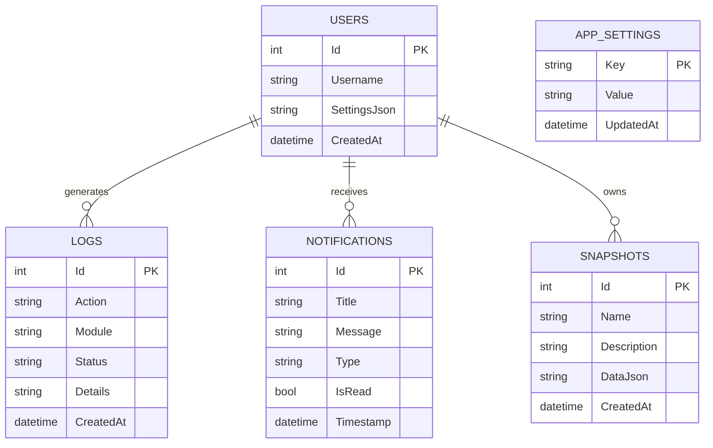

# 💾 04. Cơ Sở Dữ Liệu & Quản Lý Dữ Liệu (Database & Storage)

Tài liệu này trình bày chi tiết về kiến trúc tầng lưu trữ dữ liệu, cấu hình cơ sở dữ liệu SQLite 3, lược đồ bảng (Schema), chiến lược di chuyển (Migration) và mã hóa an toàn trong **WinCare Pro Suite v4.3.0**.

---

## 🗄️ 1. Tổng Quan Tầng Lưu Trữ

WinCare Pro sử dụng cơ sở dữ liệu nhúng **SQLite 3** thông qua gói thư viện chính thức `Microsoft.Data.Sqlite`.

- **Vị trí tệp CSDL:** `%AppData%\WinCarePro\wincaredb.db`
- **Lớp quản lý:** [Infrastructure/Database/DbManager.cs](file:///d:/WinCare/Infrastructure/Database/DbManager.cs)
- **Cơ chế đồng bộ:** Khóa đối tượng `private readonly object _dbLock = new();` đảm bảo an toàn truy cập đa luồng từ các tác vụ nền.

---

## ⚡ 2. Cấu Hình Tối Ưu Hiệu Năng (SQLite PRAGMAs)

Khi khởi tạo kết nối CSDL, `DbManager` tự động thực thi chuỗi câu lệnh PRAGMA nhằm tối ưu hóa tốc độ I/O và tính toàn vẹn:

```sql
-- 1. Kích hoạt chế độ Write-Ahead Logging (Đọc và ghi song song không khóa lẫn nhau)
PRAGMA journal_mode = WAL;

-- 2. Đồng bộ đĩa mức Normal (Tăng tốc độ ghi mà vẫn an toàn khi mất điện đột ngột)
PRAGMA synchronous = NORMAL;

-- 3. Kích hoạt ràng buộc khóa ngoại
PRAGMA foreign_keys = ON;

-- 4. Tăng kích thước bộ nhớ đệm trang lên 8000 trang (~32MB RAM)
PRAGMA cache_size = -8000;

-- 5. Lưu trữ bảng tạm thời trong RAM thay vì ghi xuống đĩa
PRAGMA temp_store = MEMORY;
```

---

## 📊 3. Lược Đồ Cơ Sở Dữ Liệu (Database Schema)

Hệ thống quản lý dữ liệu qua các bảng chính sau:



### 3.1. Bảng `Users`
Lưu trữ hồ sơ cấu hình và tùy chọn của người dùng Windows hiện tại.

| Cột | Kiểu Dữ Liệu | Thuộc Tính | Diễn Giải |
| :--- | :--- | :--- | :--- |
| `Id` | INTEGER | PRIMARY KEY AUTOINCREMENT | Định danh bản ghi |
| `Username` | TEXT | NOT NULL UNIQUE | Tên tài khoản Windows (`Environment.UserName`) |
| `Settings` | TEXT | NULL | Chuỗi JSON chứa toàn bộ cấu hình cá nhân |
| `CreatedAt` | DATETIME | DEFAULT CURRENT_TIMESTAMP | Thời điểm tạo hồ sơ |

### 3.2. Bảng `Logs` (Audit Activity Logs)
Lưu lại lịch sử tất cả các hành động can thiệp hệ thống phục vụ mục đích kiểm toán và hoàn tác.

| Cột | Kiểu Dữ Liệu | Thuộc Tính | Diễn Giải |
| :--- | :--- | :--- | :--- |
| `Id` | INTEGER | PRIMARY KEY AUTOINCREMENT | Khóa chính |
| `Action` | TEXT | NOT NULL | Tên hành vi (VD: "Flush RAM", "Clean Junk") |
| `Module` | TEXT | NOT NULL | Tên phân hệ thực hiện |
| `Status` | TEXT | NOT NULL | "Success" / "Warning" / "Failed" |
| `Details` | TEXT | NULL | Thông tin chi tiết (dung lượng dọn, khóa xóa) |
| `CreatedAt` | DATETIME | DEFAULT CURRENT_TIMESTAMP | Thời gian thực thi |

*Chỉ mục tối ưu:* `CREATE INDEX idx_logs_module_date ON Logs(Module, CreatedAt DESC);`

### 3.3. Bảng `Notifications`
Lưu trữ thông báo trong Notification Center của ứng dụng.

| Cột | Kiểu Dữ Liệu | Thuộc Tính | Diễn Giải |
| :--- | :--- | :--- | :--- |
| `Id` | INTEGER | PRIMARY KEY AUTOINCREMENT | Khóa chính |
| `Title` | TEXT | NOT NULL | Tiêu đề thông báo |
| `Message` | TEXT | NOT NULL | Nội dung chi tiết |
| `Type` | TEXT | NOT NULL | "Info", "Success", "Warning", "Error" |
| `IsRead` | INTEGER | DEFAULT 0 | Trạng thái đã xem (0: Chưa đọc, 1: Đã đọc) |
| `Timestamp` | DATETIME | DEFAULT CURRENT_TIMESTAMP | Thời gian nhận |

### 3.4. Bảng `Snapshots` (System Snapshots & Rollback)
Lưu trạng thái cấu hình hệ thống trước khi tinh chỉnh để hỗ trợ hoàn tác 1-Click.

| Cột | Kiểu Dữ Liệu | Thuộc Tính | Diễn Giải |
| :--- | :--- | :--- | :--- |
| `Id` | INTEGER | PRIMARY KEY AUTOINCREMENT | Khóa chính |
| `Name` | TEXT | NOT NULL | Tên điểm lưu trạng thái |
| `Description` | TEXT | NULL | Mô tả hành động trước khi lưu |
| `DataJson` | TEXT | NOT NULL | Bản chụp JSON các giá trị Registry & Services cũ |
| `CreatedAt` | DATETIME | DEFAULT CURRENT_TIMESTAMP | Thời điểm tạo |

### 3.5. Bảng `AppSettings`
Lưu trữ các cặp Key-Value cài đặt toàn cục.

| Cột | Kiểu Dữ Liệu | Thuộc Tính | Diễn Giải |
| :--- | :--- | :--- | :--- |
| `Key` | TEXT | PRIMARY KEY | Khóa cấu hình (VD: "Language", "Theme") |
| `Value` | TEXT | NOT NULL | Giá trị tương ứng |
| `UpdatedAt` | DATETIME | DEFAULT CURRENT_TIMESTAMP | Thời điểm cập nhật |

---

## 🔄 4. Chiến Lược Nâng Cấp Schema (`PRAGMA user_version`)

Để đảm bảo tương thích ngược và nâng cấp cơ sở dữ liệu mượt mà khi phát hành phiên bản mới, `DbManager` sử dụng `PRAGMA user_version`:

```csharp
public void ApplyMigrations()
{
    lock (_dbLock)
    {
        using var connection = CreateConnection();
        connection.Open();

        using var cmd = connection.CreateCommand();
        cmd.CommandText = "PRAGMA user_version;";
        var currentVersion = Convert.ToInt32(cmd.ExecuteScalar() ?? 0);

        if (currentVersion < 1)
        {
            MigrateToV1(connection);
            SetDatabaseVersion(connection, 1);
        }
        if (currentVersion < 2)
        {
            MigrateToV2(connection);
            SetDatabaseVersion(connection, 2);
        }
        if (currentVersion < 3)
        {
            MigrateToV3(connection);
            SetDatabaseVersion(connection, 3);
        }
    }
}
```

---

## 🔐 5. Cơ Chế Mã Hóa Dữ Liệu Nhạy Cảm (Windows DPAPI)

Đối với các cài đặt hoặc thông tin nhạy cảm (như mã token, cấu hình nâng cao), hệ thống tích hợp lớp mã hóa [CryptoHelper.cs](file:///d:/WinCare/Infrastructure/Security/CryptoHelper.cs) sử dụng **Windows Data Protection API (DPAPI)**:

```csharp
public static class CryptoHelper
{
    // Mã hóa dữ liệu gắn với tài khoản người dùng hiện tại (CurrentUser Scope)
    public static string Protect(string plainText)
    {
        if (string.IsNullOrEmpty(plainText)) return plainText;
        var plainBytes = Encoding.UTF8.GetBytes(plainText);
        var cipherBytes = ProtectedData.Protect(plainBytes, null, DataProtectionScope.CurrentUser);
        return Convert.ToBase64String(cipherBytes);
    }

    // Giải mã an toàn
    public static string Unprotect(string cipherText)
    {
        if (string.IsNullOrEmpty(cipherText)) return cipherText;
        var cipherBytes = Convert.FromBase64String(cipherText);
        var plainBytes = ProtectedData.Unprotect(cipherBytes, null, DataProtectionScope.CurrentUser);
        return Encoding.UTF8.GetString(plainBytes);
    }
}
```

### Ưu điểm của DPAPI:
1. Không cần lưu trữ khóa mã hóa trong file cấu hình (Khóa được Windows quản lý và bảo vệ theo mật khẩu đăng nhập Windows của user).
2. Tài khoản người dùng khác hoặc phần mềm lạ chạy dưới user khác không thể giải mã dữ liệu này.
