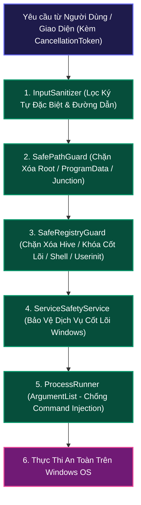

# 🔒 05. Tiêu Chuẩn Bảo Mật & Cơ Chế An Toàn (Security & Safety Architecture)

> [⬅️ 04. CSDL & Lưu Trữ](04_DATABASE_AND_STORAGE.md) • [🏠 Mục Lục Docs](README.md) • **Chương 05** • [Trang Kế Tiếp: 06. Dịch Vụ Nền & Hạ Tầng ➡️](06_SERVICES_AND_INFRASTRUCTURE.md)

WinCare Pro là ứng dụng can thiệp sâu vào hệ điều hành Windows, do đó tiêu chuẩn an toàn **Zero-Bug Hardened** được đặt lên mức ưu tiên cao nhất nhằm loại bỏ triệt để nguy cơ làm hỏng hệ điều hành, rò rỉ dữ liệu hoặc bị lợi dụng tấn công.

---

## 🛡️ 1. Mô Hình Phòng Thủ Đa Tầng (Defense-in-Depth Model)



---

## 🚫 2. Chống Tấn Công Command Injection (`ProcessRunner`)

- **Vị trí tệp:** [Core/Helpers/ProcessRunner.cs](file:///d:/WinCare/Core/Helpers/ProcessRunner.cs)
- **Vấn đề an ninh:** Việc nối chuỗi câu lệnh thô (ví dụ: `cmd.exe /c "tool.exe " + userInput`) có nguy cơ bị tấn công chèn mã (Command Injection) nếu người dùng hoặc tên phần mềm chứa các ký tự điều khiển shell như `&`, `|`, `;`, `powershell -enc`, `&&`.
- **Giải pháp trong WinCare Pro:**
  - Tuyệt đối **không** dùng thuộc tính `Arguments` dạng chuỗi ghép.
  - Sử dụng cấu trúc danh sách tham số phân tách an toàn `ProcessStartInfo.ArgumentList`. Mỗi tham số được hệ điều hành Windows truyền trực tiếp vào mảng `argv` của tiến trình con mà không thông qua trình thông dịch shell trung gian.

```csharp
// Chuẩn bảo mật trong WinCare Pro:
var psi = new ProcessStartInfo
{
    FileName = "winget.exe",
    UseShellExecute = false,
    RedirectStandardOutput = true,
    RedirectStandardError = true,
    CreateNoWindow = true
};
// Thêm từng tham số độc lập vào ArgumentList
psi.ArgumentList.Add("upgrade");
psi.ArgumentList.Add("--id");
psi.ArgumentList.Add(sanitizedPackageId); // An toàn 100% trước ký tự & hoặc |
psi.ArgumentList.Add("--silent");
```

---

## 🛡️ 3. Ngăn Chặn Xóa Nhầm & Bảo Vệ Dữ Liệu Cá Nhân (`SafePathGuard`)

- **Vị trí tệp:** [Core/Helpers/SafePathGuard.cs](file:///d:/WinCare/Core/Helpers/SafePathGuard.cs)
- **Cơ chế bảo vệ đa tầng:**

### 3.1. Danh Sách Đen Thư Mục Hệ Thống Cốt Lõi (System Protected Roots)
Tuyệt đối chặn xóa hoặc can thiệp vào các thư mục:
- `C:\Windows`, `C:\Windows\System32`, `C:\Windows\SysWOW64`
- `C:\Windows\WinSxS` (Chỉ được dọn qua DISM chính thống)
- `C:\Boot`, `C:\Recovery`, `C:\System Volume Information`
- `C:\ProgramData` (Bảo vệ dữ liệu dịch vụ và phần mềm hệ thống)
- `C:\Program Files\Windows Defender`

### 3.2. Bảo Vệ Thư Mục Không Rỗng Khi Xóa Không Đệ Quy
Khi gọi thao tác xóa thư mục với cờ `recursive: false`, `SafePathGuard` xác minh thư mục hoàn toàn rỗng. Nếu còn tệp tin hoặc thư mục con, thao tác lập tức bị từ chối thay vì ném exception hoặc xóa nhầm.

### 3.3. Bảo Vệ Tệp Cơ Sở Dữ Liệu & Thông Tin Đăng Nhập Người Dùng (Credential Shield)
Khi quét dọn tệp rác trình duyệt hoặc ứng dụng, `SafePathGuard` tự động loại trừ các tệp chứa session/cookies/tokens:
- `Login Data`, `Login Data For Account` (Mật khẩu trình duyệt)
- `Web Data` (Dữ liệu tự điền autofill)
- `Cookies`, `Cookies-journal`
- `Local State` (Chứa khóa giải mã DPAPI Master Key của trình duyệt Chromium)
- Tệp SAM, SYSTEM, SECURITY trong `%windir%\System32\config`

### 3.4. Phát Hiện và Bỏ Qua Junction Points / Symlinks
Ngăn chặn kỹ thuật tấn công liên kết chéo (Directory Traversal via Reparse Points):
```csharp
public static bool IsReparsePoint(string path)
{
    var dirInfo = new DirectoryInfo(path);
    return (dirInfo.Attributes & FileAttributes.ReparsePoint) != 0;
}
```
Nếu phát hiện thư mục là Junction Point trỏ tới vị trí khác, động cơ dọn dẹp sẽ lập tức bỏ qua, không xóa đệ quy.

---

## 🧬 4. Phòng Vệ Khóa & Giá Trị Registry Cốt Lõi (`SafeRegistryGuard`)

- **Vị trí tệp:** [Core/Helpers/SafeRegistryGuard.cs](file:///d:/WinCare/Core/Helpers/SafeRegistryGuard.cs)
- **Cơ chế bảo vệ 4 tầng:**

### 4.1. Chặn Xóa Root Hives
Tuyệt đối ngăn chặn xóa các Root Hives:
- `HKEY_LOCAL_MACHINE`, `HKEY_CURRENT_USER`, `HKEY_CLASSES_ROOT`, `HKEY_USERS`, `HKEY_CURRENT_CONFIG`.

### 4.2. Chặn Các Tiền Tố Hệ Thống Sống Còn
Bảo vệ toàn bộ các nhánh khóa then chốt:
- `HKLM\SYSTEM\CurrentControlSet\Control`
- `HKLM\SOFTWARE\Microsoft\Windows NT\CurrentVersion`

### 4.3. Yêu Cầu Độ Sâu Khóa Tối Thiểu (Segment Depth ≥ 3)
Mọi thao tác xóa khóa con Registry phải có độ sâu tối thiểu từ 3 cấp trở lên (ví dụ: `SOFTWARE\Vendor\AppName`), ngăn ngừa xóa nhầm toàn bộ nhánh nhà sản xuất như `SOFTWARE\Microsoft`.

### 4.4. Bảo Vệ Giá Trị Khởi Động Sống Còn
Chặn can thiệp hoặc xóa các giá trị khởi động Windows trọng yếu:
- Giá trị `Shell` (mặc định `explorer.exe`).
- Giá trị `Userinit` (mặc định `userinit.exe`).

---

## ⚙️ 5. Bảo Vệ Dịch Vụ Cốt Lõi Của Windows (`ServiceSafetyService`)

- **Vị trí tệp:** [Infrastructure/Security/ServiceSafetyService.cs](file:///d:/WinCare/Infrastructure/Security/ServiceSafetyService.cs)
- **Vấn đề:** Nếu người dùng hoặc thuật toán dọn dẹp vô tình tắt các dịch vụ nền tối quan trọng, Windows có thể bị màn hình xanh (BSOD), mất mạng hoặc không thể đăng nhập.
- **Danh sách trắng dịch vụ bất khả xâm phạm (System Core Whitelist):**

| Tên Dịch Vụ (ServiceName) | Tên Hiển Thị | Hậu Quả Nếu Bị Vô Hiệu Hóa |
| :--- | :--- | :--- |
| `RpcSs` | Remote Procedure Call | Sập toàn bộ hệ thống Windows |
| `DcomLaunch` | DCOM Server Process Launcher | Không thể mở bất kỳ ứng dụng nào |
| `SamSs` | Security Accounts Manager | Không thể đăng nhập tài khoản |
| `ProfSvc` | User Profile Service | Lỗi nạp hồ sơ người dùng |
| `gpsvc` | Group Policy Client | Lỗi chính sách bảo mật |
| `BFE` | Base Filtering Engine | Tường lửa ngừng hoạt động |
| `WinDefend` | Microsoft Defender Antivirus | Mất lá chắn diệt virus |
| `CryptSvc` | Cryptographic Services | Không thể cài đặt driver và update |
| `EventLog` | Windows Event Log | Mất nhật ký lỗi hệ thống |
| `PlugPlay` | Plug and Play | Lỗi nhận diện thiết bị phần cứng |
| `RpcEptMapper` | RPC Endpoint Mapper | Mất liên lạc giữa các tiến trình hệ thống |

`ServiceSafetyService.IsProtectedService(string serviceName)` sẽ trả về `true` và chặn mọi yêu cầu thay đổi trạng thái của các dịch vụ này.

---

## ⏱️ 6. Vòng Đời Hủy Tác Vụ Bất Đồng Bộ & An Toàn Dispatcher

- **Vị trí:** Tất cả ViewModels kế thừa `ViewModelBase` và các Feature Pages.
- **Cơ chế CancellationToken:**
  - Mọi thao tác I/O, quét Registry, quét tệp rác, ping mạng đều nhận tham số `CancellationToken`.
  - Khi người dùng bấm nút Hủy hoặc rời trang (`Cleanup`), token lập tức kích hoạt hủy bỏ, ngắt vòng lặp an toàn và giải phóng tài nguyên.
- **An toàn UI Dispatcher:**
  - 100% các cập nhật thuộc tính Observable và danh sách ObservableCollection từ luồng nền được bọc qua `DispatcherQueue.TryEnqueue`, ngăn chặn triệt để `COMException (0x8001010E)`.

---

## 🔍 7. Kiểm Tra Chữ Ký Số Tiến Trình (WinTrust API Interop)

- **Vị trí tệp:** [Engines/Repair/SecurityPrivacyEngine.cs](file:///d:/WinCare/Engines/Repair/SecurityPrivacyEngine.cs)
- Hệ thống gọi hàm API Win32 gốc `WinVerifyTrust` từ thư viện `wintrust.dll` để xác thực:
  1. Tệp thực thi (`.exe`, `.dll`, `.sys`) có chứng chỉ số hợp lệ không.
  2. Tệp có bị chỉnh sửa mã nhị phân (Tampered/Corrupted) sau khi ký hay không.
  3. Chứng chỉ có thuộc nhà phát hành đáng tin cậy (Microsoft Corporation, Google, Apple...) hay không.

---

## 🛡️ 8. Quản Lý Quyền Nâng Cao (UAC Elevation & Manifest)

- Ứng dụng khai báo quyền trong [app.manifest](file:///d:/WinCare/app.manifest):
  ```xml
  <requestedExecutionLevel level="requireAdministrator" uiAccess="false" />
  ```
- Đảm bảo toàn bộ quyền can thiệp phần cứng (S.M.A.R.T, SFC, DISM, Registry HKLM, Network Interface Reset) được thực thi mà không gặp lỗi cấp quyền `Access Denied`.

---

> [⬅️ 04. CSDL & Lưu Trữ](04_DATABASE_AND_STORAGE.md) • [🏠 Mục Lục Docs](README.md) • **Chương 05** • [Trang Kế Tiếp: 06. Dịch Vụ Nền & Hạ Tầng ➡️](06_SERVICES_AND_INFRASTRUCTURE.md)
