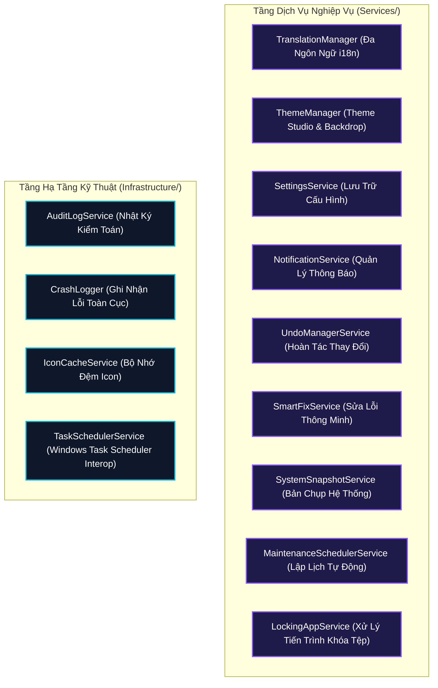

# 🛠️ 06. Tầng Dịch Vụ & Hạ Tầng (Services & Infrastructure)

> [⬅️ 05. Tiêu Chuẩn Bảo Mật & An Toàn](05_SECURITY_AND_SAFETY_ARCHITECTURE.md) • [🏠 Mục Lục Docs](README.md) • **Chương 06** • [Trang Kế Tiếp: 07. Hệ Thống Thiết Kế UI/UX Aura Glass ➡️](07_UI_UX_DESIGN_SYSTEM.md)

Tài liệu này cung cấp chi tiết về các dịch vụ nghiệp vụ nền (`Services/`) và các module hạ tầng kỹ thuật (`Infrastructure/`) trong **WinCare Pro Suite v4.9 (Codename: Nova)**.

---

## 🏗️ Danh Sách Các Dịch Vụ Hệ Thống



---

## 1. 🌐 Dịch Vụ Đa Ngôn Ngữ (`TranslationManager`)

- **Vị trí tệp:** [Services/TranslationService/TranslationManager.cs](file:///d:/WinCare/Services/TranslationService/TranslationManager.cs), [TranslationManager.Translations.cs](file:///d:/WinCare/Services/TranslationService/TranslationManager.Translations.cs)
- **Cơ chế hoạt động:**
  - Hỗ trợ chuyển đổi ngôn ngữ thời gian thực (Hot-swapping) giữa **Tiếng Việt (`vi-VN`)** và **English (`en-US`)** mà không yêu cầu khởi động lại ứng dụng.
  - Sử dụng từ điển tra cứu nhanh `Dictionary<string, Dictionary<string, string>>` được nạp sẵn vào bộ nhớ.
  - Cung cấp phương thức mở rộng [TranslationExtensions.cs](file:///d:/WinCare/Services/TranslationService/TranslationExtensions.cs):
    ```csharp
    public static string Translate(this string key) => TranslationManager.Instance.GetString(key);
    ```
  - Phát sự kiện `LanguageChanged` để các ViewModel và View tự động làm mới chuỗi hiển thị.

---

## 2. 🎨 Dịch Vụ Quản Lý Giao Diện (`ThemeManager`)

- **Vị trí tệp:** [Services/ThemeService/ThemeManager.cs](file:///d:/WinCare/Services/ThemeService/ThemeManager.cs)
- **Tính năng cốt lõi:**
  - **3 Chủ đề giao diện (Themes):** `Dark` (Tối hiện đại), `Light` (Sáng thanh lịch), và `Cyberpunk` (Neon tím-xanh công nghệ cao).
  - **Chất liệu nền (Backdrop Material):** Hỗ trợ `MicaAlt`, `Mica`, và `DesktopAcrylic` thông qua `SystemBackdrop` của Windows App SDK.
  - **Accent Color động:** Cập nhật bảng màu `ResourceDictionary` thời gian thực trên toàn bộ cây giao diện XAML.

---

## 3. ⚙️ Dịch Vụ Lưu Cấu Hình (`SettingsService`)

- **Vị trí tệp:** [Services/SettingsService/SettingsService.cs](file:///d:/WinCare/Services/SettingsService/SettingsService.cs)
- **Mục đích:** Đọc và ghi các tùy chọn người dùng vào bảng `AppSettings` trong CSDL SQLite.
- **Phương thức:**
  - `GetAsync<T>(string key, T defaultValue)`: Đọc giá trị có ép kiểu tự động (Deserialization JSON).
  - `SetAsync<T>(string key, T value)`: Ghi giá trị và kích hoạt thông báo thay đổi cài đặt.

---

## 4. 🔔 Dịch Vụ Quản Lý Thông Báo (`NotificationService`)

- **Vị trí tệp:** `Services/NotificationService/NotificationService.cs`
- **Tính năng:**
  - Lưu lịch sử thông báo vào bảng `Notifications` trong SQLite.
  - Hiển thị Toast Notification trên Windows Action Center hoặc In-App InfoBar tùy theo trạng thái cửa sổ ứng dụng (Active / Minimized to Tray).
  - Cung cấp các mức độ thông báo: `Info`, `Success`, `Warning`, `Error`.

---

## 5. ↩️ Dịch Vụ Quản Lý Hoàn Tác (`UndoManagerService`)

- **Vị trí tệp:** [Services/Implementations/UndoManagerService.cs](file:///d:/WinCare/Services/Implementations/UndoManagerService.cs)
- **Mục đích:** Ghi nhận chuỗi thao tác cấu hình hệ thống (thay đổi Registry, tắt Service, đổi DNS) vào ngăn xếp hoàn tác (Undo Stack).
- **Nguyên tắc:** Mỗi thao tác `ExecuteAction(forwardAction, rollbackAction)` phải đính kèm một `rollbackAction` tương ứng để có thể đảo ngược trạng thái an toàn.

---

## 6. 📸 Dịch Vụ Bản Chụp Hệ Thống (`SystemSnapshotService`)

- **Vị trí tệp:** `Services/SystemSnapshotService/SystemSnapshotService.cs`
- **Mục đích:** Tạo bản chụp toàn diện trạng thái hệ thống (System Snapshot) trước các phiên bảo trì lớn:
  - Sao lưu toàn bộ Registry Tweaks hiện hành.
  - Lưu trạng thái khởi động của tất cả Windows Services.
  - Lưu danh sách Startup Apps.
- Cho phép người dùng chọn một Snapshot bất kỳ trong lịch sử để khôi phục 100% về thời điểm trước đó.

---

## 7. ⏰ Dịch Vụ Lập Lịch Bảo Trì (`MaintenanceSchedulerService`)

- **Vị trí tệp:** `Services/MaintenanceSchedulerService/MaintenanceSchedulerService.cs`
- **Tính năng:**
  - Tích hợp với `TaskSchedulerService` để tạo tác vụ định kỳ trong Windows Task Scheduler (`schtasks.exe`).
  - Hỗ trợ các chu kỳ: **Hàng ngày (Daily)**, **Hàng tuần (Weekly)**, hoặc **Khi máy tính ở chế độ rảnh rỗi (On System Idle)**.
  - Tự động chạy chế độ nền dọn rác, thu hồi RAM và kiểm tra bản cập nhật phần mềm mới.

---

## 8. 🖼️ Bộ Nhớ Đệm Biểu Tượng (`IconCacheService`)

- **Vị trí tệp:** [Infrastructure/Caching/IconCacheService.cs](file:///d:/WinCare/Infrastructure/Caching/IconCacheService.cs)
- **Vấn đề hiệu năng:** Việc trích xuất biểu tượng (`SHGetFileInfo` / `ExtractIconEx`) cho hàng trăm tiến trình và phần mềm trực tiếp từ đĩa cứng gây nghẽn luồng và giật lag giao diện.
- **Giải pháp:**
  - Sử dụng bộ nhớ đệm `ConcurrentDictionary<string, ImageSource>` trong RAM.
  - Chỉ trích xuất icon từ tệp `.exe` lần đầu tiên, các lần truy vấn tiếp theo trả về kết quả ngay lập tức với độ trễ $O(1)$.

---

## 9. 📝 Dịch Vụ Nhật Ký Kiểm Toán & Ghi Nhận Sự Cố (`AuditLogService` & `CrashLogger`)

- **Vị trí tệp:** [Infrastructure/Logging/AuditLogService.cs](file:///d:/WinCare/Infrastructure/Logging/AuditLogService.cs), [Infrastructure/Logging/CrashLogger.cs](file:///d:/WinCare/Infrastructure/Logging/CrashLogger.cs)
- **`AuditLogService`:** Ghi lại mọi hành động dọn dẹp, tối ưu hóa hoặc sửa lỗi vào CSDL SQLite kèm mã lỗi và thời gian chính xác.
- **`CrashLogger`:** Bắt toàn bộ các ngoại lệ chưa được xử lý (`AppDomain.CurrentDomain.UnhandledException` và `TaskScheduler.UnobservedTaskException`), tự động ghi tệp nhật ký `%AppData%\WinCarePro\CrashLogs\crash_YYYYMMDD_HHmmss.log` và tạo bản ghi sự cố để lập trình viên dễ dàng debug.

---

> [⬅️ 05. Tiêu Chuẩn Bảo Mật & An Toàn](05_SECURITY_AND_SAFETY_ARCHITECTURE.md) • [🏠 Mục Lục Docs](README.md) • **Chương 06** • [Trang Kế Tiếp: 07. Hệ Thống Thiết Kế UI/UX Aura Glass ➡️](07_UI_UX_DESIGN_SYSTEM.md)
