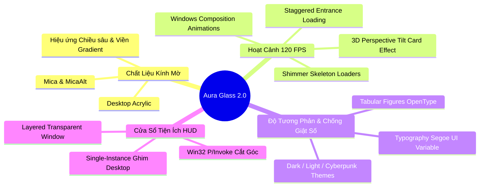

# 🎨 07. Hệ Thống Thiết Kế Giao Diện (Aura Glassmorphic Fluent 2.0)

WinCare Pro Suite v4.3.0 được xây dựng trên hệ thống thiết kế độc quyền **Aura Glassmorphic Fluent 2.0**, kết hợp sức mạnh của **WinUI 3 (Windows App SDK 2.2.0)** và **Windows Composition API** nhằm mang lại trải nghiệm thị giác hiện đại, mượt mà và cao cấp bậc nhất trên hệ điều hành Windows.

---

## 💎 1. Các Trụ Cột Thiết Kế Giao Diện



---

## 🪟 2. Chất Liệu Nền Kính Mờ (Backdrop Materials)

WinCare Pro tích hợp hệ thống Backdrop động tùy biến theo sở thích người dùng và phiên bản Windows:

- **Mica / MicaAlt:** Chất liệu nền độc quyền của Windows 11, hòa trộn tinh tế giữa màu hình nền Desktop của người dùng và bảng màu của ứng dụng mà không tiêu tốn GPU.
- **Desktop Acrylic:** Hiệu ứng làm mờ thấu kính (Gaussian Blur Backdrop) cho trải nghiệm trong suốt xuyên thấu trên cả Windows 10 và Windows 11.
- **Tùy biến tại [MainWindow.Win32.cs](file:///d:/WinCare/MainWindow.Win32.cs):**
  - Tự động fallback về Solid Color nếu hệ thống chạy trên máy ảo hoặc cấu hình GPU không hỗ trợ tăng tốc phần cứng.

---

## ✨ 3. Bộ Hoạt Cảnh Mượt Mà (Motion & Animations)

- **Vị trí tệp:** [Core/Helpers/AnimationHelper.cs](file:///d:/WinCare/Core/Helpers/AnimationHelper.cs), [Core/Helpers/Animation3DHelper.cs](file:///d:/WinCare/Core/Helpers/Animation3DHelper.cs)

### 3.1. Hiệu Ứng Nghiêng 3D Tương Tác (3D Card Perspective Tilt)
Khi người dùng di chuyển con trỏ chuột lên các thẻ chức năng (Feature Cards) trên Dashboard:
- `Animation3DHelper` tính toán vector độ lệch giữa tâm thẻ và tọa độ chuột $(X, Y)$.
- Áp dụng phép biến đổi không gian `Matrix4x4` hoặc `RotationAngleInDegrees` qua Windows Composition Layer, tạo cảm giác thẻ nghiêng 3D theo góc nhìn người dùng.

### 3.2. Hiệu Ứng Nạp Phân Tầng (Staggered Entrance Animation)
Khi chuyển trang qua `NavigationView`:
- Các phần tử danh sách (Cards, Rows, Charts) không xuất hiện đồng loạt mà xuất hiện so le với độ trễ (Delay) tính bằng mili-giây:
  $$\text{Delay}_i = i \times 40\text{ ms}$$
- Kết hợp `FadeIn` và `SlideIn` từ dưới lên tạo cảm giác chuyển động thanh thoát, nhẹ nhàng.

### 3.3. Trạng Thái Nạp Giả Lập (Shimmer Skeleton Loaders)
- Trong thời gian ứng dụng quét rác hoặc đọc thông tin WMI, các thẻ giao diện hiển thị hiệu ứng ánh sáng quét ngang (Shimmer Wave Effect) thay vì vòng xoay `ProgressRing` đơn điệu, giúp người dùng ước lượng được bố cục dữ liệu sắp xuất hiện.

---

## ⏱️ 4. Chống Giật Số Với Kiểu Số Cố Định (Tabular Figures)

- **Vấn đề:** Khi cập nhật thông số CPU/RAM hoặc Tốc độ mạng mỗi giây, độ rộng của các chữ số thường (`1`, `8`, `0`) là khác nhau trong font chữ tỷ lệ (Proportional Font). Điều này khiến nhãn văn bản bị co giãn liên tục, gây khó chịu cho mắt.
- **Giải pháp trong WinCare Pro:**
  - Áp dụng tính năng OpenType **Tabular Figures** (`tnum`) cho toàn bộ các TextBlock hiển thị số liệu:
  ```xml
  <TextBlock Text="{x:Bind ViewModel.CpuUsageText, Mode=OneWay}"
             FontTypography.NumeralAlignment="Tabular"
             FontFamily="Segoe UI Variable Display" />
  ```
  - Mọi chữ số từ $0$ đến $9$ đều có cùng một bề ngang cố định, đảm bảo thanh HUD chip trên TitleBar luôn ổn định tuyệt đối.

---

## 🪟 5. Kiến Trúc Cửa Sổ Nổi Mini (Desktop HUD Widget)

- **Vị trí tệp:** [Modules/DesktopWidget/DesktopWidgetWindow.xaml](file:///d:/WinCare/Modules/DesktopWidget/DesktopWidgetWindow.xaml)
- **Kỹ thuật Win32 P/Invoke:**
  1. **Ẩn khỏi thanh Taskbar & Alt+Tab:** Thiết lập kiểu mở rộng `WS_EX_TOOLWINDOW` và loại bỏ `WS_EX_APPWINDOW`.
  2. **Ghim nổi trên cùng (Always on Top):** Gọi hàm `SetWindowPos(hwnd, HWND_TOPMOST, ...)`.
  3. **Kéo thả tự do:** Bắt sự kiện `PointerPressed` trên vùng tiêu đề Widget và gọi `ReleaseCapture` kết hợp `SendMessage(hwnd, WM_NCLBUTTONDOWN, HT_CAPTION, 0)`.
  4. **Single-Instance Safe:** Sử dụng `Mutex` định danh để đảm bảo người dùng chỉ có thể mở duy nhất 1 Widget nổi tại một thời điểm.

---

## 🎨 6. Bảng Màu Theme Studio (Color Palettes)

WinCare Pro cung cấp 3 bộ bảng màu thiết kế theo chuẩn WCAG AAA về độ tương phản:

| Thành Phần | Dark Theme (Mặc định) | Light Theme | Cyberpunk Neon |
| :--- | :--- | :--- | :--- |
| **Màu Nền Chính** | `#0D1117` / `#161B22` | `#F6F8FA` / `#FFFFFF` | `#080114` / `#12072B` |
| **Màu Nhấn (Accent)** | `#7F56D9` (Aura Violet) | `#6941C6` (Royal Purple) | `#00F2FE` & `#FE0979` |
| **Đường Viền Card** | `rgba(255,255,255,0.08)` | `rgba(0,0,0,0.06)` | `rgba(0,242,254,0.3)` |
| **Màu Chữ Tiêu Đề** | `#F0F6FC` | `#1F2328` | `#00F2FE` |
| **Màu Trạng Thái Tốt** | `#2EA043` (Emerald) | `#1A7F37` (Forest Green) | `#00FF9D` (Neon Lime) |
| **Màu Cảnh Báo** | `#D29922` (Amber) | `#9A6700` (Warm Ochre) | `#FFD000` (Bright Yellow)|
| **Màu Nguy Hiểm** | `#F85149` (Coral Red) | `#CF222E` (Crimson) | `#FF0055` (Neon Red) |
