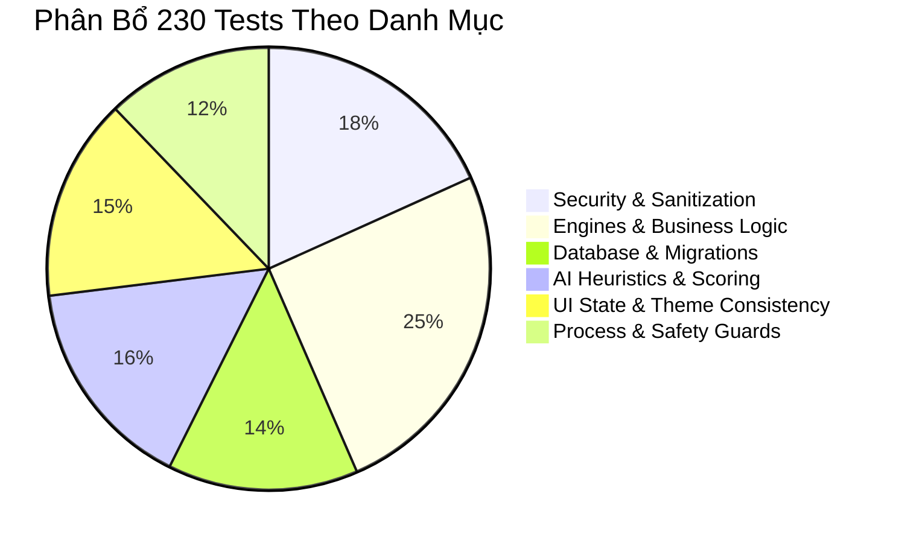

# 🧪 08. Kiểm Thử Tự Động & Đảm Bảo Chất Lượng (QA & Testing)

> [⬅️ 07. Thiết Kế UI/UX Aura Glass](07_UI_UX_DESIGN_SYSTEM.md) • [🏠 Mục Lục Docs](README.md) • **Chương 08** • [Trang Kế Tiếp: 09. Đóng Gói & CI/CD ➡️](09_BUILD_DEPLOYMENT_AND_PACKAGING.md)

Chất lượng phần mềm và độ tin cậy tuyệt đối được đảm bảo thông qua bộ kiểm thử tự động toàn diện trong dự án `WinCarePro.Tests` với **230 bài kiểm thử xUnit đạt tỷ lệ vượt qua 100% (230/230 Passed — Zero-Bug Policy)**.

---

## 📊 1. Tổng Quan Bộ Kiểm Thử (Test Suite Overview)

- **Framework:** `xUnit.net v2`
- **Thư viện Mocking & Assertion:** `Moq`, `FluentAssertions`
- **Môi trường chạy:** Windows 10/11 x64 (.NET 10.0 runtime)
- **Vị trí thư mục:** [WinCarePro.Tests/](file:///d:/WinCare/WinCarePro.Tests/)



---

## 🗂️ 2. Danh Mục Các Lớp Kiểm Thử (Test Classes & Coverage)

| STT | Tập Tin Test | Danh Mục Kiểm Thử | Số Lượng Tests & Mục Tiêu |
| :---: | :--- | :--- | :--- |
| **1** | [SecurityAndSafetyTests.cs](file:///d:/WinCare/WinCarePro.Tests/SecurityAndSafetyTests.cs) | An Toàn & Bảo Vệ | Kiểm thử `SafePathGuard` chặn xóa thư mục hệ điều hành, bỏ qua Junction Points, chặn xóa tệp Credential. |
| **2** | [SecurityAndSanitizationTests.cs](file:///d:/WinCare/WinCarePro.Tests/SecurityAndSanitizationTests.cs) | Chống Injection | Xác thực `InputSanitizer` và `ProcessRunner.ArgumentList` loại bỏ hoàn toàn các chuỗi ký tự tấn công shell. |
| **3** | [DbManagerRegressionTests.cs](file:///d:/WinCare/WinCarePro.Tests/DbManagerRegressionTests.cs) | Cơ Sở Dữ Liệu | Kiểm thử nâng cấp migration `PRAGMA user_version`, kiểm thử khóa đồng bộ đa luồng `_dbLock`. |
| **4** | [DbAndReportTests.cs](file:///d:/WinCare/WinCarePro.Tests/DbAndReportTests.cs) | Lưu Trữ & Lịch Sử | Kiểm tra ghi/đọc bảng `Logs`, `Users`, `Notifications` và các truy vấn tổng hợp báo cáo. |
| **5** | [AiDiagnosticsEngineTests.cs](file:///d:/WinCare/WinCarePro.Tests/AiDiagnosticsEngineTests.cs) | Thuật Toán AI | Đánh giá tính chính xác của 8 luồng quét Heuristic và khả năng phân loại mức độ nghiêm trọng. |
| **6** | [AiWinCareEngineTests.cs](file:///d:/WinCare/WinCarePro.Tests/AiWinCareEngineTests.cs) | Chấm Điểm Sức Khỏe | Kiểm thử công thức tính điểm `Composite Health Score` (0-100) với các trường hợp biên (Edge Cases). |
| **7** | [DriverBackupAndAiForecastingTests.cs](file:///d:/WinCare/WinCarePro.Tests/DriverBackupAndAiForecastingTests.cs) | Dự Báo & Driver | Kiểm thử thuật toán ngoại suy số ngày đầy ổ đĩa và logic xuất danh sách Driver. |
| **8** | [JunkCleanerEngineTests.cs](file:///d:/WinCare/WinCarePro.Tests/JunkCleanerEngineTests.cs) | Dọn Dẹp Rác | Kiểm tra tính toán dung lượng tệp rác, bỏ qua file đang bị khóa mà không làm dừng tiến trình quét. |
| **9** | [SystemOptimizerEngineTests.cs](file:///d:/WinCare/WinCarePro.Tests/SystemOptimizerEngineTests.cs) | Tối Ưu RAM & Tweak | Kiểm thử gọi Win32 `EmptyWorkingSet`, cấu hình Registry DWORD an toàn. |
| **10** | [SystemRepairTests.cs](file:///d:/WinCare/WinCarePro.Tests/SystemRepairTests.cs) | Sửa Lỗi Windows | Kiểm thử chuỗi lệnh SFC, DISM và cơ chế bắt mã trả về `ExitCode`. |
| **11** | [NetworkCenterEngineTests.cs](file:///d:/WinCare/WinCarePro.Tests/NetworkCenterEngineTests.cs) | Mạng & DNS | Kiểm thử đo Ping, phân giải IP DNS Benchmark và chuỗi lệnh Reset Network Stack. |
| **12** | [UninstallEngineTests.cs](file:///d:/WinCare/WinCarePro.Tests/UninstallEngineTests.cs) | Gỡ Phần Mềm | Kiểm tra phân tích tàn dư thư mục và khóa Registry mồ côi. |
| **13** | [CryptoHelperTests.cs](file:///d:/WinCare/WinCarePro.Tests/CryptoHelperTests.cs) | Mã Hóa DPAPI | Kiểm thử tính đối xứng mã hóa `Protect` và giải mã `Unprotect`. |
| **14** | [UiThemeAndConsistencyTests.cs](file:///d:/WinCare/WinCarePro.Tests/UiThemeAndConsistencyTests.cs) | Giao Diện & i18n | Kiểm tra tính nhất quán của từ điển dịch thuật ngữ Anh-Việt (Không bị thiếu Key dịch). |

---

## 🚀 3. Hướng Dẫn Chạy Kiểm Thử (Executing Tests)

### 3.1. Chạy Toàn Bộ Bộ Kiểm Thử qua .NET CLI

Mở PowerShell tại thư mục gốc của dự án và thực thi lệnh:

```powershell
dotnet test WinCarePro.Tests/WinCarePro.Tests.csproj --verbosity normal
```

### 3.2. Chạy Theo Từng Nhóm Kiểm Thử Cụ Thể

- **Chạy nhóm kiểm thử bảo mật:**
  ```powershell
  dotnet test WinCarePro.Tests/WinCarePro.Tests.csproj --filter "FullyQualifiedName~Security"
  ```

- **Chạy nhóm kiểm thử cơ sở dữ liệu:**
  ```powershell
  dotnet test WinCarePro.Tests/WinCarePro.Tests.csproj --filter "FullyQualifiedName~Db"
  ```

- **Chạy và xuất báo cáo kết quả:**
  ```powershell
  dotnet test WinCarePro.Tests/WinCarePro.Tests.csproj --logger "trx;LogFileName=TestResults.trx"
  ```

---

## 🛡️ 4. Quy Chuẩn Đảm Bảo An Toàn Cho Từng Bài Test

1. **Isolation & In-Memory Database:** Các bài test CSDL sử dụng cơ sở dữ liệu tạm thời trong RAM (`Data Source=:memory:`) hoặc file SQLite độc lập trong thư mục `TestTemp/`, tự động xóa sạch sau khi bài test hoàn tất.
2. **Mocking External OS Calls:** Các lệnh có khả năng can thiệp hệ thống thật (như `sfc /scannow`, `EmptyWorkingSet`, `KillProcess`) được mock hoặc bọc trong môi trường kiểm thử an toàn, không làm thay đổi trạng thái máy của lập trình viên.
3. **Assertive Invariants:** Luôn kiểm tra các giá trị biên (chuỗi rỗng, đường dẫn null, ký tự đặc biệt nguy hiểm, số âm) để đảm bảo không xảy ra hiện tượng ngoại lệ `NullReferenceException` hoặc `ArgumentException`.

---

> [⬅️ 07. Thiết Kế UI/UX Aura Glass](07_UI_UX_DESIGN_SYSTEM.md) • [🏠 Mục Lục Docs](README.md) • **Chương 08** • [Trang Kế Tiếp: 09. Đóng Gói & CI/CD ➡️](09_BUILD_DEPLOYMENT_AND_PACKAGING.md)
