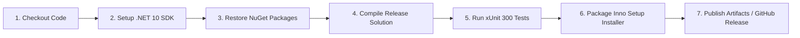

# 📦 09. Đóng Gói, Triển Khai & Cập Nhật Tự Động (Build, Packaging & CI/CD)

> [⬅️ 08. Kiểm Thử Tự Động & QA](08_TESTING_AND_QUALITY_ASSURANCE.md) • [🏠 Mục Lục Docs](README.md) • **Chương 09** • [Trang Kế Tiếp: 10. Hướng Dẫn Lập Trình Viên Mới ➡️](10_DEVELOPER_ONBOARDING_GUIDE.md)

Tài liệu này hướng dẫn quy trình biên dịch mã nguồn, xuất bản bản phát hành (Publish), đóng gói bộ cài đặt cài qua **Inno Setup**, cấu hình hệ thống cập nhật tự động **Auto-Update**, và thiết lập đường ống tích hợp liên tục **CI/CD** trong **WinCare Pro Suite v4.9 (Codename: Nova)**.

---

## 🛠️ 1. Yêu Cầu Môi Trường Biên Dịch (Build Prerequisites)

Để biên dịch và đóng gói thành công WinCare Pro Suite, máy tính phát triển cần cài đặt:

1. **Hệ điều hành:** Windows 10 (Build 19041 trở lên) hoặc Windows 11 (khuyên dùng x64).
2. **SDK:** [.NET 10.0 SDK](https://dotnet.microsoft.com/download/dotnet/10.0) (hoặc mới nhất).
3. **Windows App SDK:** Phiên bản 2.2.0 (được cấu hình trong `WinCarePro.csproj`).
4. **Trình đóng gói:** [Inno Setup 6.x](https://jrsoftware.org/isdl.php) (đã thêm `ISCC.exe` vào biến môi trường PATH hệ thống).
5. **IDE Khuyên dùng:** Visual Studio 2022 (v17.10 trở lên) với gói cài đặt *.NET Desktop Development* và *Windows App SDK C# Templates*.

---

## 🚀 2. Quy Trình Xuất Bản Bản Phát Hành (Publish Pipeline)

Dự án hỗ trợ xuất bản dạng **Self-Contained Single-File (x64)** (đã nhúng sẵn toàn bộ .NET 10 Runtime để người dùng cuối có thể chạy ngay mà không cần cài đặt thêm .NET).

### 2.1. Lệnh Biên Dịch Nhanh qua .NET CLI

```powershell
dotnet publish WinCarePro.csproj `
    -c Release `
    -r win-x64 `
    --self-contained true `
    -p:PublishSingleFile=false `
    -p:IncludeNativeLibrariesForSelfExtract=true `
    -p:EnableCompressionInSingleFile=true `
    -o "./PublishOutputFolder"
```

### 2.2. Sử Dụng Kịch Bản Tự Động [publish.bat](file:///d:/WinCare/publish.bat)
Chạy trực tiếp file `publish.bat` tại thư mục gốc để dọn dẹp các thư mục `bin/`, `obj/` cũ và biên dịch phiên bản Release vào thư mục `PublishOutputFolder`.

---

## 📦 3. Đóng Gói Bộ Cài Đặt (Inno Setup Installer)

- **Tập tin cấu hình:** [setup.iss](file:///d:/WinCare/setup.iss)
- **Tập tin thực thi kịch bản:** [publish_installer.bat](file:///d:/WinCare/publish_installer.bat)

### 3.1. Các Đặc Điểm Của Bộ Cài Đặt WinCare Pro Setup:
- **Tự động yêu cầu quyền Administrator:** `PrivilegesRequired=admin` đảm bảo ghi nhận các khóa Registry và Service.
- **Tự động đóng tiến trình cũ:** Nếu WinCare Pro hoặc Desktop Widget đang chạy ngầm, bộ cài đặt sẽ tự động gửi thông điệp yêu cầu đóng ứng dụng trước khi ghi đè tệp tin.
- **Tích hợp gỡ cài đặt sạch sẽ (Clean Uninstaller):** Tự động xóa các file tạm và cung cấp tùy chọn xóa toàn bộ cơ sở dữ liệu cấu hình `%AppData%\WinCarePro\`.
- **Hỗ trợ biểu tượng và phím tắt Desktop & Start Menu:** Tạo phím tắt chuẩn Fluent Design.

### 3.2. Lệnh Đóng Gói File Cài Đặt `.exe`

```powershell
iscc setup.iss
```
File cài đặt sau khi hoàn tất sẽ nằm tại: `PublishOutput/WinCareProSetup.exe`.

---

## 🔄 4. Cơ Chế Kiểm Tra Cập Nhật Tự Động (Auto-Update)

- **Tập tin cấu hình mẫu:** [update.json](file:///d:/WinCare/update.json)
- **Cấu trúc dữ liệu JSON kiểm tra phiên bản:**

```json
{
  "version": "4.9.0",
  "url": "https://github.com/Nguyen-Trung-Tien/WinCarePro/releases/download/v4.9.0/WinCareProSetup.exe",
  "sha256": "6a4fbc46540a539b45a74016c119ef64398f98dabbf3be1266c2aadd1b4119a4",
  "changelog": "Cập nhật v4.9.0 (Codename: Nova): Production Hardening toàn diện, SafeRegistryGuard & SafePathGuard chống can thiệp hệ điều hành, ServiceSafetyService bảo vệ dịch vụ cốt lõi, quản lý vòng đời CancellationToken triệt tiêu rò rỉ tác vụ.",
  "beta_version": "4.9.0-beta",
  "beta_url": "https://github.com/Nguyen-Trung-Tien/WinCarePro/releases/download/v4.9.0-beta/WinCareProSetup_Beta.exe",
  "beta_sha256": "6a4fbc46540a539b45a74016c119ef64398f98dabbf3be1266c2aadd1b4119a4",
  "beta_changelog": "WinCare Pro v4.9 (Nova Production Hardening & Safety Architecture Release)"
}
```

### 4.1. Quy Trình Kiểm Tra & Tải Bản Cập Nhật:
1. Ứng dụng gửi yêu cầu HTTP GET tới URL lưu trữ tệp `update.json` trên GitHub Releases.
2. So sánh chuỗi phiên bản ngữ nghĩa `SemVer` (`NewVersion > CurrentVersion`).
3. Nếu có bản mới, hiển thị hộp thoại cập nhật với nội dung Changelog tương ứng theo ngôn ngữ hiện tại của người dùng.
4. Tải file `WinCareProSetup.exe` về thư mục tạm `%TEMP%\WinCareProUpdate\`, kiểm tra mã băm SHA-256 đối chiếu tính toàn vẹn.
5. Khởi chạy file cài đặt với tham số `/SILENT` và tự động khởi động lại ứng dụng.

---

## 🔄 5. Đường Ống Tích Hợp Liên Tục (GitHub Actions CI/CD)

- **Vị trí cấu hình:** `.github/workflows/ci.yml`
- **Các bước thực thi tự động khi có commit hoặc Pull Request:**



---

> [⬅️ 08. Kiểm Thử Tự Động & QA](08_TESTING_AND_QUALITY_ASSURANCE.md) • [🏠 Mục Lục Docs](README.md) • **Chương 09** • [Trang Kế Tiếp: 10. Hướng Dẫn Lập Trình Viên Mới ➡️](10_DEVELOPER_ONBOARDING_GUIDE.md)
