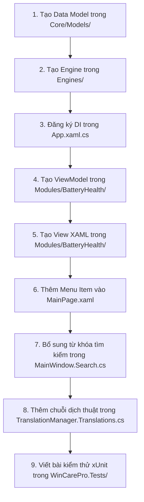

# 👨‍💻 10. Hướng Dẫn Dành Cho Lập Trình Viên Mới (Developer Onboarding Guide)

Chào mừng bạn tham gia phát triển **WinCare Pro Suite**! Tài liệu này cung cấp hướng dẫn từng bước từ việc thiết lập môi trường đến quy trình xây dựng thêm một tính năng/phân hệ mới theo đúng chuẩn kiến trúc của dự án.

---

## 💻 1. Thiết Lập Môi Trường Phát Triển (Setup Environment)

1. **Cài đặt Visual Studio 2022:**
   - Chọn tải phiên bản **Community**, **Professional**, hoặc **Enterprise** (v17.10 trở lên).
   - Trong trình cài đặt *Visual Studio Installer*, tích chọn các Workload:
     - **.NET Desktop Development** (Bao gồm .NET 10.0 SDK & C# 13).
     - **Windows application development** (Bao gồm Windows App SDK C# Templates).
2. **Cài đặt Inno Setup 6:** (Nếu cần kiểm tra đóng gói bộ cài đặt `WinCareProSetup.exe`).
3. **Mở dự án:**
   - Mở file giải pháp `WinCarePro.sln` hoặc mở thư mục `d:\WinCare` trong Visual Studio.
   - Nhấn `Ctrl + Shift + B` để Rebuild Solution và xác nhận 0 lỗi biên dịch.

---

## 📐 2. Quy Chuẩn Đặt Tên & Lập Trình (Coding Standards)

Dự án áp dụng chặt chẽ các quy chuẩn lập trình C# hiện đại:

- **Tính bất đồng bộ (Async/Await):** Tất cả các phương thức I/O, quét đĩa hoặc gọi Win32 API phải có hậu tố `Async` và nhận `CancellationToken` (ví dụ: `Task<OperationResult<T>> ScanItemsAsync(CancellationToken ct = default)`).
- **Quy chuẩn giao tiếp luồng:** Tuyệt đối **không** gọi trực tiếp các control XAML từ background thread. Luôn sử dụng `RunOnUI(() => { ... })` trong `ViewModelBase`.
- **Xử lý ngoại lệ:** Không nuốt lỗi (Silent Catch). Mọi lỗi phải được bọc vào `OperationResult.Fail(message, ex)` và ghi log qua `AuditLogService` hoặc `CrashLogger`.
- **Tránh Hardcoded String:** Tất cả chuỗi giao diện hiển thị cho người dùng phải thông qua hệ thống dịch thuật `TranslationManager.Instance.GetString("Key")` hoặc phương thức mở rộng `"Key".Translate()`.

---

## 🛠️ 3. Hướng Dẫn Từng Bước Thêm Một Phân Hệ Mới (Adding a New Module)

Giả sử bạn cần tạo một phân hệ mới tên là **BatteryHealth** (Quản lý và chẩn đoán pin laptop):



### Bước 1: Tạo Data Model
Tạo tệp `Core/Models/BatteryInfo.cs`:
```csharp
namespace WinCarePro.Core.Models;

public class BatteryInfo
{
    public double HealthPercentage { get; set; }
    public int CycleCount { get; set; }
    public double DesignedCapacityMWh { get; set; }
    public double FullChargeCapacityMWh { get; set; }
    public bool IsCharging { get; set; }
}
```

### Bước 2: Tạo Động Cơ Nghiệp Vụ (Engine)
Tạo tệp `Engines/Diagnostics/BatteryEngine.cs`:
```csharp
namespace WinCarePro.Engines.Diagnostics;

public class BatteryEngine
{
    public async Task<OperationResult<BatteryInfo>> GetBatteryReportAsync(CancellationToken ct = default)
    {
        try
        {
            // Thực thi lệnh trích xuất báo cáo pin Windows an toàn
            var result = await ProcessRunner.RunAsync("powercfg", new[] { "/batteryreport", "/output", "battery.xml", "/xml" }, ct);
            if (!result.Success) return OperationResult<BatteryInfo>.Fail("Cannot query battery status");

            var info = ParseBatteryXml("battery.xml");
            return OperationResult<BatteryInfo>.Ok(info);
        }
        catch (Exception ex)
        {
            return OperationResult<BatteryInfo>.Fail("Failed to analyze battery", ex);
        }
    }
}
```

### Bước 3: Đăng Ký Dependency Injection trong `App.xaml.cs`
Mở [App.xaml.cs](file:///d:/WinCare/App.xaml.cs) và bổ sung:
```csharp
services.AddSingleton<BatteryEngine>();
services.AddTransient<BatteryViewModel>();
```

### Bước 4: Tạo ViewModel
Tạo tệp `Modules/BatteryHealth/BatteryViewModel.cs`:
```csharp
namespace WinCarePro.Modules.BatteryHealth;

public partial class BatteryViewModel : ViewModelBase
{
    private readonly BatteryEngine _engine;

    [ObservableProperty]
    private BatteryInfo _batteryInfo;

    [ObservableProperty]
    private bool _isLoading;

    public BatteryViewModel(BatteryEngine engine)
    {
        _engine = engine;
    }

    [RelayCommand]
    public async Task LoadDataAsync()
    {
        IsLoading = true;
        var result = await Task.Run(() => _engine.GetBatteryReportAsync());
        RunOnUI(() =>
        {
            if (result.Success) BatteryInfo = result.Data;
            IsLoading = false;
        });
    }
}
```

### Bước 5: Tạo View XAML
Tạo tệp `Modules/BatteryHealth/BatteryPage.xaml` và `BatteryPage.xaml.cs`:
```xml
<Page x:Class="WinCarePro.Modules.BatteryHealth.BatteryPage"
      xmlns="http://schemas.microsoft.com/winfx/2006/xaml/presentation"
      xmlns:x="http://schemas.microsoft.com/winfx/2006/xaml">
    <Grid Padding="24">
        <!-- Áp dụng Aura Glass Card Design -->
        <Border Style="{StaticResource AuraGlassCardStyle}">
            <StackPanel Spacing="12">
                <TextBlock Text="Battery Health" Style="{StaticResource SubtitleTextBlockStyle}"/>
                <ProgressBar Value="{x:Bind ViewModel.BatteryInfo.HealthPercentage, Mode=OneWay}" Maximum="100"/>
            </StackPanel>
        </Border>
    </Grid>
</Page>
```

### Bước 6 & 7: Tích Hợp Điều Hướng & Tìm Kiếm Toàn Cục
- Mở [MainPage.xaml](file:///d:/WinCare/MainPage.xaml) thêm `NavigationViewItem` tương ứng.
- Mở [MainWindow.Search.cs](file:///d:/WinCare/MainWindow.Search.cs) thêm thẻ tìm kiếm `"battery"`, `"pin"`, `"powercfg"` để người dùng gõ tìm nhanh trên TitleBar.

### Bước 8: Bổ Sung Từ Điển Dịch Thuật
Mở [TranslationManager.Translations.cs](file:///d:/WinCare/Services/TranslationService/TranslationManager.Translations.cs):
```csharp
["vi-VN"]["Nav_Battery"] = "Sức Khỏe Pin";
["en-US"]["Nav_Battery"] = "Battery Health";
```

### Bước 9: Viết Bài Kiểm Thử xUnit
Tạo tệp `WinCarePro.Tests/BatteryEngineTests.cs`:
```csharp
[Fact]
public async Task BatteryEngine_ShouldParseReportCorrectly()
{
    var engine = new BatteryEngine();
    var res = await engine.GetBatteryReportAsync();
    res.Success.Should().BeTrue();
}
```

---

## 🐛 4. Gỡ Lỗi & Debugging Tips

- **Xem log kiểm toán:** Mở tệp SQLite `%AppData%\WinCarePro\wincaredb.db` bằng công cụ *DB Browser for SQLite* để xem các bản ghi bảng `Logs`.
- **Xem Crash Logs:** Xem thư mục `%AppData%\WinCarePro\CrashLogs\` nếu ứng dụng bị đóng đột ngột.
- **XAML Live Preview:** Sử dụng tính năng XAML Hot Reload và Live Visual Tree trong Visual Studio 2022 để chỉnh sửa màu sắc và khoảng cách Padding trực tiếp trong khi ứng dụng đang chạy.
