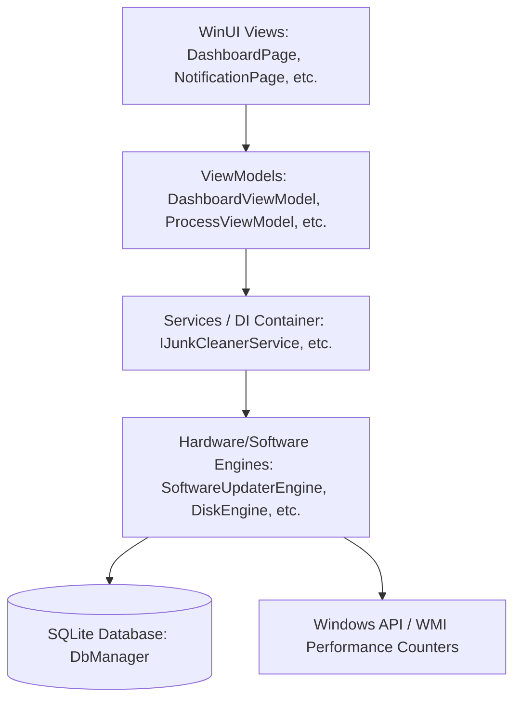
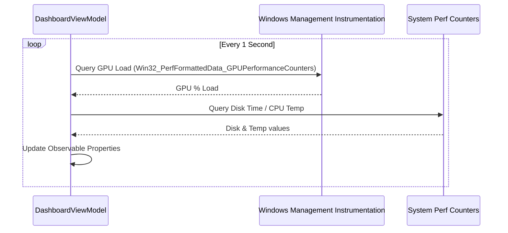

# WinCare Pro Architecture

This document details the system design, data flows, and module dependencies for WinCare Pro.

## Architectural Overview

WinCare Pro is built on top of WinUI 3 (Windows App SDK) using the MVVM (Model-View-ViewModel) pattern and Dependency Injection.

## Core Modules

### 1. Presentation Layer (Views & ViewModels)
- **Views**: Written in XAML with modern styles, using `x:Bind` for compiled data binding.
- **ViewModels**: Inherit from `ViewModelBase` and implement `INotifyPropertyChanged`. Handles formatting and background async tasks.

### 2. Service & Dependency Injection
Managed in `App.xaml.cs` via `Microsoft.Extensions.DependencyInjection`:
- All core scanning and action engines are registered as **Singletons**.
- ViewModels are registered as **Transients** for clean life cycles.

### 3. Database Layer (`DbManager`)
SQLite-backed database (`wincaredb.db`) containing tables:
- `Users`: Stores user profiles and app configurations.
- `Logs`: Historical audit trail of cleanups, fixes, and optimizations.
- `Notifications`: System alert items.
- `Reports`: File references to generated diagnostic reports.

---

## Technical Flow Diagrams

### Performance Telemetry Collection Flow

