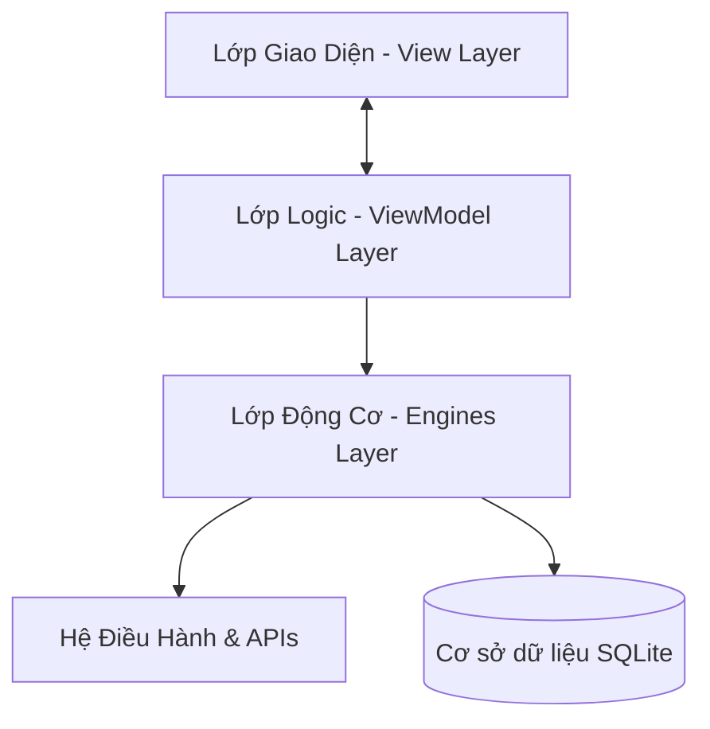

# 📘 Hướng Dẫn Phát Triển & Tài Liệu Kiến Trúc Hệ Thống (Developer & Architecture Guide)

Tài liệu này dành cho các nhà phát triển và kiến trúc sư phần mềm muốn tìm hiểu sâu về cách hoạt động, kiến trúc thiết kế, và các tiêu chuẩn bảo mật/hiệu năng trong dự án **WinCare Pro**.

---

## 🏛️ 1. Kiến trúc Tổng quan (Modular MVVM Architecture)

WinCare Pro tuân thủ mô hình **MVVM (Model-View-ViewModel)** chuẩn của Windows App SDK (WinUI 3). Dự án được phân rã thành các lớp (layers) rõ ràng nhằm tăng cường khả năng kiểm thử (testability) và bảo trì (maintainability):



### 1.1. Lớp Giao Diện (View Layer)
- Thư mục: `Modules/`, `MainWindow.xaml`, `MainPage.xaml`
- Sử dụng ngôn ngữ thiết kế **Fluent Design** với hiệu ứng Mica, acrylic và chuyển động mượt mà.
- Giao diện được khai báo bằng XAML và tách biệt logic giao diện vào code-behind (`.xaml.cs`). Code-behind chủ yếu xử lý các hiệu ứng đồ họa, hoạt cảnh (Animations) và các tương tác Windows Win32 gốc (ví dụ: subclass cửa sổ để đặt kích thước tối thiểu).

### 1.2. Lớp Logic (ViewModel Layer)
- Thư mục: `Modules/<Feature>/` (ví dụ: `Modules/JunkCleaner/JunkViewModel.cs`)
- Sử dụng thư viện **CommunityToolkit.Mvvm** làm nền tảng.
- Kế thừa từ `ViewModelBase` và triển khai `ObservableProperty` cho các thuộc tính liên kết dữ liệu (Data Binding) và `RelayCommand` cho các hành động của người dùng.
- Giao tiếp với View qua Cơ chế Liên kết Dữ liệu (Data Binding) hai chiều và cơ chế Command. Không chứa bất kỳ tham chiếu trực tiếp nào tới các control giao diện XAML để giữ tính độc lập khi viết Unit Tests.

### 1.3. Lớp Động Cơ & Dịch Vụ (Engines & Services Layer)
- Thư mục: `Engines/`, `Services/`
- Chứa toàn bộ logic nghiệp vụ (business logic) của hệ thống.
- Các Engine được đăng ký trong hệ thống Dependency Injection (DI) tại [App.xaml.cs](file:///d:/WinCare/App.xaml.cs) và được tiêm (inject) vào các ViewModel khi khởi tạo.
- Toàn bộ các tác vụ I/O nặng hoặc các lệnh gọi hệ điều hành đều được thực thi bất đồng bộ thông qua `Task.Run` hoặc `ProcessRunner.RunAsync` để tránh gây đơ luồng giao diện người dùng (UI Thread).

---

## 💾 2. Thiết kế Cơ sở Dữ liệu & Lưu trữ (Data Layer)

Ứng dụng sử dụng cơ sở dữ liệu cục bộ **SQLite 3** thông qua thư viện `Microsoft.Data.Sqlite`.

### 2.1. Cấu hình Cơ sở Dữ liệu
- **Tập tin:** [DbManager.cs](file:///d:/WinCare/Infrastructure/Database/DbManager.cs)
- **Tệp tin CSDL:** `%AppData%\WinCarePro\wincaredb.db`
- **Tối ưu hóa hiệu năng ghi:**
  - Kích hoạt chế độ **Write-Ahead Logging (WAL)**: `PRAGMA journal_mode=WAL;` cho phép đọc và ghi song song mà không khóa lẫn nhau.
  - Cấu hình độ đồng bộ **Normal**: `PRAGMA synchronous=NORMAL;` cân bằng giữa tốc độ ghi và an toàn dữ liệu.
  - Sử dụng khóa đồng bộ hóa `lock (DbLock)` để đảm bảo an toàn đa luồng (Thread-Safety).

### 2.2. Lược đồ các Bảng (Database Schema)

#### Bảng `Users` (Lưu thông tin cài đặt người dùng)
| Tên Trường | Kiểu Dữ Liệu | Thuộc tính | Mô tả |
| :--- | :--- | :--- | :--- |
| `Id` | INTEGER | PRIMARY KEY AUTOINCREMENT | Khóa chính |
| `Username` | TEXT | NOT NULL | Tên tài khoản Windows người dùng |
| `Settings` | TEXT | - | Cài đặt cấu hình dạng chuỗi JSON |
| `CreatedAt` | DATETIME | DEFAULT CURRENT_TIMESTAMP | Ngày tạo |

#### Bảng `Logs` (Nhật ký hành động bảo trì)
| Tên Trường | Kiểu Dữ Liệu | Thuộc tính | Mô tả |
| :--- | :--- | :--- | :--- |
| `Id` | INTEGER | PRIMARY KEY AUTOINCREMENT | Khóa chính |
| `Action` | TEXT | NOT NULL | Tên hành động (Ví dụ: "Booster RAM") |
| `Module` | TEXT | NOT NULL | Tên phân hệ (Ví dụ: "System Optimizer") |
| `Status` | TEXT | NOT NULL | Trạng thái ("Success" hoặc "Failed") |
| `CreatedAt` | DATETIME | DEFAULT CURRENT_TIMESTAMP | Thời gian thực hiện |

* Chỉ mục (Index): Tạo chỉ mục `idx_logs_module_createdat` trên `(Module, CreatedAt DESC)` để tối ưu hóa hiển thị lịch sử ở dashboard.

#### Bảng `UpdatedApps` (Theo dõi cập nhật phần mềm)
| Tên Trường | Kiểu Dữ Liệu | Thuộc tính | Mô tả |
| :--- | :--- | :--- | :--- |
| `AppId` | TEXT | PRIMARY KEY | ID định danh phần mềm (Ví dụ: "7zip.7zip") |
| `Version` | TEXT | NOT NULL | Phiên bản đã cập nhật thành công |
| `UpdatedAt` | DATETIME | DEFAULT CURRENT_TIMESTAMP | Thời gian cập nhật |

---

## ⚙️ 3. Chi tiết Luồng xử lý của Các Engine Cốt Lõi

### 3.1. JunkCleanerEngine (Dọn rác hệ thống)
- **Tập tin:** [JunkCleanerEngine.cs](file:///d:/WinCare/Engines/Optimization/JunkCleanerEngine.cs)
- **Danh mục dọn dẹp:** Temp Files của Windows và User, Bộ đệm trình duyệt (Chrome, Edge, Firefox), Nhật ký hệ thống (System Logs), Windows Error Reports, Bộ nhớ đệm Icon và Font.
- **Giải pháp kỹ thuật an toàn:**
  - Bỏ qua các điểm liên kết cứng/mềm bằng cách kiểm tra thuộc tính `FileAttributes.ReparsePoint`. Tránh việc xóa đệ quy lặp vô hạn hoặc xóa dữ liệu người dùng bên ngoài đích.
  - Sử dụng phương thức Win32 API `MoveFileEx(..., MOVEFILE_DELAY_UNTIL_REBOOT)` để lập lịch xóa các tệp tin đang bị khóa bởi tiến trình khác ngay trong lần khởi động máy tiếp theo.

### 3.2. SoftwareUpdaterEngine (Cập nhật phần mềm bên thứ ba)
- **Tập tin:** [SoftwareUpdaterEngine.cs](file:///d:/WinCare/Engines/Repair/SoftwareUpdaterEngine.cs)
- **Quy trình hoạt động:**
  1. Đọc registry của hệ thống để xác định phiên bản hiện tại của ứng dụng được hỗ trợ.
  2. So sánh với phiên bản mới nhất được cấu hình cứng hoặc kéo từ API.
  3. Sử dụng `HttpClient` để tải tệp cài đặt mới nhất về thư mục Temp.
  4. **Kiểm tra chữ ký số:** Sử dụng lớp `X509Certificate2` để trích xuất chứng thư số của file cài đặt. Chỉ thực thi file nếu chứng thư hợp lệ (`cert.Verify() == true`), bảo vệ người dùng trước các mã độc giả mạo.
  5. Chạy file cài đặt âm thầm (Silent Install) với cờ tương ứng (ví dụ: `/VERYSILENT` cho Inno Setup, `/qn` cho MSI).

### 3.3. SystemOptimizerEngine (Tối ưu hiệu năng & RAM)
- **Tập tin:** [SystemOptimizerEngine.cs](file:///d:/WinCare/Engines/Optimization/SystemOptimizerEngine.cs)
- **Dọn dẹp bộ nhớ RAM (RAM Booster):**
  - Quét danh sách các tiến trình đang chạy (bỏ qua System và Idle).
  - Sử dụng Win32 API `EmptyWorkingSet(hProcess)` (từ thư viện `psapi.dll`) để thu hồi phân vùng nhớ vật lý không hoạt động và chuyển chúng vào vùng nhớ ảo (Pagefile), giải phóng RAM vật lý cho các ứng dụng ưu tiên.
- **Tinh chỉnh Registry (Registry Tweaks):**
  - Chỉnh sửa các khóa Registry nhằm tăng tốc thời gian phản hồi của hệ thống.
  - Tất cả các thay đổi Registry được bọc trong các khối kiểm tra xem khóa đó có quyền ghi hay không và lưu giữ giá trị mặc định để hỗ trợ tính năng rollback.

---

## 🛡️ 4. Thiết kế Bảo mật & Phân quyền (Security & Privileges)

Do ứng dụng can thiệp sâu vào các cài đặt hệ thống, WinCare Pro áp dụng các nguyên tắc bảo mật chặt chẽ sau:

### 4.1. Đặc quyền Quản trị cao nhất (Elevated Administrator Rights)
Ứng dụng được cấu hình để luôn yêu cầu quyền chạy quản trị tối cao ngay khi khởi động thông qua [app.manifest](file:///d:/WinCare/app.manifest):
```xml
<requestedExecutionLevel level="requireAdministrator" uiAccess="false" />
```
Điều này đảm bảo các lệnh hệ thống như `sfc /scannow`, `dism`, hoặc sửa đổi Registry tại nhánh `HKEY_LOCAL_MACHINE` không bị từ chối quyền truy cập (`UnauthorizedAccessException`).

### 4.2. Chống Tấn công Chèn lệnh (Command Injection Prevention)
Khi sử dụng [ProcessRunner.cs](file:///d:/WinCare/Core/Helpers/ProcessRunner.cs) để khởi chạy các tiến trình ngoài, ứng dụng tách biệt rõ ràng phần tệp thực thi (`FileName`) và các tham số (`Arguments`). Không sử dụng cơ chế nối chuỗi thô từ input của người dùng để ngăn chặn tấn công chèn lệnh độc hại.

### 4.3. An toàn Dữ liệu Mạng
Hệ thống giám sát và cấu hình Secure DNS sử dụng DNS-over-HTTPS (DoH). Cấu hình này được ghi trực tiếp vào cấu trúc đăng ký DNS của Windows một cách an toàn thông qua Registry hệ thống.

---

## 🚀 5. Hướng dẫn Biên dịch, Đóng gói & Phát hành

### 5.1. Biên dịch Dự án
Sử dụng dòng lệnh để khôi phục và biên dịch dự án ở chế độ Release:
```powershell
dotnet restore
dotnet build -c Release -r win-x64
```

### 5.2. Chạy Kiểm thử (Unit Tests)
Dự án có phân hệ kiểm thử [WinCarePro.Tests](file:///d:/WinCare/WinCarePro.Tests) sử dụng khung kiểm thử **xUnit**. Để chạy các kiểm thử:
```powershell
dotnet test WinCarePro.Tests\WinCarePro.Tests.csproj --verbosity normal
```

### 5.3. Tạo Bản phát hành Portable (`publish.bat`)
Script [publish.bat](file:///d:/WinCare/publish.bat) thực hiện các bước sau:
1. Dọn dẹp bản build cũ.
2. Biên dịch và nén ứng dụng thành 1 file exe duy nhất thông qua cờ `-p:PublishSingleFile=true`.
3. Copy thư mục tài nguyên `Assets` vào bên cạnh file exe trong thư mục `PublishOutput`.

### 5.4. Đóng gói Bộ cài đặt Setup (`publish_installer.bat`)
Script [publish_installer.bat](file:///d:/WinCare/publish_installer.bat) tự động hóa:
1. Biên dịch ứng dụng ra thư mục tạm `PublishOutputFolder`.
2. Gọi trình biên dịch **ISCC.exe** của **Inno Setup 6** với kịch bản [setup.iss](file:///d:/WinCare/setup.iss).
3. Đóng gói toàn bộ runtime .NET 10 (Self-contained) và Assets thành bộ cài `PublishOutput\WinCareProSetup.exe` duy nhất.

---
*Tài liệu được cập nhật tự động theo phiên bản mã nguồn mới nhất.*
