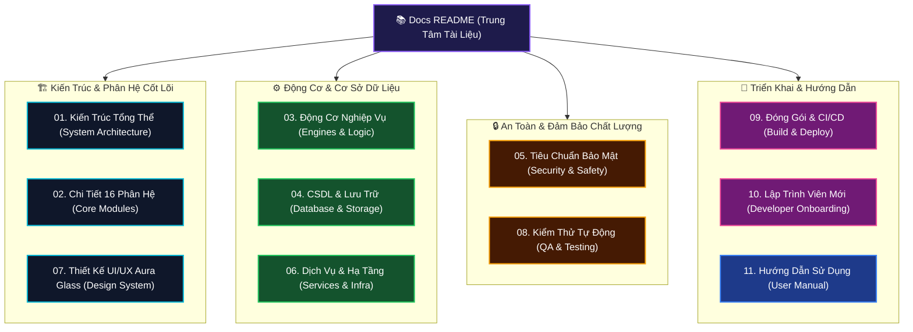

# 📚 WinCare Pro Suite — Documentation Hub (Trung Tâm Tài Liệu)

> **Phiên bản hệ thống:** v4.5 (Codename: Nova)  
> **Nền tảng:** Windows 10 (Build 19041+) & Windows 11 (x64)  
> **Công nghệ cốt lõi:** .NET 10.0 • Windows App SDK (WinUI 3) • SQLite WAL • Modular MVVM  
> **Ngôn ngữ tài liệu:** Tiếng Việt (Chính thức) & English Technical References  

---

## 🗺️ Bản Đồ Cấu Trúc Tài Liệu (Documentation Map)

Thư mục tài liệu này được cấu trúc thành **11 chuyên đề chuyên sâu** và các bản hướng dẫn tổng hợp, bao quát toàn diện từ kiến trúc tầng thấp, thuật toán động cơ, an toàn bảo mật cho đến quy trình đóng gói và hướng dẫn sử dụng:

---

## 📑 Danh Mục 11 Tài Liệu Chuyên Đề

| STT | Tài Liệu | Tóm Tắt Nội Dung | Đối Tượng |
| :---: | :--- | :--- | :--- |
| **01** | [**01. Kiến Trúc Tổng Thể Hệ Thống**](01_SYSTEM_ARCHITECTURE.md) | Mô hình 4 tầng phân lớp, nguyên lý thiết kế, Dependency Injection và quản lý luồng dữ liệu an toàn. | *Architects, Developers* |
| **02** | [**02. Chi Tiết 16 Phân Hệ Chức Năng**](02_CORE_MODULES_DETAILED.md) | Đặc tả 16 Modules: Dashboard, AI Assistant, Junk Cleaner, Uninstaller, Security, Turbo Game, Widget,... | *Developers, Product Owners* |
| **03** | [**03. Tầng Động Cơ Nghiệp Vụ**](03_ENGINES_AND_BUSINESS_LOGIC.md) | Thuật toán Heuristic chẩn đoán AI, RAM booster, công thức chấm điểm sức khỏe, SFC/DISM wrapper. | *Engine Developers* |
| **04** | [**04. Cơ Sở Dữ Liệu & Lưu Trữ**](04_DATABASE_AND_STORAGE.md) | SQLite 3 WAL Mode, PRAGMA tuning, Lược đồ 6 bảng CSDL, Version Migration và bảo mật dữ liệu. | *Data & Backend Devs* |
| **05** | [**05. Tiêu Chuẩn An Toàn & Bảo Mật**](05_SECURITY_AND_SAFETY_ARCHITECTURE.md) | SafePathGuard chống xóa nhầm, Service Safety Whitelist, ProcessRunner ArgumentList chống Injection. | *Security Engineers* |
| **06** | [**06. Dịch Vụ Nền & Hạ Tầng Hệ Thống**](06_SERVICES_AND_INFRASTRUCTURE.md) | Background Workers, Theme Studio đa bảng màu, Bộ dịch thuật ngữ đa ngôn ngữ, UndoManager hoàn tác. | *Core Developers* |
| **07** | [**07. Hệ Thống Thiết Kế UI/UX Aura Glass**](07_UI_UX_DESIGN_SYSTEM.md) | Fluent Design 2.0, Mica Backdrop, Acrylic, Shimmer Skeleton Loader, Composition 120 FPS Motion. | *UI/UX Designers & Devs* |
| **08** | [**08. Kiểm Thử Tự Động & Đảm Bảo Chất Lượng**](08_TESTING_AND_QUALITY_ASSURANCE.md) | Bộ 227 Unit Tests xUnit, kiểm thử đa luồng, Mocking, tỷ lệ bao phủ và tiêu chuẩn Zero-Bug. | *QA & Testers* |
| **09** | [**09. Đóng Gói, Triển Khai & CI/CD**](09_BUILD_DEPLOYMENT_AND_PACKAGING.md) | Biên dịch Self-Contained x64, Đóng gói Inno Setup 6, cấu hình Auto-Update và GitHub Actions CI. | *DevOps, Release Managers* |
| **10** | [**10. Hướng Dẫn Lập Trình Viên Mới**](10_DEVELOPER_ONBOARDING_GUIDE.md) | Setup môi trường Visual Studio 2022, quy chuẩn code C# 13, hướng dẫn từng bước thêm một Module mới. | *New Developers* |
| **11** | [**11. Hướng Dẫn Sử Dụng Chi Tiết (Tiếng Việt)**](11_USER_MANUAL_VI.md) | Cẩm nang thao tác dành cho người dùng cuối: Dọn dẹp máy tính, tăng tốc game, khôi phục hệ thống. | *End Users, Support Team* |

---

## 🔍 Tài Liệu Bổ Sung (Quick References)

- [**DEVELOPER_GUIDE.md**](DEVELOPER_GUIDE.md): Hướng dẫn tóm tắt nhanh cho lập trình viên và lối tắt tra cứu.
- [**SYSTEM_OVERVIEW.md**](SYSTEM_OVERVIEW.md): Bản tổng quan kỹ thuật tiếng Anh (Technical Executive Summary).

---

## ⚡ Hướng Dẫn Đọc Theo Vai Trò (Reading Pathways)

### 👨‍💻 Dành cho Lập trình viên mới bắt đầu (New Developer Pathway)
1. Đọc [**10. Hướng Dẫn Lập Trình Viên Mới**](10_DEVELOPER_ONBOARDING_GUIDE.md) để thiết lập môi trường và hiểu quy chuẩn code.
2. Tham khảo [**01. Kiến Trúc Tổng Thể**](01_SYSTEM_ARCHITECTURE.md) để nắm luồng MVVM và DI.
3. Xem [**02. Chi Tiết 16 Phân Hệ**](02_CORE_MODULES_DETAILED.md) và [**03. Tầng Động Cơ**](03_ENGINES_AND_BUSINESS_LOGIC.md) để bắt tay vào viết tính năng.

### 🛡️ Dành cho Kỹ sư An ninh & Hệ thống (Security & Systems Pathway)
1. Đọc [**05. Tiêu Chuẩn Bảo Mật & Cơ Chế An Toàn**](05_SECURITY_AND_SAFETY_ARCHITECTURE.md).
2. Xem [**04. Cơ Sở Dữ Liệu & Lưu Trữ**](04_DATABASE_AND_STORAGE.md).
3. Đọc [**08. Kiểm Thử Tự Động & QA**](08_TESTING_AND_QUALITY_ASSURANCE.md).

### 🎨 Dành cho Thiết kế & Lập trình Giao diện (Frontend & UI Pathway)
1. Đọc [**07. Hệ Thống Thiết Kế UI/UX Aura Glass**](07_UI_UX_DESIGN_SYSTEM.md).
2. Xem [**02. Chi Tiết 16 Phân Hệ**](02_CORE_MODULES_DETAILED.md).
3. Xem [**06. Dịch Vụ Nền & Hạ Tầng**](06_SERVICES_AND_INFRASTRUCTURE.md) (Theme Studio & Animation).

---

  Tài liệu được chuẩn hóa và quản lý bởi nhóm phát triển <b>WinCare Pro Suite</b>

