# WinCare Pro — System Architecture & Technical Overview

> [🏠 Main Documentation Hub](README.md) • [01. Detailed System Architecture (Vietnamese)](01_SYSTEM_ARCHITECTURE.md)
>
> **Version:** 4.5 Nova (Production Release)  
> **Platform:** Windows 10 (Build 19041+) & Windows 11 (x64)  
> **Framework:** .NET 10.0 + Windows App SDK (WinUI 3)  
> **Architecture Standard:** Layered Domain-Driven Architecture with Zero-Trust Security & Thread-Safe Concurrency

---

## 1. Executive Summary & Vision

**WinCare Pro** is an enterprise-grade, high-performance system optimization, repair, security diagnostics, and maintenance suite for Windows. Engineered from the ground up with the core priority rule:

$$\text{Safety} > \text{Correctness} > \text{Security} > \text{Stability} > \text{Performance} > \text{Maintainability} > \text{UX} > \text{Visual Aesthetics}$$

The platform combines native Win32/P-Invoke kernel operations, thread-safe SQLite persistence, Windows App SDK modern UI, and localized heuristic AI algorithms to optimize hardware resources without compromising operating system integrity.

---

## 2. High-Level Architecture

WinCare Pro follows a clean **4-Tier Layered Architecture**:

```mermaid
graph TD
    subgraph Presentation_Layer ["Presentation Layer (WinUI 3 / XAML)"]
        MainWindow["MainWindow (Mica Backdrop & NavigationFrame)"]
        Pages["Views (DashboardPage, JunkCleanerPage, OptimizerPage, RepairPage, etc.)"]
        Converters["Converters (ThemeToBrush, BooleanToVisibility, etc.)"]
    end

    subgraph Business_Engines ["Business Engine Layer (Engines)"]
        JunkEngine["JunkCleanerEngine"]
        OptEngine["SystemOptimizerEngine"]
        RepairEngine["SystemEngine / SystemRepair"]
        UpdateEngine["SoftwareUpdaterEngine"]
        UninstallEngine["UninstallEngine"]
        DiskEngine["DiskEngine"]
        NetworkEngine["NetworkCenterEngine"]
        StartupEngine["StartupEngine"]
        AiEngine["AiWinCareEngine & AiDiagnostics"]
    end

    subgraph Core_Domain ["Core & Domain Layer (Core)"]
        OpResult["OperationResult & OperationResult&lt;T&gt;"]
        Models["SystemTweak, JunkCategory, InstalledAppInfo, etc."]
        SafeGuard["SafePathGuard (System Directory & File Blacklist)"]
        ProcRunner["ProcessRunner (Structured Argument Execution)"]
    end

    subgraph Infrastructure_Layer ["Infrastructure Layer"]
        DbManager["DbManager (SQLite WAL + PRAGMA user_version Migrations)"]
        CryptoHelper["CryptoHelper (Windows DPAPI Encryption)"]
        CrashLogger["CrashLogger & Activity Logger"]
        Win32Interop["Native P/Invoke (wintrust.dll, psapi.dll, kernel32.dll)"]
    end

    Presentation_Layer --> Business_Engines
    Business_Engines --> Core_Domain
    Business_Engines --> Infrastructure_Layer
    Core_Domain --> Infrastructure_Layer
```



---

## 3. Core Engine Specifications

### 3.1. JunkCleanerEngine (`Engines/Optimization/JunkCleanerEngine.cs`)
- **Parallel Scanning:** Leverages `Task.WhenAll` across 12 distinct junk categories (User Temp, Windows Temp, SoftwareDistribution, Browser Caches, Shader Caches, WER Logs, Thumbnails, Delivery Optimization, Prefetch, Crash Dumps, Developer Caches, Recycle Bin).
- **Safe Traversal & Deletion:**
  - Strict validation via `SafePathGuard.IsPathSafeForDeletion`.
  - Rejects system roots (`C:\`, `C:\Windows`, `System32`, user profiles).
  - Reparse point and junction detection: Links are never traversed recursively to prevent deleting files outside target folders.
  - Zero-reboot-queue policy: In-use locked files are safely skipped without calling silent `MoveFileEx(..., MOVEFILE_DELAY_UNTIL_REBOOT)`.
- **Cancellation & Pacing:** Fully cooperative asynchronous cancellation via `CancellationToken`.

### 3.2. SystemOptimizerEngine (`Engines/Optimization/SystemOptimizerEngine.cs`)
- **Physical RAM Booster:**
  - Iterates non-critical user-space processes via `OpenProcess` (`PROCESS_SET_QUOTA | PROCESS_QUERY_INFORMATION`).
  - Executes `EmptyWorkingSet` via native `psapi.dll` with parallel throttling.
  - Evaluates before/after physical RAM counters via `GlobalMemoryStatusEx`.
- **System Tweaks (13 Granular Safe Tweaks):**
  - **Performance:** `MenuShowDelay`, `AutoEndTasks`, `WaitToKillAppTimeout`, `NetworkThrottlingIndex`, `SystemResponsiveness`, `MinAnimate`, `HwSchMode`, `GameDVR_Enabled`.
  - **Disk & Storage:** `NtfsDisableLastAccessUpdate`.
  - **Privacy & System Logs:** `AllowTelemetry`, `AllowCortana`, `WerDisabled`, `DisableLocation`.
- **State Snapshots & Reversibility:** Before applying any tweak, the original state is logged to `DbManager.SaveSnapshot("SystemTweak", tweak.Id, originalValue, recommendedValue)`, enabling atomic 1-click restore.

### 3.3. SoftwareUpdaterEngine (`Engines/Repair/SoftwareUpdaterEngine.cs`)
- **Zero Simulation / Zero Mock Policy:** Direct downloads and updates execute live against real software repositories.
- **WinVerifyTrust Authenticode Signature Verification:**
  - Invokes `wintrust.dll` with `WINTRUST_ACTION_GENERIC_VERIFY_V2`.
  - Verifies digital certificate chain validity and root trust.
  - Validates `ExpectedPublisher` against certificate `X509Certificate2.Subject` (e.g., Microsoft Corporation, Mozilla Corporation, Google LLC, OpenJS Foundation).
  - Automatically deletes and rejects corrupt or untrusted installers before execution.

### 3.4. UninstallEngine (`Engines/Repair/UninstallEngine.*.cs`)
- **Multi-Hive Registry Scanning:** Aggregates installed applications across 64-bit (`HKLM\...\Uninstall`), 32-bit (`WOW6432Node`), and user-level (`HKCU`) registry keys.
- **Deep Leftovers Engine:** Identifies registry residues and abandoned app data folders while protecting system critical folders (`Windows`, `System32`, `Microsoft`, `WindowsApps`).
- **Clean Production Environment:** Eliminated all mock app injection or debug-only bypasses.

### 3.5. SystemEngine & Diagnostics (`Engines/Diagnostics/SystemEngine.cs`)
- **Command Injection Immunity:** Eliminated `cmd.exe /c [string]` formatting. All Windows diagnostics and repairs directly execute native binaries (`sfc.exe`, `dism.exe`, `sc.exe`, `net.exe`, `netsh.exe`, `ipconfig.exe`, `powershell.exe`) with strongly-typed `IEnumerable<string>` argument lists.
- **Subsystem Repairs:**
  - Windows Update Reset (Graceful service lifecycle management & folder renaming).
  - Service Configuration Alignment (`sc.exe config start= auto`).
  - Network Stack Reset (`ipconfig /flushdns`, `/registerdns`, `/release`, `/renew`, `netsh winsock reset`).
  - Automated Pre-Repair Restore Point creation (`powershell Checkpoint-Computer`).

---

## 4. Security & Cryptography Architecture

| Security Domain | Implementation | Security Benefit |
| :--- | :--- | :--- |
| **Data at Rest** | `CryptoHelper` (Windows DPAPI `ProtectedData.Protect`) | User credentials and sensitive token values are encrypted using machine/user cryptographic keys. |
| **Binary Execution** | `ProcessRunner.RunAsync(fileName, args, ...)` | Prevents argument injection, command chaining (`&`, `\|`, `;`), and shell escaping. |
| **Filesystem Safety** | `SafePathGuard` & Reparse Point Filtering | Protects critical Windows files, registry roots, and prevents symlink directory escapes. |
| **Code Signing Verification** | `WinVerifyTrust` P/Invoke + Subject Validation | Prevents execution of tampered, unsigned, or spoofed third-party installers. |

---

## 5. Database & State Persistence (`Infrastructure/Database/DbManager.cs`)

### 5.1. SQLite Engine Configuration
- **Concurrency Mode:** `PRAGMA journal_mode=WAL` (Write-Ahead Logging) enables simultaneous readers without blocking writers.
- **Safety Pragmas:** `PRAGMA synchronous=NORMAL; PRAGMA busy_timeout=5000; PRAGMA cache_size=-2000; PRAGMA temp_store=MEMORY;`.
- **Thread Safety:** Double-guarded locking (`DbLock`) with progressive retry backoff for database busy conditions.

### 5.2. Schema Versioning & Automated Migrations
Database versioning is tracked directly via SQLite internal `PRAGMA user_version`:
- **Version 1 (Baseline):** `Users`, `Logs`, `Reports`, `UpdatedApps`, `Notifications`, `StateSnapshots`.
- **Version 2 (Index Optimization):** Added compound indices `idx_snapshots_cat_key` and `idx_logs_createdat` for millisecond query retrieval.

---

## 6. Unified Error Handling: `OperationResult`

All engines return structured, strongly-typed result objects rather than ambiguous booleans:

```csharp
public class OperationResult
{
    public OperationStatus Status { get; set; } // Success, PartialSuccess, Warning, Cancelled, Failed, RequiresElevation, RequiresRestart
    public bool IsSuccess => Status == OperationStatus.Success || Status == OperationStatus.PartialSuccess;
    public bool IsFailure => !IsSuccess;
    public string Message { get; set; }
    public string? Details { get; set; }
    public string? ErrorCode { get; set; }
    public List<string> Warnings { get; set; }
    public List<string> Errors { get; set; }
    public TimeSpan Duration { get; set; }
}

public class OperationResult<T> : OperationResult
{
    public T? Data { get; set; }
}
```

---

## 7. Quality Assurance & Test Verification Matrix

WinCare Pro includes a comprehensive xUnit test suite (`WinCarePro.Tests`):

| Test Suite | Test Area | Verification Target |
| :--- | :--- | :--- |
| `MasterUpgradePhaseTests` | Core Architecture | `OperationResult`, Authenticode `WinVerifyTrust`, `StateSnapshots`, SystemTweak metadata. |
| `SecurityAndSafetyTests` | Filesystem & Shell | `SafePathGuard` system path rejection, argument sanitization, `.reg` header safety. |
| `UninstallEngineTests` | App Management | Name normalization, version stripping, protected folder validation. |
| `JunkCleanerEngineTests` | Cleaning Engine | Directory recursion, size calculations, category filters. |
| `SystemOptimizerEngineTests`| System Tweaks | Registry value encoding/decoding, RAM working set metrics. |
| `NetworkCenterEngineTests` | Network Engine | DNS benchmark, packet parsing, ping telemetry. |
| `SettingsAndStateTests` | Config & Theme | Theme persistence, user settings caching, JSON serialization. |

- **Test Suite Status:** **227 tests passing (100% success rate, 0 failures, 0 regressions)**.

---

## 8. Directory & Source Structure

```
d:\WinCare\
├── App.xaml / App.xaml.cs                # Application bootstrap & DI setup
├── MainWindow.xaml / MainWindow.xaml.cs  # Main Window host & Mica backdrop
├── MainPage.xaml / MainPage.xaml.cs      # Master navigation frame & sidebar
├── Core/
│   ├── Helpers/                          # SafePathGuard, ProcessRunner, ThemeHelper
│   └── Models/                           # OperationResult, SystemTweak, InstalledAppInfo
├── docs/                                 # Documentation & Specifications
│   ├── DEVELOPER_GUIDE.md                # Developer onboarding & build guide
│   ├── SYSTEM_OVERVIEW.md                # Master Technical Architecture Document
│   └── USER_GUIDE.md                     # End-user manual
├── Engines/
│   ├── Diagnostics/                      # SystemEngine, AiDiagnosticsEngine, SystemScanner
│   ├── Maintenance/                      # DiskEngine, StartupEngine, RegistryBackupEngine
│   ├── Optimization/                     # JunkCleanerEngine, SystemOptimizerEngine
│   ├── Network/                          # NetworkCenterEngine, NetworkEngine
│   ├── Repair/                           # SoftwareUpdaterEngine, UninstallEngine
│   └── Security/                         # SecurityCenterEngine, WindowsDefenderEngine
├── Infrastructure/
│   ├── Database/                         # DbManager (SQLite WAL & Migrations)
│   ├── Logging/                          # CrashLogger, Activity Log
│   └── Security/                         # CryptoHelper (DPAPI)
├── Presentation/
│   ├── Converters/                       # UI Data Binding Value Converters
│   ├── Themes/                           # Color Palettes, Mica & Acrylic styles
│   └── Views/                            # WinUI 3 Feature Pages
└── WinCarePro.Tests/                     # Comprehensive xUnit Unit & Integration Tests
```
