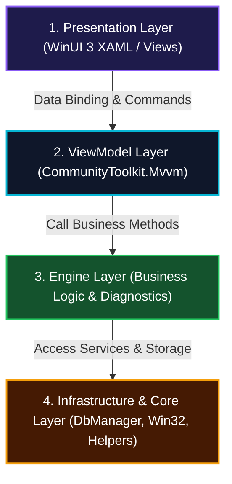

# 📐 01. Quy Chuẩn Kiến Trúc & Thiết Kế Phần Mềm (Architecture & Design Rules)

> [🏠 Mục Lục Rules](README.md) • **Rule 01** • [Quy Chuẩn Tiếp Theo: 02. An Toàn & Bảo Mật ➡️](02_SECURITY_AND_SAFETY_RULES.md)

---

## 🏛️ 1. Mô Hình Phân Tầng Tuyệt Đối (Strict 4-Tier Architecture)

Dự án WinCare Pro áp dụng cấu trúc 4 tầng phân lớp độc lập. Quy tắc phụ thuộc (Dependency Direction) phải đi một chiều từ ngoài vào trong:

$$\text{Presentation (UI/Views)} \longrightarrow \text{ViewModel} \longrightarrow \text{Engines (Business Logic)} \longrightarrow \text{Infrastructure / Core}$$



### Quy tắc bất khả xâm phạm:
- ❌ **CẤM:** Tầng View gọi trực tiếp các phương thức của tầng Engine hoặc Infrastructure mà bỏ qua ViewModel.
- ❌ **CẤM:** Tầng Engine chứa bất kỳ tham chiếu nào tới XAML UI Controls (như `Button`, `TextBox`, `SolidColorBrush`, `Window`).
- ❌ **CẤM:** ViewModel tham chiếu chéo phụ thuộc lẫn nhau trực tiếp (Cross-ViewModel tight coupling). Nếu cần giao tiếp, phải sử dụng `WeakReferenceMessenger` hoặc thông qua Service trung gian.

---

## 🧩 2. Quy Chuẩn Modular MVVM Pattern

Mỗi phân hệ chức năng trong `Modules/` phải là một cặp **View - ViewModel** tự trị:

```
Modules/
└── JunkCleaner/
    ├── JunkCleanerPage.xaml       # Khai báo cấu trúc giao diện
    ├── JunkCleanerPage.xaml.cs    # Code-behind (Chỉ xử lý animation & Win32 window hooking)
    └── JunkViewModel.cs           # State, Commands, Binding properties
```

### Tiêu chuẩn ViewModel:
1. **Kế thừa từ `ViewModelBase`:** Mọi ViewModel phải kế thừa từ `ViewModelBase` để thừa hưởng các cơ chế an toàn luồng `RunOnUI()` và quản lý trạng thái `IsBusy`.
2. **Sử dụng Source Generators:** Sử dụng thuộc tính `[ObservableProperty]` và `[RelayCommand]` của `CommunityToolkit.Mvvm` thay vì viết thủ công các trường `INotifyPropertyChanged`.
3. **Lazy Initialization:** Không thực hiện quét đĩa hoặc kết nối I/O nặng trong hàm khởi tạo (Constructor). Việc khởi tạo dữ liệu phải được gọi bất đồng bộ trong sự kiện `Loaded` của View hoặc khi người dùng kích hoạt lệnh.

---

## 💉 3. Quy Chuẩn Dependency Injection (DI) & Quản Lý Vòng Đời

Hệ thống DI được quản lý tại [App.xaml.cs](file:///d:/WinCare/App.xaml.cs) sử dụng `Microsoft.Extensions.DependencyInjection`:

| Vòng đời (Lifetime) | Danh mục áp dụng | Ví dụ lớp |
| :--- | :--- | :--- |
| **Singleton** | Dịch vụ hệ thống, Quản lý CSDL, Bộ đệm, Quản lý giao diện | `DbManager`, `ThemeManager`, `TranslationManager`, `NotificationService`, `LockingAppService` |
| **Transient** | Các Engine tính toán độc lập, các ViewModel theo trang | `JunkCleanerEngine`, `SystemOptimizerEngine`, `JunkViewModel`, `DashboardViewModel` |

### Quy tắc tiêm phụ thuộc:
- ✅ **Constructor Injection:** Luôn tiêm các phụ thuộc thông qua Constructor.
- ❌ **CẤM Service Locator ngầm:** Hạn chế tối đa việc gọi `App.Services.GetService<T>()` trực tiếp bên trong các hàm con của Engine, trừ các trường hợp đặc biệt ở tầng khởi tạo ứng dụng.

---

## 🪟 4. Quy Chuẩn Vòng Đời Ứng Dụng (Single-Instance & Background Minimization)

1. **Single-Instance Enforcement:**
   - Ứng dụng chính sử dụng `System.Threading.Mutex` toàn cục có tên `Local\WinCarePro_SingleInstance_Mutex`.
   - Nếu phát hiện tiến trình khác đã chạy, lập tức kích hoạt cửa sổ hiện tại lên tiền cảnh (`SetForegroundWindow`) và kết thúc tiến trình mới ngay lập tức.
2. **Desktop HUD Widget Isolation:**
   - Cửa sổ Desktop HUD Widget là một `Window` độc lập nhưng chia sẻ cùng một Data Context hoặc Engine Singleton.
   - Khi đóng cửa sổ chính, nếu tùy chọn chạy nền được bật, ứng dụng phải thu nhỏ xuống System Tray thay vì thoát hoàn toàn (`Environment.Exit(0)`).

---

<div align="center">
  <sub>[🏠 Mục Lục Rules](README.md) • WinCare Pro Suite Production Engineering Governance</sub>
</div>
