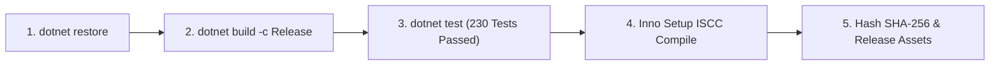

# 📦 08. Quy Chuẩn Đóng Gói, Phát Hành & CI/CD (Release & CI/CD Rules)

> [⬅️ 07. Kiểm Thử & QA](07_TESTING_AND_QA_RULES.md) • [🏠 Mục Lục Rules](README.md) • **Rule 08** • [Quy Chuẩn Tiếp Theo: 09. Tương Tác Registry & Win32 ➡️](09_REGISTRY_AND_OS_INTEROP_RULES.md)

---

## 🚀 1. Quy Chuẩn Xuất Bản Bản Phát Hành (Self-Contained Publish)

1. **Kiến trúc đích:** `win-x64` (Khuyên dùng và hỗ trợ chính thức).
2. **Cấu hình Self-Contained:**
   - Bản phát hành chính thức **bắt buộc** phải là `--self-contained true` để nhúng sẵn toàn bộ .NET 10 Runtime, đảm bảo người dùng cuối có thể sử dụng ngay mà không gặp lỗi thiếu thư viện runtime.
3. **Cờ tối ưu hóa biên dịch:**
   ```powershell
   dotnet publish WinCarePro.csproj `
       -c Release `
       -r win-x64 `
       --self-contained true `
       -p:PublishSingleFile=false `
       -p:IncludeNativeLibrariesForSelfExtract=true `
       -p:EnableCompressionInSingleFile=true `
       -o "./PublishOutputFolder"
   ```

---

## 📦 2. Quy Chuẩn Bộ Cài Đặt Inno Setup (`setup.iss`)

1. **Yêu cầu quyền Quản trị viên:**
   - Khai báo bắt buộc: `PrivilegesRequired=admin` và `PrivilegesRequiredOverridesAllowed=no`.
2. **Cơ chế phát hiện và đóng tiến trình cũ:**
   - Bộ cài đặt phải kiểm tra `Mutex` của WinCare Pro và Desktop Widget, hiển thị thông báo yêu cầu đóng hoặc tự động đóng an toàn trước khi sao chép đè tệp tin mới.
3. **Gỡ cài đặt sạch sẽ (Clean Uninstall):**
   - Trình gỡ cài đặt phải xóa sạch các tệp nhị phân trong thư mục cài đặt `Program Files\WinCarePro\`.
   - Cung cấp tùy chọn hộp thoại hỏi người dùng có muốn xóa dữ liệu cấu hình `%AppData%\WinCarePro\` hay giữ lại cho lần cài đặt sau.

---

## 🏷️ 3. Quy Chuẩn Đánh Số Phiên Bản (Semantic Versioning 2.0)

Hệ thống tuân thủ định dạng phiên bản: **`MAJOR.MINOR.PATCH`** (Ví dụ: `4.5.0`):

- **MAJOR (Số chính):** Khi có thay đổi đột phá về kiến trúc hoặc giao diện thế hệ mới.
- **MINOR (Số phụ):** Khi bổ sung thêm phân hệ chức năng mới (New Module) hoặc nâng cấp lớn các Engine.
- **PATCH (Bản vá):** Sửa lỗi, tối ưu hiệu năng, cập nhật cơ sở dữ liệu định nghĩa rác hoặc vá bảo mật.

### Đồng bộ phiên bản:
Khi nâng phiên bản, phải cập nhật đồng thời ở các vị trí:
1. `WinCarePro.csproj` (`<Version>4.5.0</Version>`)
2. `setup.iss` (`#define MyAppVersion "4.5.0"`)
3. `update.json` (`"version": "4.5.0"`)
4. `Package.appxmanifest`

---

## 🤖 4. Quy Chuẩn Tích Hợp & Triển Khai Liên Tục (GitHub Actions CI/CD)

Mọi commit và Pull Request vào nhánh `main` phải vượt qua toàn bộ các bước trong `.github/workflows/ci.yml`:



---

> [⬅️ 07. Kiểm Thử & QA](07_TESTING_AND_QA_RULES.md) • [🏠 Mục Lục Rules](README.md) • **Rule 08** • [Quy Chuẩn Tiếp Theo: 09. Tương Tác Registry & Win32 ➡️](09_REGISTRY_AND_OS_INTEROP_RULES.md)

