# 🛡️ WinCare Pro Suite — Production System Rules & Engineering Governance

> **Phiên bản áp dụng:** v4.5 Nova (Production Release)  
> **Nền tảng mục tiêu:** Windows 10 (Build 19041+) & Windows 11 (x64)  
> **Bộ công nghệ:** .NET 10.0 • C# 13 • Windows App SDK (WinUI 3) • SQLite WAL  
> **Mục tiêu tối thượng:** Đảm bảo tính ổn định tuyệt đối, an toàn dữ liệu, hiệu năng cao và chuẩn mực mã nguồn cấp Enterprise.

---

## 🏛️ 1. Kim Chỉ Nam Ưu Tiên Tuyệt Đối (Core Hierarchy of Priorities)

Mọi quyết định thiết kế kỹ thuật, sửa đổi mã nguồn hoặc triển khai tính năng mới trong toàn bộ hệ thống WinCare Pro **bắt buộc** phải tuân theo thứ tự ưu tiên bất khả xâm phạm sau:

$$\mathbf{Safety} > \mathbf{Correctness} > \mathbf{Security} > \mathbf{Stability} > \mathbf{Performance} > \mathbf{Maintainability} > \mathbf{UX} > \mathbf{Aesthetics}$$

1. **Safety (An toàn tuyệt đối):** Không bao giờ được phép làm hỏng hệ điều hành, xóa nhầm file người dùng, hoặc vô hiệu hóa các dịch vụ Windows thiết yếu.
2. **Correctness (Tính chính xác):** Kết quả tính toán, dung lượng quét, chỉ số phần cứng và thao tác hệ thống phải phản ánh dữ liệu thực tế, không dùng dữ liệu giả lập trong môi trường Production.
3. **Security (Bảo mật Zero-Trust):** Triệt tiêu hoàn toàn Command Injection, Path Traversal, và rò rỉ thông tin nhạy cảm.
4. **Stability (Độ ổn định không crash):** Bọc an toàn 100% các cập nhật UI Thread, xử lý toàn diện ngoại lệ I/O và Win32.
5. **Performance (Hiệu năng vượt trội):** Tối ưu RAM nền (< 15MB), Cold Start < 350ms, không gây đơ lag UI.

---

## 🗺️ 2. Bản Đồ Bộ Quy Chuẩn Kỹ Thuật (Rules Architecture Map)

```mermaid
graph TD
    classDef index fill:#1e1b4b,stroke:#8b5cf6,stroke-width:2px,color:#fff;
    classDef arch fill:#0f172a,stroke:#06b6d4,stroke-width:2px,color:#fff;
    classDef sec fill:#451a03,stroke:#f59e0b,stroke-width:2px,color:#fff;
    classDef thread fill:#14532d,stroke:#22c55e,stroke-width:2px,color:#fff;
    classDef perf fill:#701a75,stroke:#ec4899,stroke-width:2px,color:#fff;
    classDef code fill:#1e3a8a,stroke:#3b82f6,stroke-width:2px,color:#fff;

    Index["📋 README.md (Production Rules Master Index)"]:::index

    R01["01. Kiến Trúc & Phân Tầng<br/>(01_ARCHITECTURE_AND_DESIGN_RULES.md)"]:::arch
    R02["02. An Toàn & Bảo Mật Hệ Thống<br/>(02_SECURITY_AND_SAFETY_RULES.md)"]:::sec
    R03["03. Bất Đồng Bộ & An Toàn Đa Luồng<br/>(03_CONCURRENCY_AND_THREADING_RULES.md)"]:::thread
    R04["04. Hiệu Năng & Quản Lý Bộ Nhớ<br/>(04_PERFORMANCE_AND_MEMORY_RULES.md)"]:::perf
    R05["05. Quy Chuẩn Mã Nguồn C# 13<br/>(05_CODING_STANDARDS_AND_CONVENTIONS.md)"]:::code
    R06["06. Giao Diện & Trải Nghiệm UI/UX<br/>(06_UI_UX_AND_AESTHETICS_RULES.md)"]:::code
    R07["07. Kiểm Thử Tự Động & Đảm Bảo QA<br/>(07_TESTING_AND_QA_RULES.md)"]:::sec
    R08["08. Đóng Gói, Phát Hành & CI/CD<br/>(08_RELEASE_PACKAGING_AND_CICD_RULES.md)"]:::arch
    R09["09. Tương Tác Registry & Win32 Interop<br/>(09_REGISTRY_AND_OS_INTEROP_RULES.md)"]:::sec
    R10["10. Quản Lý Sự Cố & Ghi Log<br/>(10_INCIDENT_MANAGEMENT_AND_LOGGING_RULES.md)"]:::thread

    Index --> R01
    Index --> R02
    Index --> R03
    Index --> R04
    Index --> R05
    Index --> R06
    Index --> R07
    Index --> R08
    Index --> R09
    Index --> R10
```

---

## 📑 3. Danh Mục 10 Bộ Quy Chuẩn Chi Tiết

| STT | Tập Tin Quy Chuẩn | Phạm Vi & Mục Tiêu Trọng Tâm | Mức Độ Bắt Buộc |
| :---: | :--- | :--- | :---: |
| **01** | [**01. Kiến Trúc & Thiết Kế Phần Mềm**](01_ARCHITECTURE_AND_DESIGN_RULES.md) | Mô hình 4 tầng phân lớp, Modular MVVM, DI Scope, Single-Instance Lifecycle, ngăn chặn rò rỉ phụ thuộc. | 🔴 **Bắt Buộc 100%** |
| **02** | [**02. Bảo Mật & An Toàn Tuyệt Đối**](02_SECURITY_AND_SAFETY_RULES.md) | Chống Command Injection (`ArgumentList`), SafePathGuard, Service Safety Whitelist, WinTrust, DPAPI. | 🔴 **Bắt Buộc 100%** |
| **03** | [**03. Đa Luồng & Bất Đồng Bộ**](03_CONCURRENCY_AND_THREADING_RULES.md) | Luồng UI (`DispatcherQueue`), `CancellationToken`, SQLite WAL lock, Deadlock prevention, `Task.Run`. | 🔴 **Bắt Buộc 100%** |
| **04** | [**04. Hiệu Năng & Quản Lý Bộ Nhớ**](04_PERFORMANCE_AND_MEMORY_RULES.md) | Trim RAM nền (< 15MB), Cold Start < 350ms, chống rò rỉ sự kiện XAML, Tabular figures, Caching I/O. | 🟡 **Nghiêm Ngặt** |
| **05** | [**05. Chuẩn Lập Trình C# 13 & .NET 10**](05_CODING_STANDARDS_AND_CONVENTIONS.md) | Mẫu `OperationResult<T>`, Nullable Safety, No Empty Catch, Quy chuẩn tên gọi, bắt buộc dịch i18n. | 🔴 **Bắt Buộc 100%** |
| **06** | [**06. Giao Diện Aura Glass & UI/UX**](06_UI_UX_AND_AESTHETICS_RULES.md) | Mica/Acrylic backdrop, Composition 120 FPS, Shimmer Loaders, WCAG AAA Contrast, Theme Studio. | 🟡 **Nghiêm Ngặt** |
| **07** | [**07. Kiểm Thử Tự Động & Đảm Bảo QA**](07_TESTING_AND_QA_RULES.md) | Duy trì 100% Pass (227/227 Tests), In-Memory SQLite, Mock Win32 nguy hiểm, kiểm thử biên Edge Cases. | 🔴 **Bắt Buộc 100%** |
| **08** | [**08. Đóng Gói, Phát Hành & CI/CD**](08_RELEASE_PACKAGING_AND_CICD_RULES.md) | Xuất bản Self-Contained x64, Inno Setup Mutex & Admin, SemVer 2.0, GitHub Actions Validation. | 🔴 **Bắt Buộc 100%** |
| **09** | [**09. Tương Tác Registry & Win32 Interop**](09_REGISTRY_AND_OS_INTEROP_RULES.md) | Tự động xuất `.reg` trước khi sửa Registry, xử lý WOW64 32/64-bit views, quản lý SafeHandle và timeout WMI. | 🔴 **Bắt Buộc 100%** |
| **10** | [**10. Quản Lý Sự Cố & Ghi Log**](10_INCIDENT_MANAGEMENT_AND_LOGGING_RULES.md) | Phân tầng Audit Log vs Crash Logger, bảo vệ Zero-PII, xoay vòng file log (max 5MB, 30 ngày), Global Exception hooks. | 🔴 **Bắt Buộc 100%** |

---

## 🚦 4. Quy Trình Kiểm Duyệt Mã Nguồn (Code Review & Merge Gate)

Trước khi một Pull Request hoặc thay đổi mã nguồn được phép tích hợp vào nhánh chính (`main`):

1. **Static Analysis:** Không còn bất kỳ cảnh báo hoặc lỗi biên dịch cấp độ nghiêm trọng nào (`0 Errors, 0 Warnings`).
2. **Automated Test Suite:** Toàn bộ 227 bài kiểm thử xUnit trong `WinCarePro.Tests` phải hoàn thành `Passed 100%`.
3. **Security Audit:** Xác nhận không phát sinh việc nối chuỗi câu lệnh thô (Raw string command) hoặc mở rộng quyền sai quy định.
4. **Safety Check:** Mọi thao tác xóa tệp hoặc sửa Registry đều được bao bọc bởi `SafePathGuard` và có cơ chế Snapshot/Undo.

---

  Bộ quy chuẩn hệ thống được xây dựng và duy trì bởi <b>Đội Ngũ Kỹ Sư Phần Mềm WinCare Pro</b>

